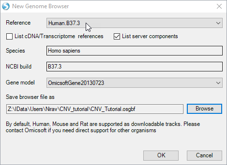
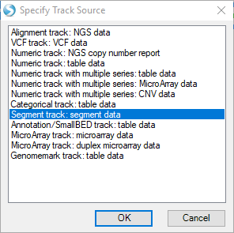
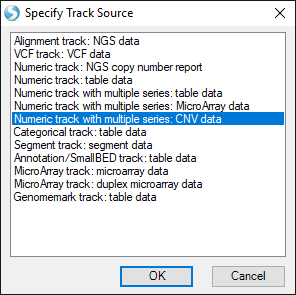
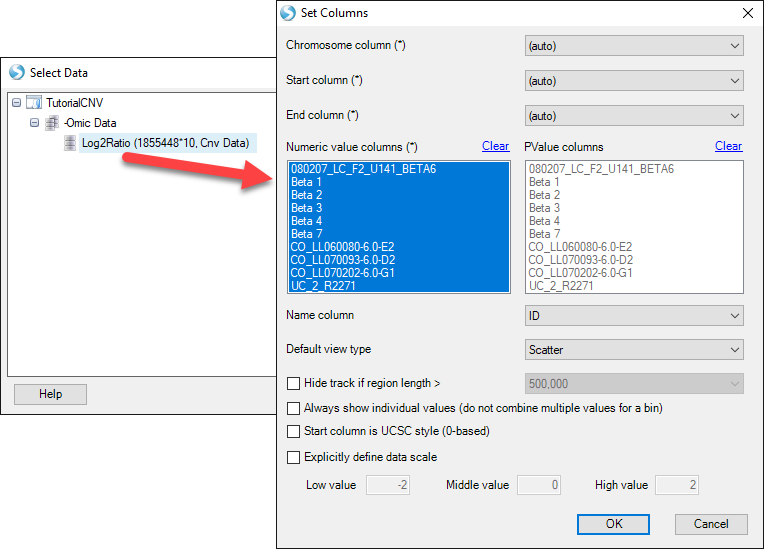
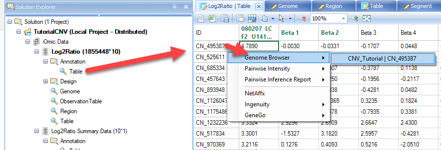

# Genome Browser Visualization

Processed data from CNV analyses performed in this tutorial can also be viewed directly in the Genome Broswer tab. To access the browser, simply click the **Browser** tab at the top of your screen:

If you have not already done so, create a New Genome Browser by clicking new. You will see the following prompt:

Choose the default reference and gene models and select and output folder and name. Click "OK". Go to **Add Track | Add Track from Analysis**:

First, try choosing the option *Segment track: segment data* and click "OK".

Find your open segment table from this tutorial and click "OK":

Choose the default options and click "OK" again:

You will see two additional tracks appear in your **Genome Browser**: *Log2RatioMean* and *CNStatus*. Browse to chromosome 13 within the toolbar and notice that the *Beta2* sample we examined earlier has a *log2RatioMean* of ~0.35 and a corresponding copy number status of 3 for a large portion of the chromosome:

User can zoom in on regions of interest by using magnification tools in the upper right part of the browser, the click wheel of a mouse, or by simply holding *Shift* and left-clicking to highlight a region.

In addition to the segment tracks, one can upload additional CNV tracks. Go to **Add Track | Add Track from Analysis**:

This time, choose the option *Numeric track with multiple series: CNV data*:

Find your CNV analysis output and click **OK**. Select the data you want to visualize and click **OK**. Here, we choose all the data and set all other parameters to default:

In this view you can visualize the individual SNPs on the CNV chip and their position within the genome. This can also be achieved by going to the Table view of the CNV data, right-clicking on individual SNPs, and selecting the genome browser view:

As you can see with this SNP, our top sample, has an elevated log2 value relative to the other samples. Users are encouraged to explore display options to adjust track height, width of data points, and more:

