# Convert Expression Data to ALV

The first step in creating your own ComparisonLand is to import your data into Array Studio and attach Annotation and Design metadata.
The resulting **.osobj** file will be converted to Land-compatible **.alv** files.

## Create Array Studio Project

First, open **Array Studio**, and create a new distributed project:

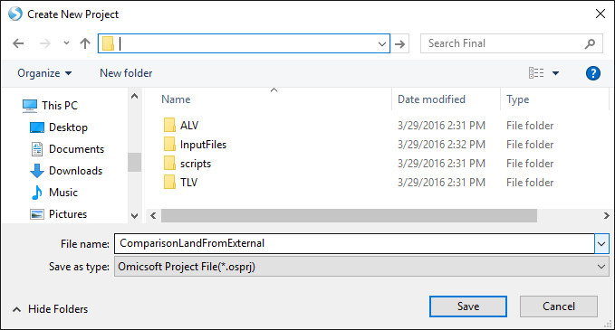

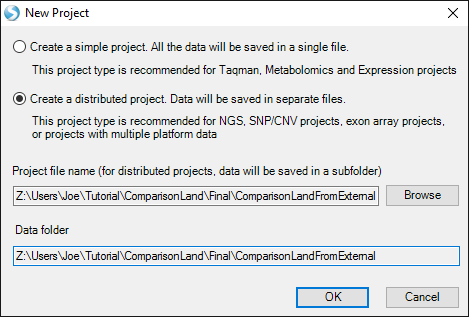

## Import Expression Data into Array Studio

The tutorial data are expression intensity measurements from an Affymetrix array for ~100 probesets (genes).
Each row contains all of the measurements for one probeset, with each sample in columns.

To import these data, click **Add Data | Expression Data**:

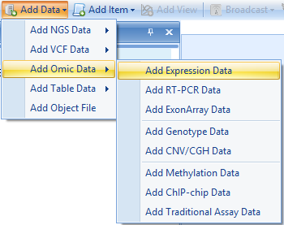

The tutorial data are tab-delimited, one gene per row, but Array Studio can import data from a variety of sources:

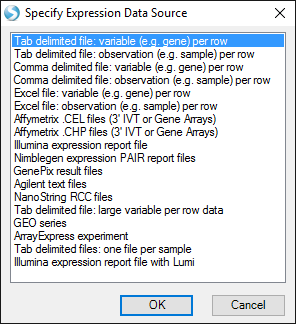

If your data have additional annotation columns (besides the ProbeSetID in the first column), you can specify them, and they will be automatically added as metadata.
The tutorial data do not have any extra columns, so do not select anything, and press **OK**:

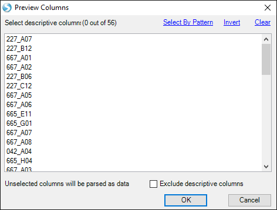

You will be prompted to add a Design metadata file, but you may add one later if you prefer:

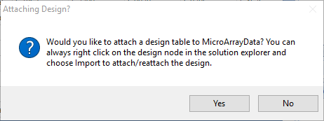

For this tutorial, select **Yes**, then select **Tab delimited File**,
navigate to "Brawndocin_Slurmycin.V2.Expression.Design.txt", and click **OK** without appending to the existing covariate table.

You will now be prompted to add Annotation metadata. Again, you may add one later, but for the tutorial dataset you can add it immediately:

The tutorial dataset probesets are from *Affymetrix HG-U133A*, which is one of many online annotations available from Array Studio.

Select source **Online annotation file**

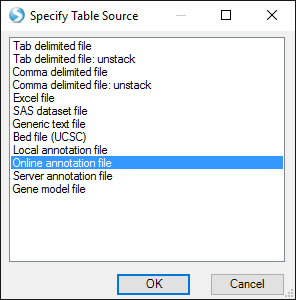

and search for **HG-U133A**, which will list all matching annotations:

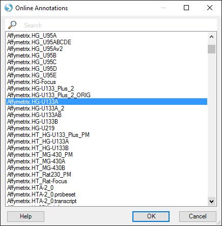

Select **OK**, which will automatically retrieve the annotation and attach it to the data. Click **OK** on the subsequent window without selecting either option.

Now you will see the tutorial data imported as an *-Omic* data type, which is a tabular dataset with associated Design and Annotation data:

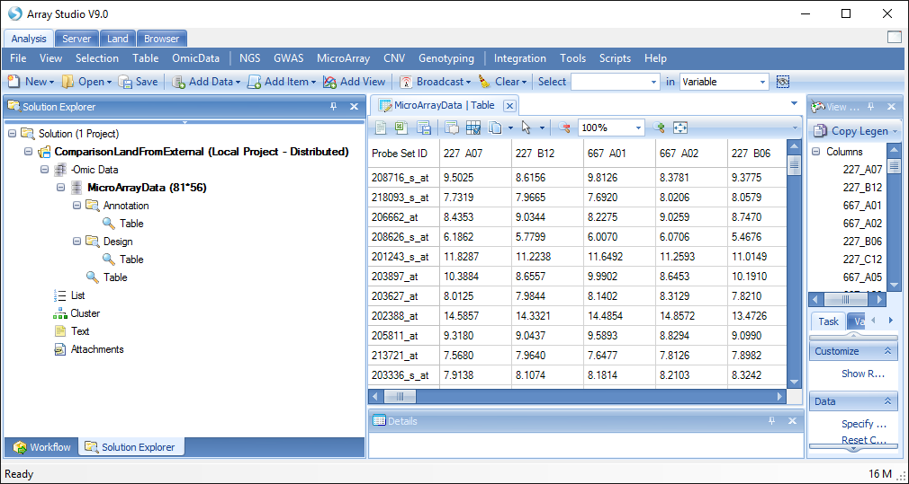

In the **Solution Explorer**, right-click on *MicroArrayData* and select *Rename*, then rename the -Omic object to "Brawndocin_Slurmycin.Expression":

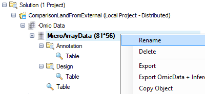

Your **Solution Explorer** will update the object name:

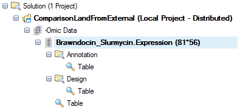

Now save the project. The **.osobj** file "Brawndocin_Slurmycin.Expression.osobj" will be used to create ComparisonLand **.alv** files.

## Convert Expression .OSOBJ file to Land-compatible .ALV files

Now you can convert the **.osobj** file to **.alv** files, which can be added to your ComparisonLand.

To do this, you will run an **OmicScript** (**Oscript**) from **Array Studio**.

**Oscripts** are text-format files that instruct Array Studio to perform commands. All Array Studio GUI functions have associated .Oscript functions. There are additional "Oscript-only" functions (such as ConvertExpressionOsobj), which do not  have a GUI module window in Array Studio.

An example **Oscript** is **ExtractExpressionOsobjToAlv.oscript**, which you will find in the zipped tutorial set: ::

	Begin LandTools /Namespace=NgsLib;
	Files "Z:\Users\Joe\Tutorial\ComparisonLand\Final\
	ComparisonLandFromExternal\
	Brawndocin_Slurmycin.Expression.osobj";
	Reference Human.B37.3;
	GeneModel OmicsoftGene20130723;
	Options /Action=ConvertExpressionOsobj
	/SampleIDColumn="Observation"
	/MappingID=Affymetrix.HG-U133A_Human.B37.3
	/IsRatio=False /MedianNormalization=False
	/TargetMedian=0
	/OutputFolder=
	"Z:\Users\Joe\Tutorial\ComparisonLand\Final\ALV";
	End;

For the tutorial, will need to change the input and output paths to match where your **.osobj** file is located,
and where you want to output the **.ALV** files.

Once you have modified and saved the **Oscript** file, Select **Tools | Run Script**:

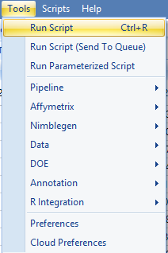

Navigate to your modified **ExtractExpressionOsobjToAlv.oshell.oscript** file, and click **OK**.

The output **.ALV** files will be found in the folder you specified.
You will find one file per sample:

