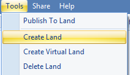
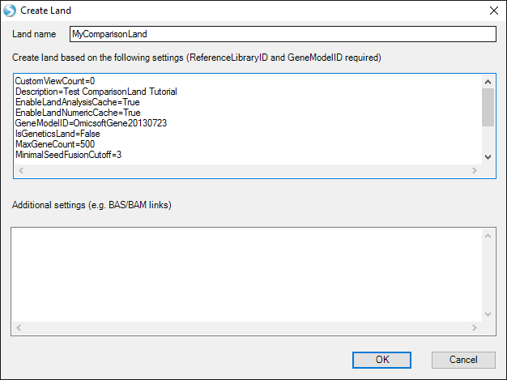
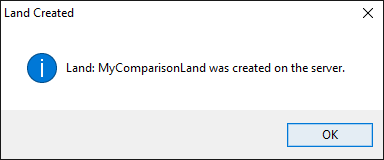
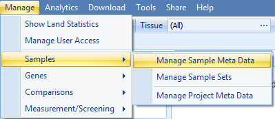
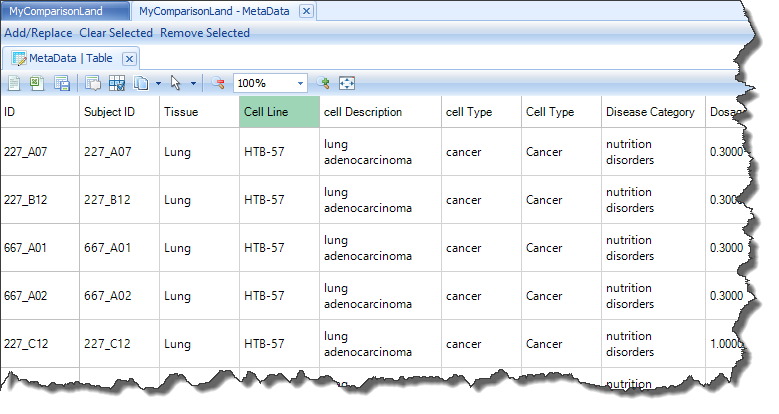
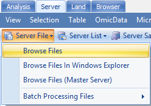
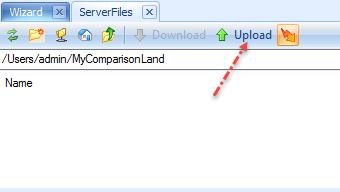
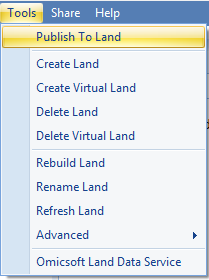
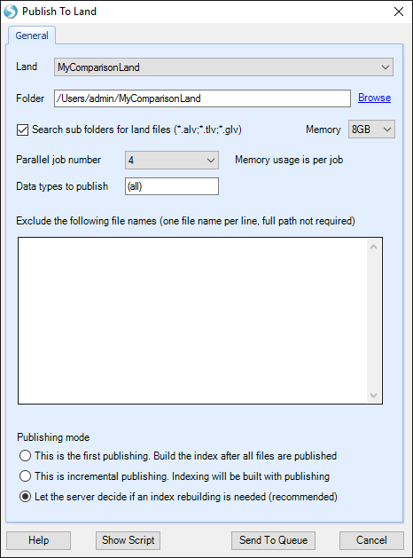

# Add Expression and Comparison Data to Land

After you have successfully created **.alv** and **.tlv** files containing your expression and comparison data, respectively, you can add these data to an existing or new ArrayLand.

## Create a New Land

If these data will be added to a new Land, you must create this Land first.

Connect to Array Server with administrator privileges, then click on the **Land** tab:

Switch to the **Land** tab, then click **Tools | Create Land**:

In the window, give your Land a unique name for the server, and enter additional settings:

In the tutorial data set, you will find a file "TutorialLandSettings.cfg" that contains some basic settings.

When successful, you will get the following message:

## Add Sample and Project MetaData to Land

Before you add your actual data to your new Land, you can add the Sample and Project MetaData.

In the tutorial dataset, the Sample Metadata are in "Brawndocin_Slurmycin.V2.Expression.Design.txt", and the Project Metadata are in "Brawndocin_Slurmycin.V2.ProjectMetaFile.txt".

In the **Land** tab, click **Manage | Samples | Manage Sample Meta Data** or **Manage Project Meta Data**:

In the **Sample Metadata** and **Project Metadata** windows, you can add, replace, clear, and remove metadata for samples.

To add new sample metadata, click **Add/Replace**, and navigate to the Sample Metadata file.

If properly imported, the window will look similar to this:

You should also import the project metadata file, which should result in a window like this:

## Add .alv and .tlv files to server

If you are processing the tutorial data, you will have generated 6 .tlv files (one per comparison between sample groups) and 56 .alv files (one per sample).

Upload these to your Array Server, by clicking on the **Server** tab, then clicking **Server File | Browse Files**:

Navigate to a location to store your files, and click **Upload**:

Navigate to your .alv and .tlv files, and upload them to the server.

Now switch back to the **Land** tab, and click **Tools | Publish To Land**:

Navigate to your server files and click *Send To Queue*:

 Note: You can only publish data one job at a time, so if you have submitted a set of files to the server for publishing, you must wait for that job to complete before submitting the next job.

When all of your .alv and .tlv data have been published, the ServerJobs queue will say "Finished", and you can start exploring your Land.
