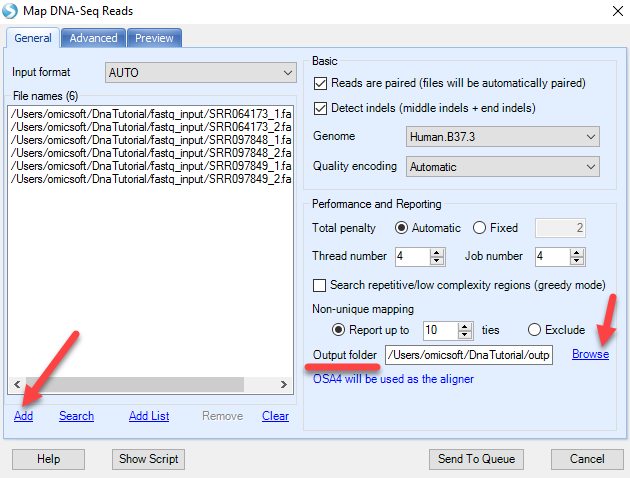
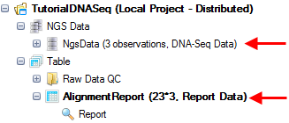

# Alignment to the Genome

The second step in most DNA-Seq analysis is the alignment of the reads to the genome.
Alternatively, if the data have already been aligned, the alignment (BAM/SAM) files can be imported through **Add NGS Data | Add DNA-Seq Data | Add Genome Mapped Reads**.

For this experiment, we will align the data using Array Studio. To add aligned NGS data, go to the **Add Data** dropdown menu on the toolbar, then choose **Add NGS Data | Add DNA-Seq Data | Map Reads to Genome (Illumina)**.

At this point, the **Map DNA-Seq Reads to Genome** module appears.
The first step is to click the **Add** button to specify the location of the files.
Choose the 6 files that were downloaded from SRA or the subset of the dataset downloaded from OmicSoft website. Note that these files are in .gz (gzip) format. The alignment process takes this into account and it is an effective way to save some space when importing files, as there is no need to extract all files.

As this is a paired experiment,
**click the Reads are paired checkbox**.
This will ensure that the pairing information is used in the alignment and counting process.

Choose the **Genome** for the experiment. In this case, use **Human.B37.3**. Omicsoft supplies standard genome builds for common organisms, but the user can always choose to build and use their own genome.

Leave the **quality encoding** set to automatic.
However for your information, these files were encoded using the Sanger quality scoring system.
**Total penalty** should be left on automatic, and is described completely in Omicsoft's white paper on alignment.

**Thread number** indicates the number of threads to use per alignment, and usually this number should be less than 6. Job number refers to the number of parallel jobs (independent processes).

**Non-unique mapping** indicates how many ties? for non-unique reads should be reported, or if they should be excluded all together.

**Output folder** allows the user to explicitly specify a location to store the alignment BAM files. Otherwise the bam files will be saved in a default location (a random number/letter folder in the project folder).
In this tutorial, **it is recommended to specify a folder**, so that BAM files can be found easily in next step (for fusion detection).

There are a few options in the **Advanced** Tab (e.g. detailed parameter settings for Indel detection). In general the default values have been tuned and should work well in most cases.

Leave the **Exclude unmapped reads in BAM** file *unchecked*, so that the generated BAM file will contain the information for all the reads (i.e. mapped and unmapped). The generated BAM files (which contain unmapped reads, possible fusion reads) can be directly used as input to the single-end fusion detection algorithm (see the fusion chapter in this tutorial).

Click Submit to **Submit** the analysis.
This could take hours, depending on the number of threads, type of computer (64-bit/32-bit), etc.

After the alignment, you will see a NgsData object and an alignment report table in the solution explorer:

