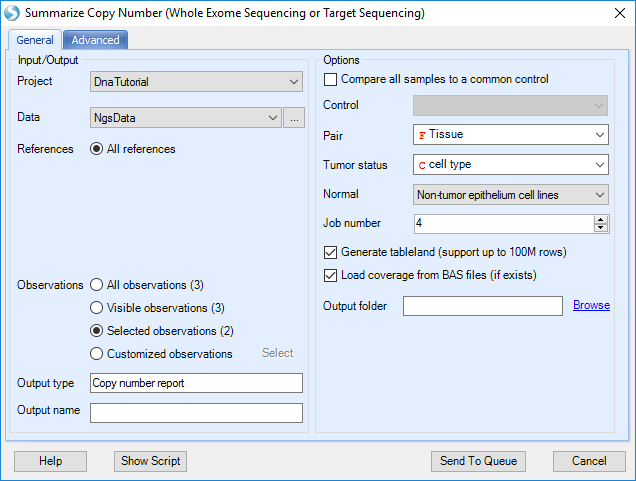
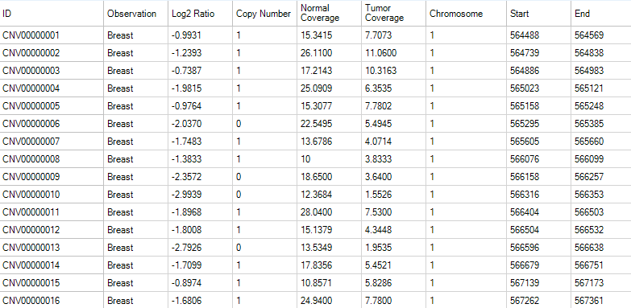
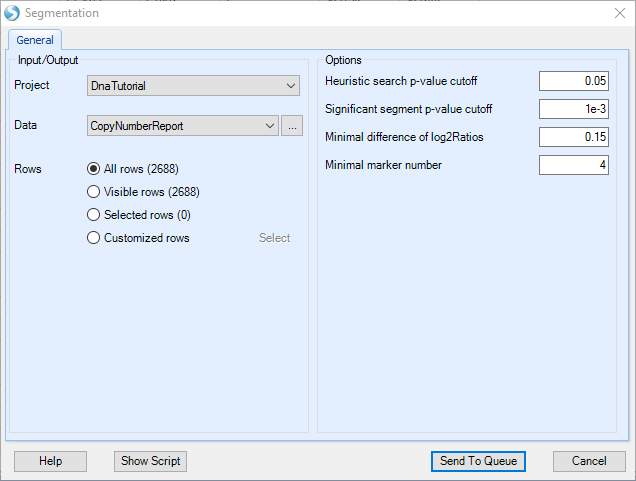
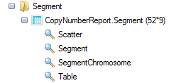
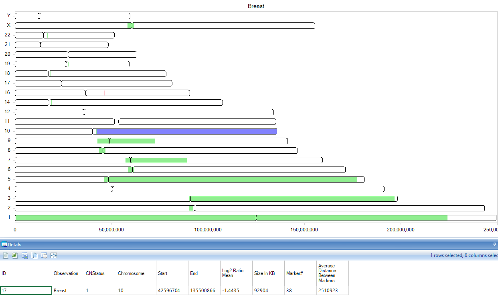

# DNA-Seq Copy Number Analysis

DNA-Seq Copy number analysis requires a matched normal sample during the analysis. The module was initially designed to detect copy number changes in tumor comparing to matched normal samples from Exon captured DNA-Seq data.

There are two steps in copy number analysis:
**Summarize Copy Number (Whole Exome Sequencing or Target Sequencing)** and **Segment Copy Number** :

## Summarize Copy Number

Check that the two samples are still selected in the **NgsData Design Table** .

**Summarize Copy Number** will summarize the copy number log2ratio between two samples. In **Summarize Copy Number**, choose the NGS data, choose the **Observations** to **Selected observations** only. The analysis will use two NGS samples selected in the design table. If user does not follow  the instruction for Observations option in this tutorial data, there will be an error: Observation number cannot be divided by two (expecting matched pairs).

Specify the **Pair** based on **Tissue** column (Breast for both),
**Tumor status** based on **cell type** column, and choose **Non-tumor epithelium cell lines** factor level to be **Normal**. There are more pileup and copy number options in the **Advanced** tab.

Leave all other settings as their defaults and click **Submit** to run the module. The output is a **copy number report** table listed under **Table** in solution explorer:

The report contains observation ID, copy number log2Ratio, predicted copy number (normally having 2 copies in human), coverage in tumor and normal sample, and genomic bin start/end.

As shown in the GUI, user can also select a base line sample to be a common control and summarize copy number by comparing every other sample to the same control. Users can sort data by Log2 Ratio or Copy Number to find some regions with significant differences in copy number. Right-click the rowID of a CNV to visualize the pileup in the Genome Browser.

## Segment Copy Number

The CNV Segmentation command will generate segmentation results for Log2Ratio copy number Data. The contiguous small segments/regions are processed and joined by a segmentation algorithm (similar to circular binary segmentation).

In **NGS | Copy Number | Segment Copy Number** , choose the **CopyNumberReport** data.

Leave all other settings as their defaults and click **Submit** to run the module. The output is a **segment report** table listed under **Table | Segment** in solution explorer:

By default, there are *table*, *scatter*, *Segment* and *SegmentChromosome* views for the report. Open the **SegmentChromosome** view and click on any segment to show details.

