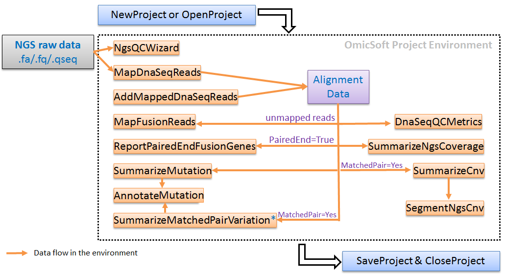

# Introduction

## Array Studio

Array Studio runs local NGS analysis in 64-bit mode on a Windows 64-bit computer with at least 8GB of RAM. Server-based analysis allows the user to run jobs on a remote server (Linux or Windows), which usually has more computing power than a desktop computer. This tutorial is based on Windows Server based NGS analysis using a Windows Workstation with 3.4GHz Intel® Core TM i7-6700 Processor (# of cores: 4; # of threads: 8) with 40GB RAM.

It is highly recommend that the user complete the prerequisite for this tutorial, the Microarray tutorial, as a way to learn the basics in Array Studio.
This tutorial assumes working knowledge of Array Studio, standard visualizations, and different modules within the software. As many of the downstream data types from next generation sequencing are "Microarray" datasets, the Microarray tutorial is an invaluable starting tool.

## Test Dataset

This DNA-Seq tutorial will cover the importing and some analysis of three public datasets.
We have selected three SRR run .fastq files. The full dataset is available on the SRA archive:

SRR097848 (MCF10A cell line):
[^link^](http://www.ncbi.nlm.nih.gov/sra/SRX040530 )

SRR097849 (MCF7 cell line):
[^link^](http://www.ncbi.nlm.nih.gov/sra/SRX040531 )

SRR064173 (K562 cell line):
[^link^](http://www.ncbi.nlm.nih.gov/sra/SRX025461 )

The whole dataset is ~2.5GB. For convenience, we provide a subset (10% of reads) of the dataset which can be downloaded at:
[^link^](http://omicsoft.com/downloads/data/tutorial/DNASeq.zip )

---
!!! note
    Note:
    The tutorial is based on the whole dataset; results will be somewhat different if you are using the subset dataset. Also, Omicsoft keeps updating algorithms and data to make sure that users have the most accurate results. Therefore, you may have slightly different results when you compare your results with the results shown in this tutorial.
---

## DNA-Seq Analysis Workflow

In this tutorial, we will introduce the DNA-Seq data analysis workflow in ArrayStudio, step by step. The workflow consists of a number of modules for DNA-Seq data processing, including raw data quality control (QC), alignment, aligned data QC, detection of fusion and mutation, and copy number analysis, as shown in the schematic chart below:

