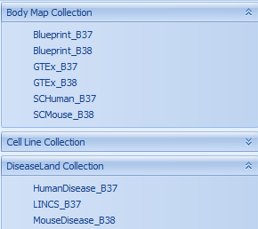
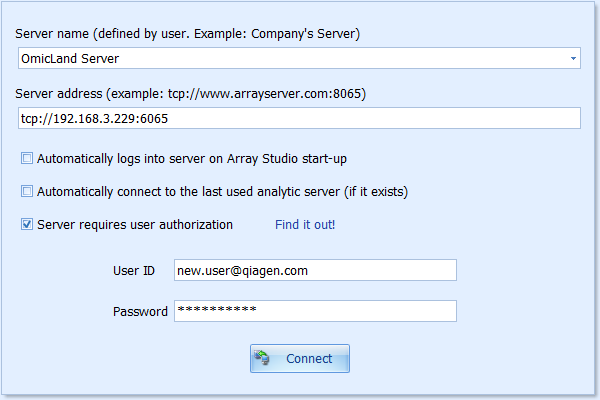
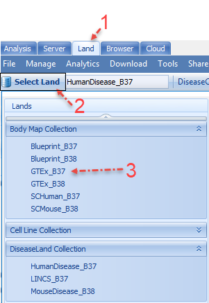

# Introduction

In this tutorial we will explore several Lands in the "DiseaseLand" collection: Body Map (GTEx and Blueprint), DiseaseLand (Human and Mouse curated disease-centric studies), scLand (Human and Mouse single-cell RNA studies), and LINCS (Cell line pharmacologic perturbation using the Broad L1000 profiling system). Each Land has its own advantages, and all serve as great tools for exploring high impact disease-centric studies. Further details are available in the DiseaseLand release White Paper.

To get the access to these lands, user should first connect to a server:

And then click the **Land** tab and click on "Select Land":

##Body Map Collection
In the current release, **Body Map** includes two lands: GTEx and Blueprint. Samples in the Body Map collection are from normal tissue; these Lands are great for answering questions such as:
* In what tissue is my gene expressed?
* Which transcripts are usually expressed from that gene for my tissue of my interest?
* Are there any genes with differential transcript usage between tissues, etc.

### GTEx

The data in GTEx Land come from the Genotype Tissue Expression (GTEx) program, which aims to study human gene expression and regulation in multiple tissues. GTEx is a map of normal tissue, revealing the genetic variation, gene expression, and other molecular phenotypes in specific human tissues.
It is a great tool to provide biological interpretations of disease related genetic variations.
Currently, GTEx covers microarray and RNA-Seq expression data for nearly 10,000 samples.

### Blueprint

The Blueprint dataset contains RNA-Seq data from a European epigenetic study [^link^](http://www.blueprint-epigenome.eu/ ), which focused on distinct types of haematopoietic cells from healthy individuals and on their malignant leukaemic counterparts.

Blueprint Land has 258 samples from 57 cell types in the latest release. It is still in expansion and we will continue to add data to this Land (including eventually the ChIP-seq data). Blueprint Land is a great tool to look into different gene expression categorized by different cell lines.

## DiseaseLand Collection

### ImmunoLand and CVMLand
Historically, ImmunoLand (focused on immunological and inflammatory disease) and CVMLand (cardiovascular and metabolic disease) were maintained as separate "Lands". As OmicSoft continued to add content, including projects focusing on neurological diseases, mood disorders, infectious diseases, etc., this explicit division became  less meaningful.

Now, all non-oncology disease studies are in **DiseaseLand**, and sub-stratified by "collection" (Immuno or CVM). Subscribers to DiseaseLand may choose to subscribe to either collection, or both, but will always find the data in **DiseaseLand**.

Hundreds of new projects are added to DiseaseLand every quarter, and it is a customer-driven expanding database (If you have other disease areas that you are interested to add into ImmunoLand, please let us know by e-mailing Omicsoft support at omicsoft.support@qiagen.com). Currently, DiseaseLand has more than 85,000 human samples and 25,000 mouse samples, across different cell types and tissues.

Omicsoft has carefully curated both sample level data and "comparison" level data, allowing users to easily search and visualize data using common queries: Treated vs Control, Disease vs Normal, Responder vs Non-Responder, etc. Expression data are reprocessed from raw files and normalized to a common standard, which dramatically improves cross-project comparisons.

### ImmunoLand Collection
The **ImmunoLand** collection contains datasets retrieved from several public projects, including GEO (Gene Expression Omnibus), SRA (Sequence Read Archive), and ArrayExpress.

As the name implies, ImmunoLand is an immune-focused  database containing data from multiple data types (RNA-Seq, Expression, more), with a focus on immune-related diseases: Asthma/Respiratory Diseases, Arthritis, Allergies, COPD, IBD, Psoriasis, SLE (systemic lupus erythematosus), Multiple Sclerosis, Neurodegenerative Diseases, and Infectious Diseases.

###CVMLand
CVMLand mainly focuses on Cardiovascular  and metabolic disease: diabetes mellitus, glucose intolerance, infectious disease, islet autoantibody positive, lipid metabolism disorder, and nutrition disorders.
