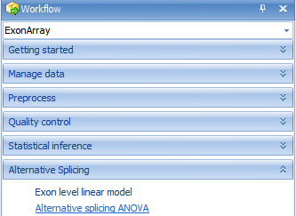
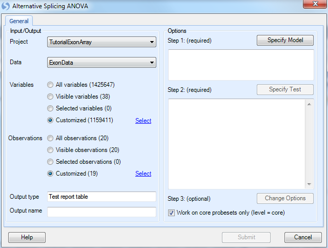
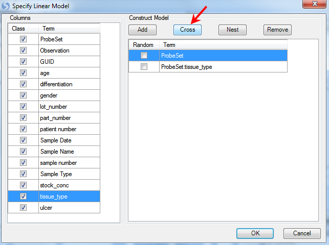
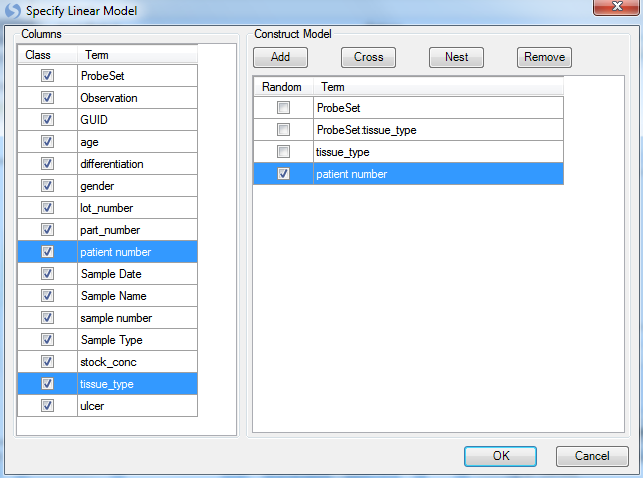
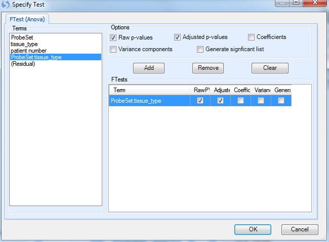
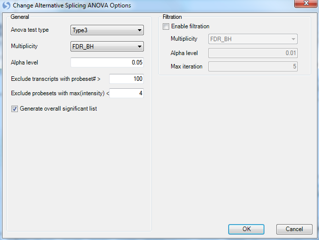
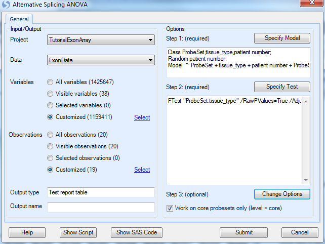
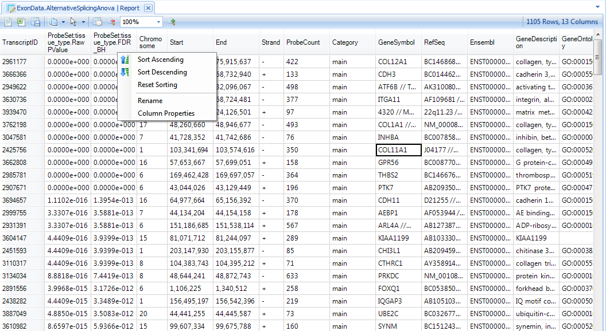
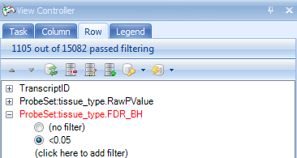

# Alternative Splicing ANOVA

Array Studio includes an **Alternative Splicing ANOVA** module that detects at the transcript level the transcripts that are alternatively spliced.

The model for this ANOVA is slightly different from the previous tests. Instead of tissue_type + patient number, this model is Probeset*tissue_type+patient number + Probeset+tissue_type. Also, the chip effect will be automatically added (random effect nested in tissue_type and patient number). So, when generating the model, we will have to adapt our usual procedure for this. In general, the user is most interested in the interaction between probeset and a factor (factors) of interest.

To run the *Alternative Splicing ANOVA*, click **Alternative Splicing ANOVA** from the **Alternative Splicing** section of *Workflow* or go to the **MicroArray Menu | ExonArray | Alternative Splicing ANOVA**.

This opens the *Alternative Splicing ANOVA* window. As usual, set the *Customized Variables* and *Customized Observations* to the lists we created earlier.

Click **Specify Model** to proceed to *Step 1* of the analysis.

By default, probeset is already added to the model. To add the interaction between probeset and *tissue_type*, click **tissue_type** in the *Columns* box and **ProbeSet** in the *Construct Model* box, then click the **Cross** button. The interaction is displayed as **Probeset:tissue_type**.

Next, add both **tissue_type** and **patient number** to the model, by selecting both, and clicking *Add*. Set **patient number** as **Random**, and click **OK** to continue.

Next, click **Specify Test** to proceed to step 2.

This opens the *Specify Test* window.
Unlike the other ANOVAs performed earlier, there are no estimates (contrasts) to be completed for this module.
Instead, the only test is **FTest**.
The user needs to pick the *Terms* for which to generate p-values.
The important term is the interaction between *ProbeSet* and *tissue_type*.
Click on **Probeset:tissue_type** and click **Add**, then click **OK** to continue.

Next, click **Change Options** to proceed to Step 3.

This module contains some of the options as the previous tests, however the point of interest is that by default, the module only runs on transcripts with *probeset#<100*, and probesets *with max(intensity)<4* will be excluded.
For transcripts with more than 100 probesets, there are too many degree of the freedom for the modeling.
If a probeset is consistently not expressed (all samples < 4), it will decrease the power of the mixed model.
Leave these options as default and click on **OK** to continue.

Once again, leave the **Work on core probesets only (level=core)** checkbox checked to only run the ANOVA on the core level probesets. Click **Submit** to continue.

This generates an **AlternativeSplicingArray.Tests** table in the *Solution Explorer*, as well as a *Report Tableview* (double-click this to open it, then sort by the first column ascending).

Notice now that the table is generated on the transcript level, rather than the probeset or exon level (as in the previous test results).

We can filter this table by p values.

