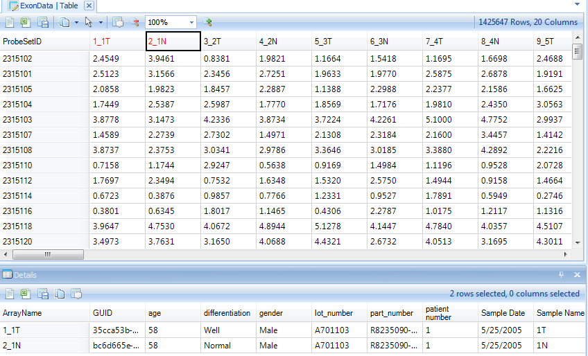

# Visualization of Data

## The TableView

At this point, the screen should look similar to below. On the left, the *Solution Explorer* should be visible. In the center of the screen, a table view called *Table* should be visible.

Scroll through the dataset to see how quickly *Array Studio* is able to scroll. *Array Studio* is able to easily handle millions of rows and columns in the *TableView*.

Please refer to Microarray Tutorial for different options and filters for TableView.

## Details Window/Web Details

The *TableView*, and all other views in *Array Studio*, are fully interactive. Clicking on particular column headers or row headers will bring up details about those observations or variables in the *Details Window*.

In the *TableView*, click the column header cell for *1_1T* and *2_1N*. Notice that the sample information for these 2 selected sample IDs are shown in the **Details** window.

If the *Details Window* is not shown at the bottom of the screen, go to **View Menu | Show Details Window** now to show it.

The user can also click on the row header cell to show annotation for any variable. Do this now, and notice that the *Details Window* updates with the annotation for that particular probeset.

