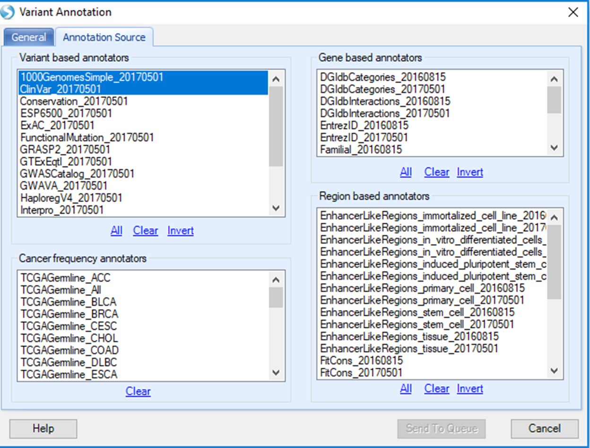
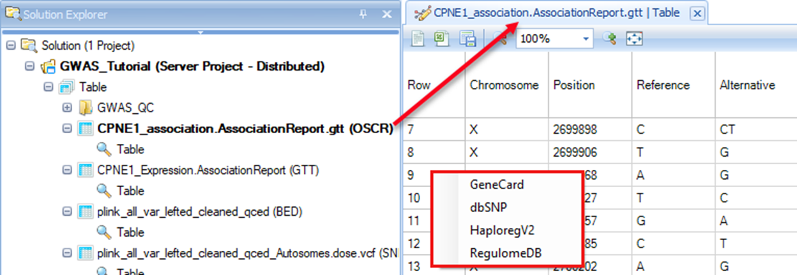
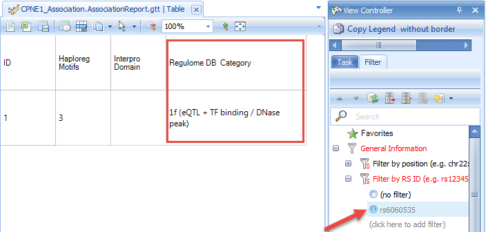
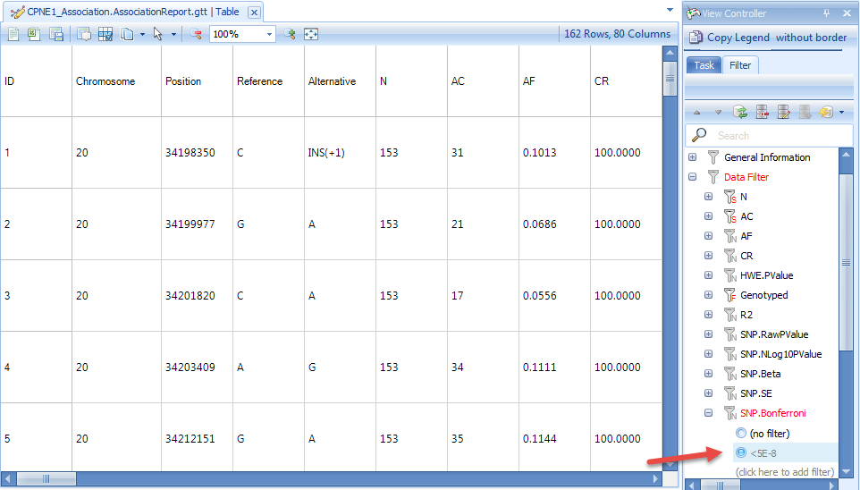

# Annotation

The annotation feature enables variant-by-variant annotations based on genetic association results file or an input file provided by users that are in GTT, VCF, or BED format. The input can also be a set of RS_IDs. Annotated results will be available in the output folder specified if the Generate text files box is checked.

## Annotation sources

Under the annotation tab, the Variant based annotators 1000GenomesSimple_20170501 and ClinVar_20170501 are selected by default. But, all the available annotation sources are shown and users have the option to make selections. After annotation sources are selected, users can go back to the General tab to confirm all the options selected are as desired before submitting the job to the server.

If you would like to include additional annotation sources, please contact Omicsoft support team (support@omicsoft.com ). Requests will be reviewed and new features may be added in future releases of Array Suite.

Please keep other options as default, and click  Send To Queue  to submit the job.

## Annotation output

After the job is finished, there will be an annotation result table (OSCR) that contains all the annotation information.

By right clicking the row ID, users can conveniently go to GeneCard, dbSNP, HaploregV2 and RegulomeDB to view corresponding information of that SNP.

## Results filtering

Please note that for annotated Omicsoft SNP Classification Results
('oscr <http://www.arrayserver.com/wiki/index.php?title=Oscr>'), variant annotation columns are fully interactive and can be filtered by mutation type, AA position and MAF etc.

In the Association chapter,we found the top SNP rs6060535 shown in NCBI eQTL browser also showed significant association with CPNE1 expression in our test Hapmap data. Now we can look for more detailed information about this SNP.

By searching the SNP ID and scrolling to the last annotation term (RegulomeDB), we will find rs6060535 is in class 1f,
which means this SNP is an eQTL, and also in transcription factor (TF) binding site or a DNase hypersensitive peak.
This also provides evidence to support our finding that rs6060535 is significantly associated with CPNE1 gene expression level.

We can also find all the significant SNPs associated with CPNE1 gene expression level by setting up a cutoff.
For example, we can find all the SNPs which show Bonferroni P-value smaller than 5E-8.
From the result, there are 162 SNPs in chr20 that show significant association with CPNE1 expression level in our tutorial Hapmap data in the level of Bonferroni P-value smaller than 5E-8.

