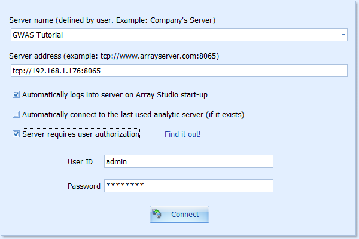
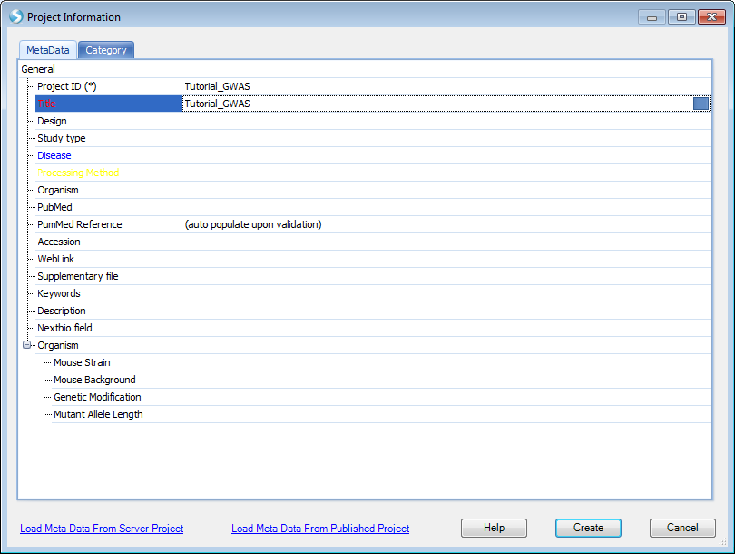
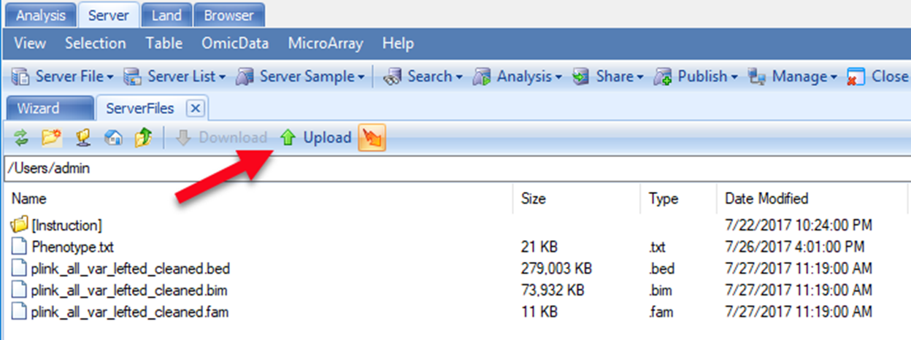
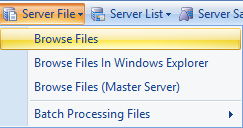

#Connecting to a Server and Uploading Files

##Connection to a Server

Before creating a server project, first connect to a server by clicking the **Server** tab at the top of Array Studio.
You may need to log off first if you do not see this interface.

Fill in the server information (where Server name can be anything given by the user to help remember the server) and log-in credentials. 
Select the **Connect** button.
In some company server configurations, it will use your computer account to login and it does not require user authorization.

##Create a server project

Upon successful login, go to the Analysis tab and click **New** to create a **New Server Project**. 
You will need to provide Project ID and Title to this new server project. 
Then click the **Create** button to complete this step.

Once the server project is successfully created, you will see it in the "Solution Explorer" window. 
In the example above, it is called "Tutorial_GWAS (Server Project   Distributed)".

##Upload local files

After the server project is created, the next step is to upload plink raw data into the project if they are not already on the server. 
This can be done by using the **upload** feature under the **server** tab. 
You will be prompted to browse folders and select the files that are needed for uploading.
You can upload multiple files at a time.
In this case, "plink_all_var_lefted_cleaned.bed", "plink_all_var_lefted_cleaned.bim", "plink_all_var_lefted_cleaned.fam" and "Phenotype.txt" files should be uploaded at this time.

If the **ServerFiles** tab is not visible, select **Server File | Browse Files**.

