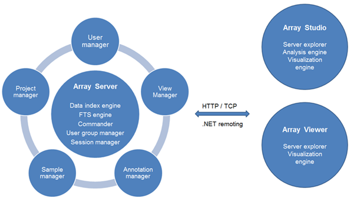

# Introduction

In this document, we will provide step-by-step tutorials on how to create a server project for server-based GWAS analysis.
Starting with a plink dataset, this tutorial will teach you how to strand-normalize, filter by quality control (QC) parameters,
impute for untested genotypes in samples, and perform association analysis between genotype and phenotypes of interest.

## ArrayServer

The GWAS module needs to be run on OmicSoft Array Server,
the OmicSoft enterprise solution that allows users to store, share, search, and integrate their GWAS projects and data.
The same solution has been applied to microarray/SNP/CNV/NGS projects and data to easily share analyzed data with clients and colleagues.
ArrayServer also hosts shared genome browsers.
The following diagram demonstrates the functionality of Array Server:

Server-based analysis allows the user to run jobs on a remote server (Linux or Windows), which usually has more computing power than a desktop computer.
The Array Studio client software, installed on a local desktop machine, is used to interact with the Array Server (like a server terminal).
Tasks such as job submission, monitoring, file transfer and data visualization can be done through the client software.
Moreover, Array Server has a built-in scheduling system that supports high performance computing clusters (both SGE and PBS/Torque),
accelerating the analysis of tremendous amounts of GWAS/imputed data.
All the Array Studio modules available for local analysis are also accessible for server-based analysis, with similar graphic interfaces.

## Server Project

A  Server Project  is a project that is created on the server, rather than on the user s client machine. This project is cached locally on the client machine, in case of loss of connection to the server, but is automatically updated each time the user logs in or clicks the **save** button. The cache is stored in the user s home folder, typically **MyDocuments/Omicsoft/ServerProjects**. A Server Project, when stored locally in the cache folder, has a different filename suffix (.ossprj) compared to a regular project (.osprj), and can only be opened when the user is connected to the server.

The concept behind a Server Project is that any data that is added to a project is first stored on the server. When the user adds a new dataset (whether it is GWAS, Gene Expression, CNV, or NextGen sequencing data), the user will be prompted with the folder structure of the Array Server instead of the local file system. If a user wishes to use a file from their local file system, the user must first upload the file to the server file system or ask an Admin to map the corresponding storage. Most companies store data on network drives, so they can map these drives directly in Array Server and all users will be able to access data easily during server analysis. All data addition and extraction is done on the server side, by Array Server, instead of the user s client machine. This allows the user to use the power of the server, instead of the user s individual client machine for the importing of data. This is extremely important for some memory/CPU-intensive importing operations (such as imputation). After data QC, imputation and analysis, data can be downloaded to the client machine, where the user can add views, run additional statistical analysis, etc.
Anytime the user saves the project, it is synchronized with the version on the server.

## Test Dataset

The user should first download the demo data file for use in the tutorial and save it to the local machine.
The file can be accessed from the following URL:
[^link^](http://www.omicsoft.com/downloads/data/tutorial/GWAS.zip )

The dataset is based on The Geuvadis Project that combined transcriptomics and genomics for a subset of 465 individuals from the 1000 Genomes Project.
The input phase 3 1000 Genomes Project data is in plink format [^link^](http://pngu.mgh.harvard.edu/~purcell/plink/res.shtml ).
*CPNE1* gene expression data for these individuals can be found in file  Phenotype.txt  in the Phenotype folder
and is based on the normalized gene-level expression provided by The Geuvadis mRNA sequencing
( <http://www.ebi.ac.uk/arrayexpress/files/E-GEUV-1/analysis_results/>).
The expression data file also contains gender information and principal component scores, which we will discuss in detail later.

Note: Omicsoft constantly updates the GWAS module in order to meet continued requests of our customers. Therefore, you may note slightly different results when you compare your results to the results in this tutorial.
Please contact customer support (support@omicsoft.com) if you have any questions as you go through this tutorial.

After this tutorial, users will be able to perform GWAS analysis to find the SNPs significantly associated with the expression level of a gene of interest (e.g. *CPNE1*).
