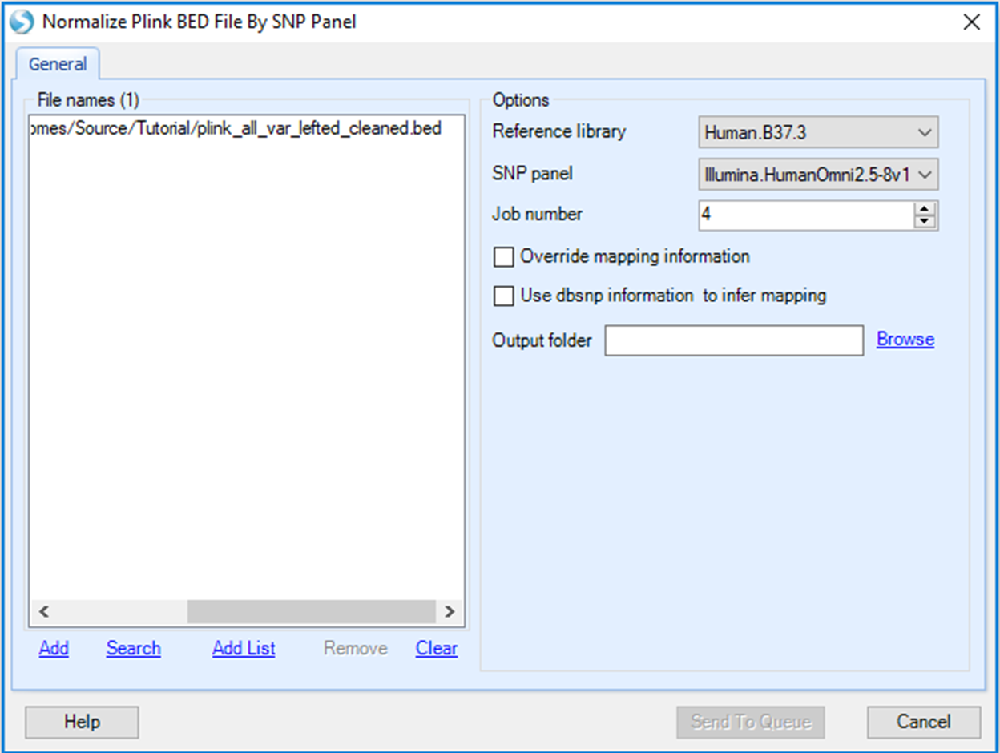

#Preprocessing

##Strand normalization

Once the tutorial plink files are available on the server, you can proceed to the Preprocessing step.
To mirror the sequential process of the overall work flow, the GWAS module is designed to automatically include output of the previous step as the input of the subsequent step.
For example, the output of the Preprocess step will be loaded as the input of the QC step by default.
Subsequently, the output of the QC step will be loaded as the input for the imputation step, which will generate input for the association step.
This streamlined process enables users to efficiently conduct GWAS analysis from raw input data to association analysis.

To facilitate GWAS data imputation and downstream variant annotation, we recommend that users first perform the  normalize strand  step.
This is to ensure that all the genotypes are reported on the forward strand of the reference genome.
This is a crucial step to ensure the accuracy of the imputation and variant annotations.
OmicSoft builds SNP panels to allow users to select a specific GWAS platform to  normalize strand .
If you do not see your GWAS panel listed as one of the SNP panel options, please contact OmicSoft support (omicsoft.support@qiagen.com ) and we will be able to build one for you.

Please note that if there is only a very little proportion of markers (less than 2%) having inconsistent strands, flipping will NOT be automatically attempted.
If there is a flipping issue, you will see a significant proportion of inconsistent SNPs.

To normalize strand, go to the Analysis tab, then select **GWAS | Preprocess | Normalize .BED Files**.

Once you click Normalize .BED Files, a new window will show up.
Here, you need to add the plink Binary PED (BED) file using the  Add  button, then select the corresponding SNP panel, Reference library and specify an output folder path.
For this tutorial, please select Human.B37.3 as the reference library, and  Illumina.HumanOmni2.5-8v1  as the SNP panel.

There are two options users can select:

*   *Override mapping information*: Checking this option will recreate mapping positions based on SNP panel.
    To do a liftover, this option has to be selected.

*   *Use dbsnp information to infer mapping*:
    If this option is checked, Array Studio will ignore any coordinate information in the source file. Array Studio will search the latest dbSNP database and recover the chromosome and position information from the "rs" IDs.

For this tutorial, please leave both options unchecked. You will need to uncheck to override mapping information to remove default settings.
Please ensure that you specify an output folder.
It is good practice to name the output folder, for example 'StrandNormalize' so that it can be identified for the following QC steps.
Then click **Send To Queue** to submit your job.
After your job is submitted, it will run on the server and you will be able to monitor its progress under the **Server Jobs** tab.

Once this job is complete, you will find a new set of plink files in the output folder previously specified.
This folder can be found under the **ServerFiles** tab.
