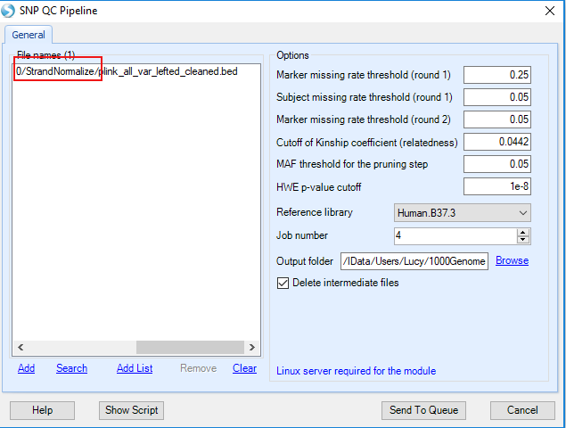
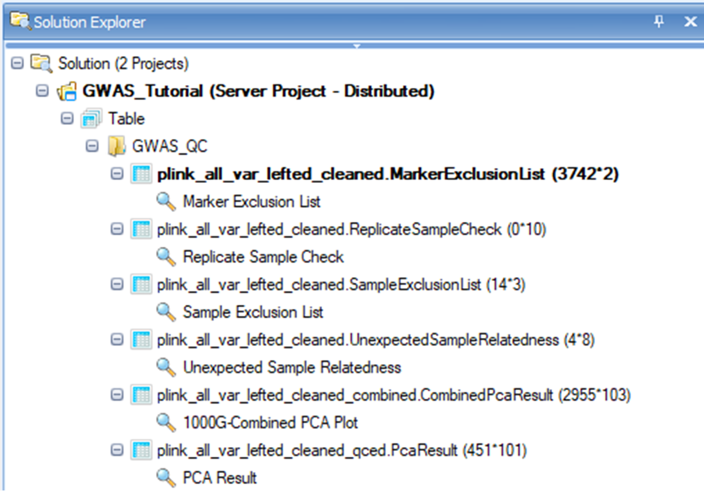
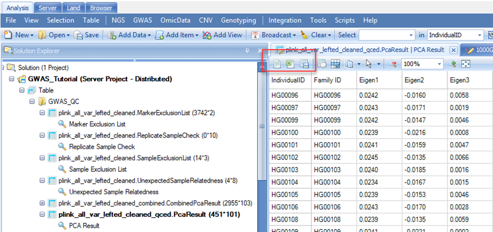
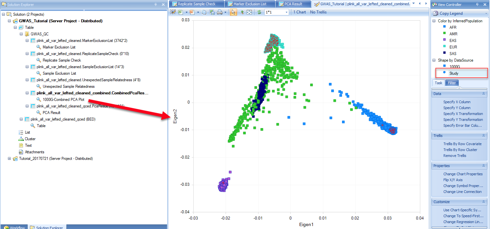
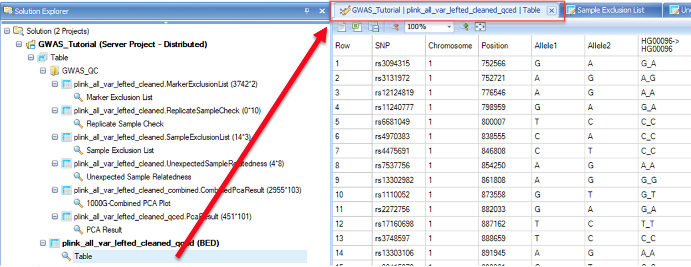

#QC of GWAS data

The data QC module offers a suite of standard data QC procedures to help prepare GWAS data for imputation or association analysis.
The main purpose of the QC is to identify problematic subjects or markers for follow-up investigation or data exclusion.

The output of the preprocessing step can be used as the input for the QC step. 
Go to the **Analysis** tab, then select **GWAS | QC**;
you will be prompted to add the input files for the QC pipeline, which consists of a sequential set of QC steps. 
The **Add** button allows you to add the set of plink files that have been pre-processed. 
If the file names are the same as the raw data, please ensure that you select the set of files that have been saved in the output folder specified in the pre-processing step.

##GWAS QC steps

There are six QC options you can specify at the QC stage; default values are given in the above figure. 
A more or less stringent threshold can be specified for each QC step.

**Marker missing rate threshold (round 1)**

Two rounds of marker missing rate QCs are conducted. 
Default cut-off for the first round is set at 25%. 
Markers with missing data more than 25% will be identified and removed. 
This cut-off value is deliberately set at a relatively high level to flag markers with high missing rate. 
The main purpose of this step is to identify markers with poor quality due to high missing rate and to exclude these markers from subject-level missing rate calculation.

**Subject missing rate threshold (round 1)**

This step identified subjects with relatively high missing rate. 
A default value of 0.05 is given to identify and remove subjects with at least 5% missing data rate.
A more stringent cut-off value can also be used.

**Marker missing rate threshold (round 2)**

In the second round of marker level missing rate QC, a default value of 0.05 is set to identify and remove markers with at least 5% missing data rate. 
A more stringent cut-off value can also be used.

**Cutoff of kinship coefficient (relatedness)**

The aim of this QC step is to identify cryptic related subjects which are established by testing pair-wise identity by state. 
Related samples are inferred based on the range of estimated kinship coefficients: >0.354, 0.354-0.177, 0.177-0.0884, and 0.0884-0.0442 that
corresponds to duplicate/MZ twin, 1st-degree, 2nd-degree, and 3rd-degree relationships, respectively. 
A default kinship value of 0.0442 is set to identify pairs of subjects with 3rd-degree or closer relationships.
By default, any subject pair with kinship value > 0.0442 will be removed.

**MAF threshold for the pruning step**

This cut-off is set for Linkage Disequilibrium (LD)-based pruning to select an independent set of common markers for Principle Component Analysis (PCA). 
A default value of 0.05 is given, which means the markers with minor allele frequency (MAF) more than 0.05 will be included in the pruning step.
After pruning, the set of independent markers are used to conduct PCA analysis which include all the study subjects and 2504 1000Genomes subjects. 
Joint analysis of study subjects and 1000Genomes subjects allows inference of genetic ancestry of study subjects based on 1000Genomes subjects with known genetic ancestry information.

**HWE p-value cutoff**

Checking for Hardy-Weinberg Equilibrium (HWE) is the final step in quality control analysis of genetic markers. 
Under HWE assumptions, allele and genotype frequencies can be estimated from one generation to the next. 
In genetic association studies, HWE principles can be applied to detect genotyping errors. 
It is critical to conduct this QC step in a subset of subjects with similar genetic ancestry. 
To do this, a subject s genetic ancestry is first inferred from PCA analysis results based on study subjects and ~2K 1000 genomes subjects from the five super populations
--
Africans, Ad Mixed Americans, East Asians, Europeans and South Asians. 
Genetic ancestry of a GWAS subject is predicted using the *k-Nearest Neighbors* algorithm. 
HWE testing is subsequently conducted in the largest subgroup of GWAS subjects.
The default cut-off is set at 1e-8; a more stringent cut-off can be set. 
Markers not passing this threshold will be excluded from the imputation step.

There is also an internal **Gender QC** check, but parameters are fixed, so no options are displayed in the *SNP QC Pipeline* window.
Heterozygosity rates based on X chromosome markers are used to determine genders. 
A male call is made if heterozygosity rate is more than 0.8, while a female call is made if it is less than 0.2.
Samples that fail the gender QC will be removed.

**Reference library** is needed here as to make sure in the PCA analysis, the genetic positions of the study subjects match with the 1000Genomes samples.

For this tutorial, please leave the options as default, specify an output folder, and click  Send To Queue  to submit your job.

After the job is finished, please click  Update Project  to view the results.

##GWAS QC results

Upon completion of GWAS data QC, QC results will be summarized as shown below.

On the left side of the screen under the Solution Explorer tab, you will see a list of QC results that are organized into the following four sections.
Three results are presented in the format of tables, and another one is a scatter plot which is fully interactive.

*   **Marker exclusion list**

    The set of markers that did not meet marker QC thresholds are summarized in the marker exclusion list along with reasons for exclusions.

*	**Replicate Sample Check**
	
	For samples that are identified as technical replicates, a test of within family relatedness is performed to confirm that pairs of samples are identical.
	Samples that fail this test are output in this file and are excluded.

*   **Subject exclusion list**

    The set of subjects that did not meet marker QC thresholds are summarized in the marker exclusion list along with reasons for exclusions.

*   Unexpected Sample Relatedness list**
	
	This table contains any subject pair with estimated kinship coefficient >0.0442.
	The output is generated by testing for pairwise relationship across families.
	N SNP (the number of SNPs that do not have missing genotypes for either individual, Z0 (the probability that IBD=0), Phi (the kinship coefficient), IBS0 (the proportion of SNPs with zero identity-by-state), 
	Kinship (estimated kinship coefficient from the SNP data, and error (indicates a difference between the estimated and specified kinship coefficients). 
	
*	**PCA results**

    PCA analysis is based on a set of LD-pruned independent common markers in 1000 Genomes subjects and GWAS subjects.
    There are two PCA results in the view. 
    The first one corresponds to the combined results with both post-QC study subjects and the 1000 Genomes subjects (which will be discussed in detail soon), 
    and the second one corresponds to the post-QC study samples only. 
    In the latter case, top 100 PC scores are shown. 
    You can export this table by selecting one of the options in the menu bar (shown in the red rectangle) in the figure below. 
    These results are needed in the downstream association analysis. 
    Therefore, you should save this table as  PCA_results.txt , which would later be merged
    with phenotype data. 
    In this tutorial, however, a combined file ( Phenotype.txt ) is provided with the sample data, so this merge step will not be needed.

*   **PCA plot**

    The combined PCA result with both post-QC study subjects and the 1000 Genomes subjects is shown in the form of PCA scatter plot.
    PCA scatter plots are generated from pairs of selected PC scores (also called eigenvectors). 
    In the below example, PC1 (or Eigen1 on the X-axis) is plotted against PC2 (or Eigen2 on the Y-axis). 
    Subjects from the 1000 Genomes project are represented by the square symbols and study subjects are denoted by filled circles. 
    The five super-populations, Africans (AFR), Ad Mixed Americans (AMR), East Asians (EAS), Europeans (EUR) and South Asians (SAS), 
    are represented by different colors as shown in the right hand **View Controller**. 
    In this example, the vast majority of the study subjects are clustered with Europeans. 
    Genetic ancestry of a study subject is further predicted using the *k-Nearest Neighbors* algorithm.
    The legends of the colors and symbols can be found on the right-hand of the screen under the View Controller tab. 
    PCA plot is fully interactive. 
    As shown in the example above, detailed information of the highlighted subject is shown in the table right below the PCA plot in the middle panel of the screen. 
    You can also review genetic ancestry information of all the study samples by selecting the filled circle symbol in the View Controller. 
    All of the study subjects will be highlighted in red color and detailed information on all the study subjects will be presented in the table format in the Details window.
    You can view the table in Excel, or perform other actions by selecting symbols shown on the menu bar of the table. 
    This can be handy if you would like to export the inferred race information for further comparison to self-reported race data.

In addition to QC results under GWAS_QC, there will also be a BED file containing the genetic information after QC step.

