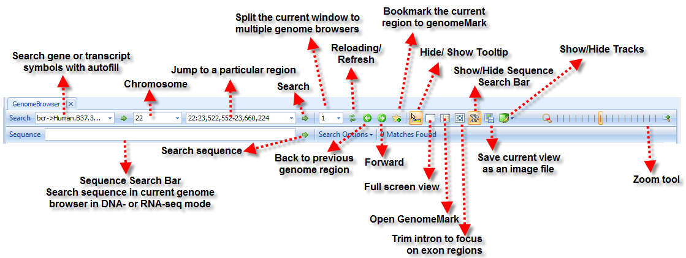
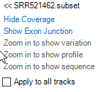
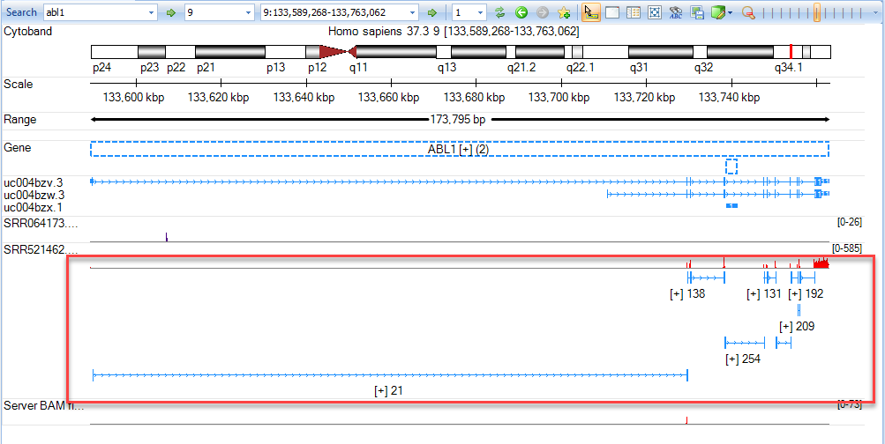
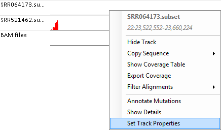
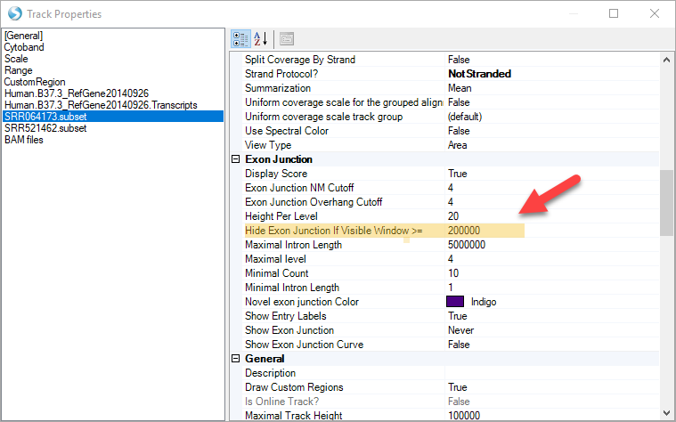
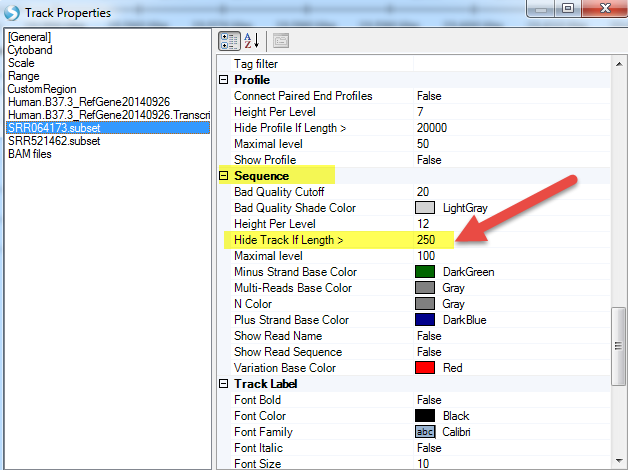
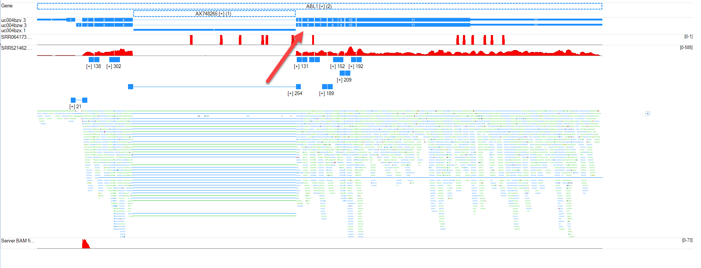
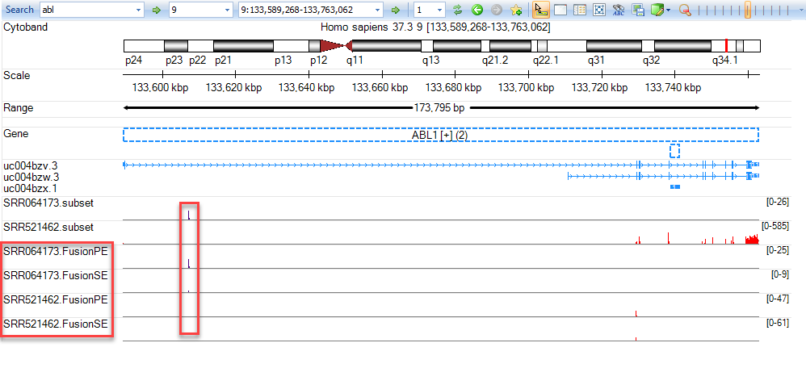
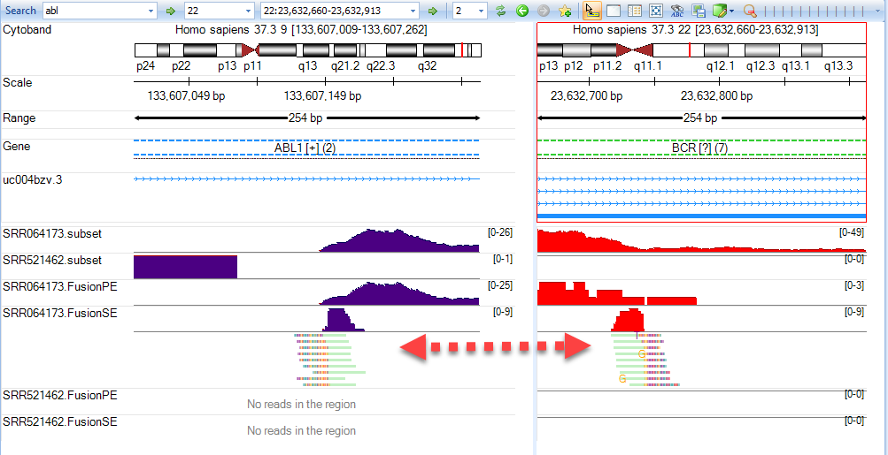

# Browsing Data

## Navigation Tools

There are tools at the top of the genome browser to help the user browse data in Genome Browser:

## Browsing Alignment Tracks

Input *abl1* in the gene search box and jump to the ABL1 region. Hovering the mouse pointer over the track labels (e.g. SRR521462) will bring up additional options

* **Coverage**:  By default, coverage is shown in red for each track added. User can *Hide Coverage* if desired.

* **Exon Junction**: This track displays the number of supporting junctions spanning reads. By default, **exon junctions** will be displayed when the current region is <200,000bp. Click **Show Exon Junction**.

* **Variation**: This track will display all variations with respect to the reference. This track is useful when examining BAM files from mutation analyses in the Genome Browser. By default, **Variation** is only displayed when the display window is <2,000bp. If any alignment track is gray in menu, press Shift and use the left mouse button to select an area to zoom in to a region quickly.

* **Alignment profile**:  Displays blue (positive strand) and green (negative strand) lines for alignment. If the alignment profile is not visible, it can be displayed by clicking the track name and selecting "Show Alignment Profile".  The gray lines are those mapping to multiple genomic locations. By default, **Alignment Profile** will be visible when the display window is <20,000 bp. *Note*: If coverage is high, genome browser will randomly select only 50 reads to show at the same position. The maximal level to display can be specified in the track properties. Click the **+** button on the right hand side of the track (arrow) to show all reads.

* **Read Sequence**: Will display sequence of individual reads mapped to reference. By default, the **read sequence** will be displayed when the current region is < 250bp. Press Shift and use the left mouse button to select an area to zoom in to a region quickly. Click **Show Read Sequences**. The user should see the **read sequences** colored in blue and green representing the reads on the positive and negative strand, respectively. Mutated nucleotides are in red and low-quality nucleotides are shaded in grey.

* *Additional Track Options*:  

1. If an option is in gray, the user needs to zoom in further.

2. The cutoffs to activate these options are defined in the track properties. These options can be modified by right-clicking on the track, and selecting "Set Track Properties":

For instance, change the longest length of when to show exon junctions:

Or change the length when to show the read sequence (just keep in mind the higher the number goes, the more memory required):

## Intron Trimming

: For RNA-Seq data, most reads are in exon regions.
The genome browser wastes a lot of space by displaying intron and intergenic regions.
Click the intron trimming button in the toolbar to collapse introns and intergenic regions, so that only exonic regions are displayed.

## Browser Fusion BAM Files

In this module, we will examine fusion events. When we imported four fusion BAM files, we combined them into a single track. Here, we will look at the individual fusion events that were identified in the DNA-seq file SRR064173. Right click on the BAM fusion track and **split it** into **multiple tracks**.

It will show the fusion supporting reads from four sources:

*   SRR064173.FusionSE: DNA fusion junction spanning reads
*   SRR064173.FusionPE: DNA inter gene fusion read pairs
*   SRR521462.FusionSE: RNA fusion junction spanning reads
*   SRR521462.FusionPE: RNA inter transcript fusion read pairs

Be sure to remove the option "Trim intron reads" as the BCR-ABL1 fusion event occurs within a non-coding breakpoint. To examine fusion reads, use your mouse to left-click and zoom in on the region shown above (within intron 1 of ABL1). **Show Alignment Profile** for *SRR064173.FusionSE* and you will see reads that are only part green (mapping to ABL1). To determine where the other portion of the read maps, right-click on the green portion of a read from *SRR064173.FusionSE* then select **Show Mate In Next Pane**

It will show the fusion genome browser view (where both ends of the read are shown - see arrows):

The user can zoom in to show the exact fusion position at genomic level in both genes:

The user can practice browsing the fusion breakpoints at transcript level on SRR521462.FusionSE and SRR521462.FusionPE tracks. Hint: it is easier to browse predicted RNA-Seq fusion results using intron trimming mode. For further practice, try using this module to identify fusions between the other two genes included in the provided BAM files (XKR3-NUP214).

The user can also return to a one panel mode by simply choosing the drop-down option from the navigation toolbar and selecting 1:

