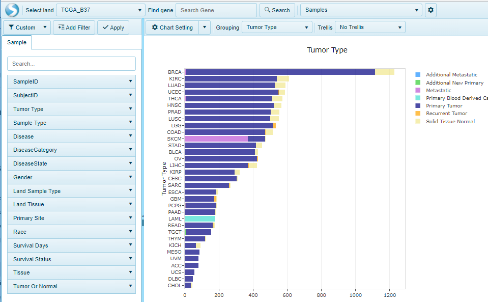

# Introduction

## Land Explorer

OmicSoft uses ArrayLand framework to deliver large data service results. ***Land Explorer*** is the quickest way to explore OmicSoft Land data (OncoLand, DiseaseLand, GeneticsLand, and Internal Lands). The streamlined web interface uses our most popular visualizations to help researchers and clinicians explore OmicSoft Lands.

Once users configured Land Explorer on both Windows Server and ArrayServer internally, all ArrayStudio/ArrayLand users can log in to Land Explorer and search all types of genomics profiles of a single gene or a set of genes instantly with rich visualizations.

This tutorial is mainly based on TCGA Land Portal. Please refer to the OncoLand Whitepaper, available through the Help menu item, for descriptions of all available Lands within Land Explorer.

## Log in to Land Explorer

Once you connect to the **LandExplorer** server, the default land chosen by the administrator (TCGA by default) will appear. Users can switch to other Lands by simply clicking **Select Land**:

The default **TCGA_B37 Land Explorer** view shows a histogram plot of samples grouped on the y-axis by Tumor Type, and colored on the x-axis by Sample Type. Other views are also available for users to query the sample data at a general level.

## Select views

### Overview

In addition to the default **Samples** view above, other views like **Data Avaliability** and **Table View** are also available for users to query the sample data at a general level.

### Gene level view
When a user searches a gene or a gene set (multiple genes), there will be more views available, like DNA-Seq, Somatic Mutation Distribution, RNA-Seq, Gene FPKM, Transcript FPKM, etc.

## Customize Views
Users could also customize the available views for selected genes/transcripts.

## Filter samples for the view
Users could also customize the view for a selected gene/transcript by filtering samples.

