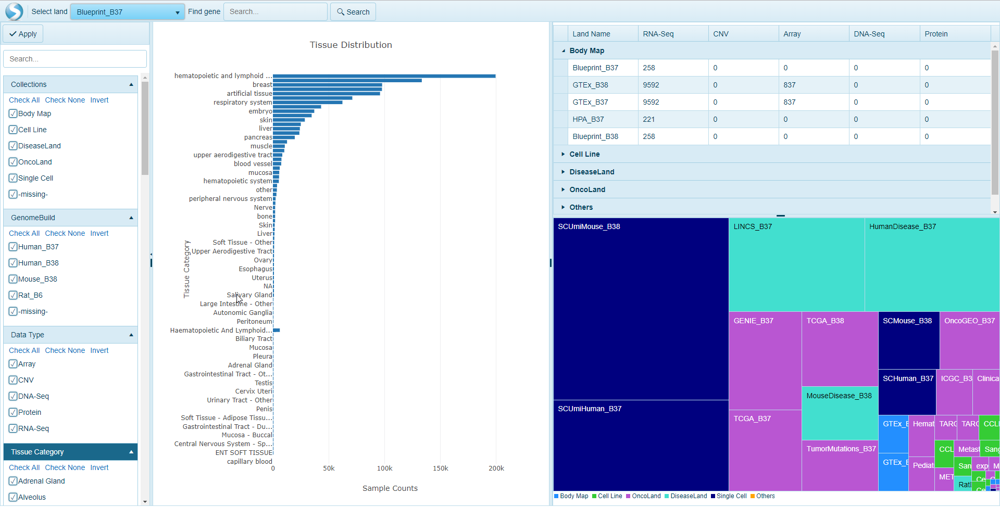
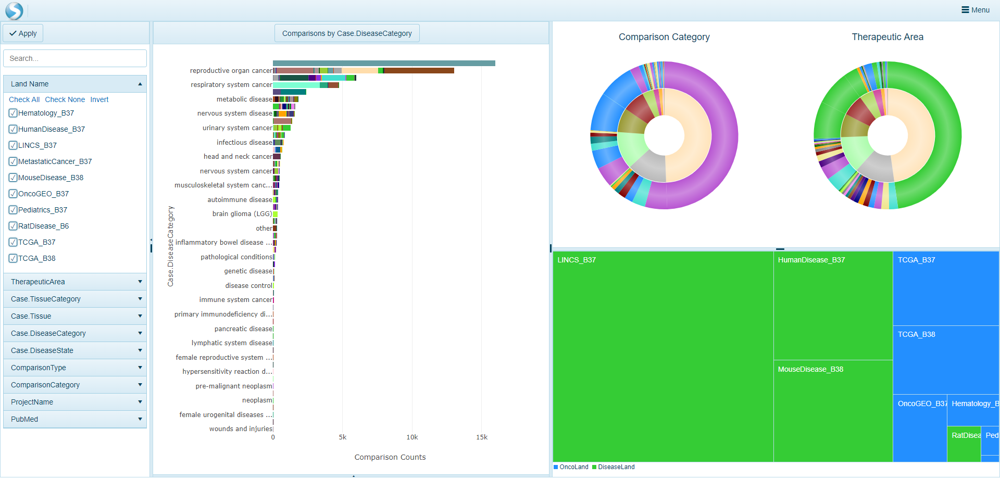

# Introduction

## Land Explorer

OmicSoft uses ArrayLand framework to deliver large amounts of clinical and "omic"-data to biologists with simplistic visualization. ***Land Explorer*** is the quickest way to explore OmicSoft Land data (OncoLand, DiseaseLand, and Internal Lands). Users of Array Studio may be familiar with the content provided within the Land Explorer framework. The streamlined web interface uses our most popular visualizations to help researchers and clinicians explore OmicSoft Lands.

### Video introduction to Land Explorer

Please see our video for a basic introduction to Land Explorer:

<iframe src="//qiagenbioinformatics.23video.com/v.ihtml/player.html?token=617eaed4e28a0df6d6554b06dffc9fb0&source=embed&photo%5fid=49720383" style="width:100%; height:100%; position: absolute; top: 0; left: 0;" frameborder="0" border="0" scrolling="no" allowfullscreen="1" mozallowfullscreen="1" webkitallowfullscreen="1" allow="autoplay; fullscreen"></iframe>

Land Explorer connects to Array Server to provide access to rich visualization of Omic-data, and delivers this data directly to a user's web browser, meaning no extra software required. Land Explorer can by used as a companion product to OmicSoft's Array Suite (to use with internal Lands and OmicSoft Lands), or as a standalone product hosted by QIAGEN/OmicSoft. Like Array Suite, Land Explorer is fully customizable to meet the needs of its users.

These tutorial pages demonstrate the utility of Land Explorer, including a description of the many [views](./Land Views/Views.md) available, as well as the [general usage and customizations](./Using Land Explorer/LandExplorerInterface.md) of these views.

## Land Explorer usage

Users can login to Land Explorer using their Array Server credentials. Please contact your Array Server adminstrator or omicsoft.support@qiagen.com if you are having issues logging in. Once you connect to the Land Explorer, there are two options for a landing page that can be customized for each Land Explorer installation: An Optional Sample Explorer or a Land View.

### Sample Explorer Option

This option allows users to query data across all Lands related to specific Sample Types. For example, the view below shows a distribution of all samples represented with the OncoLand, DiseaseLand, BodyMap, Cell Line and Single Cell collections, including sample counts, counts of data types and how these samples are distributed across all Lands.

For more information on how the Sample Explorer are configured and used, please visit the Sample Explorer [help](./Explorer/SampleExplorer.md) menu.

### Comparison Explorer Option

This option allows users to query data across all Lands related to comparisons. For example, the view below shows a distribution of all comparisons represented within OmicLands, and can be grouped by disease or tissue, with interactive pie charts and tree blocks that allow users to view and click through to OmicSoft-curated comparison(s) of interest.

For more information on how the Comparison Explorer are configured and used, please visit the Comparison Explorer [help](./Explorer/ComparisonExplorer.md) menu.

### Land View Option

If a Sample Explorer option is not defined in Land Explorer, the default view will be a Land View. In this view, the default land chosen by the administrator (TCGA by default) will appear. Users can switch to other Lands by simply clicking **Select Land**:

The default **TCGA_B37 Land Explorer** view shows a histogram plot of samples grouped on the y-axis by Tumor Type, and colored on the x-axis by Sample Type. Other views are also available for users to query the sample data at a general level.
