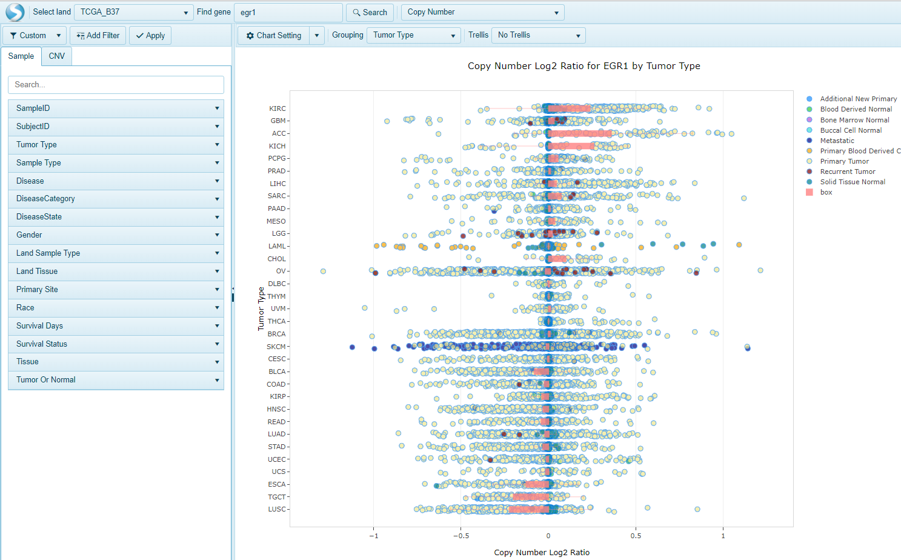
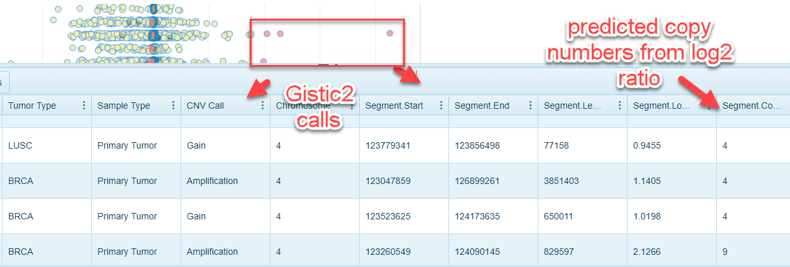
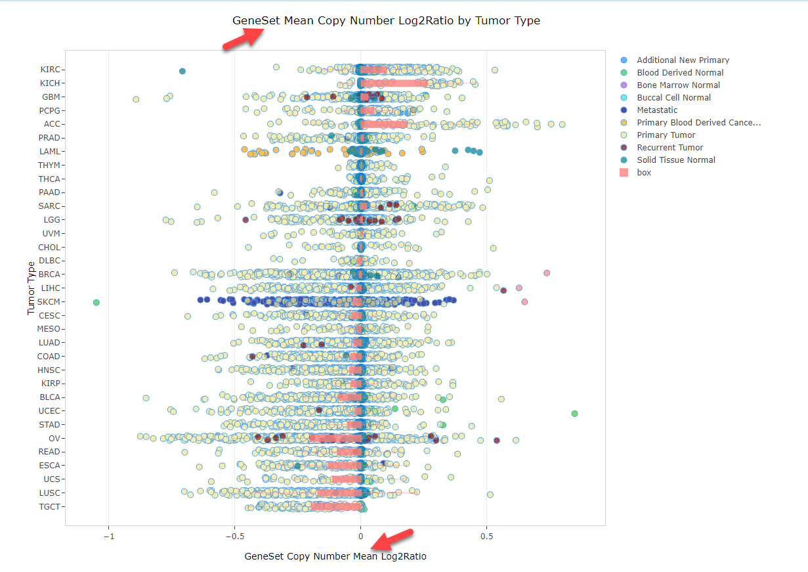

# Copy Number Views

Copy Number Variations (CNVs) can be identified using a variety of platforms. In TCGA lands, users can identify CNVs using two different types of CNV data, GISTIC2 and Log2Ratio-based calling from Affymetrix. CopyNumber_Gistic2.Level_4.tar.gz files (obtained from [Broad](http://gdac.broadinstitute.org/runs/)]) are used to get the GISTIC2 call values.  Log2Ratio segment data are downloaded from the GDC Legacy Archive. This data is available in a matrix which for each sample and includes genomic coordinates of segments along with the log2 ratio derived from an Affymetrix SNP6 Copy Number Inference Pipeline. Gene level copy number calls from GISTIC2, together with mutation data, are available in the [DNA Alteration Distribution](./DNAAlterationDistribution.md#DNA Alteration Distribution) view. Additional copy number views are summarize on this page.

## Copy Number

For Log2Ratio-based calls, searching a gene will display a variable view similar to the expression views seen for RNA-seq and microarray data.

The x-axis values in this view represent the log2 ratio. A ratio of about zero corresponds with no change in copy number. A positive ratio indicates copy number gain while a negative ratio corresponds with copy number loss. Clicking on individual samples (dots) on the plot will provide a details view that indicates the copy number status from GISTIC2 calls and Log2 ratio calls where available:

## Average Log2 ratio

For multi-gene searches, selecting the Copy Number view will create one chart per gene. Users can scroll up and down on the page to identify CNV data for each gene. Alternatively, users can view average CNV log2 ratios (averaging the log2 ratios for all genes searched):

