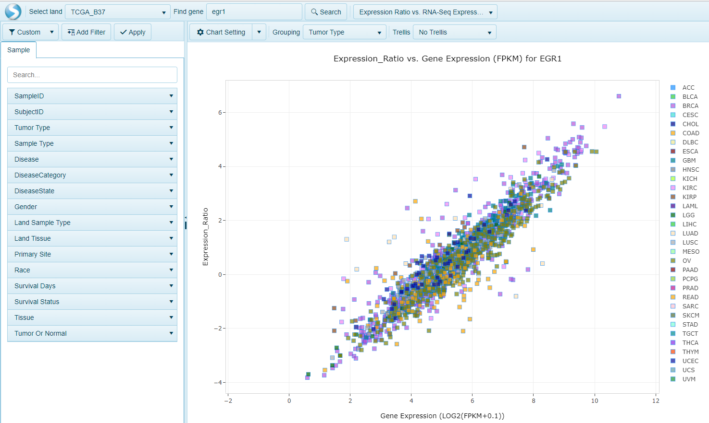

# Integration views

Omicsoft Lands have a number of OmicData types (such as copy number variation, expression and mutation data). In addition to viewing individual data types for samples, users can easily integrate these data types in integration views in Land Explorer.

# Expression vs. FPKM

## Micorarray Expression vs. Gene Expression (FPKM) View for genes in Land Portal

This view shows a single chart, for each gene, comparing Gene Expression Ratio (Sample vs Universal Human Reference) vs Gene Expression (Log2(RPKM + 0.1)). A value of 0.1 has been added to every RPKM value in order to log the data and account for potential values of 0.

# CNV vs FPKM

## Average Copy Number Log2 Ration vs. Gene Expression (FPKM) for genes View in Land Portal

This view shows a signle chart, for each gene, comparing Gene Expression Ratio (Sample vs Universal Human Reference) vs Average Copy Number Log2 Ratio. By default, all sample types (tumor and normal) are shown, users could visualize a geneset (multiple genes), and choose grouping by Tumor Type, Sample ID, Sample Type, Disease, etc.
