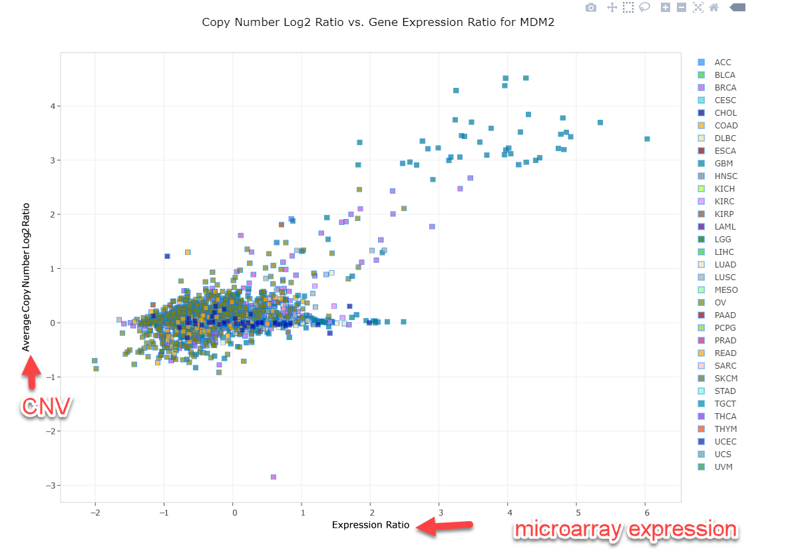

# Integration views

Omicsoft Lands have a number of OmicData types (such as copy number variation, expression and mutation data). In addition to viewing individual data types for samples, users can easily integrate these data types in integration views in Land Explorer. For example, users may be interested in whether a gene's copy number status correlates with its expression status. Alternatively, one may be interested in how well microarray and RNA-seq expression values of a gene correlate (where available).

## Microarray Expression vs. RNA-seq Expression

This view shows a single chart, for each gene, comparing Gene Expression Ratio (Sample vs Universal Human Reference) vs Gene Expression (Log2(RPKM + 0.1)). A value of 0.1 has been added to every RPKM value in order to log the data and account for potential values of 0.

## Copy Number Variation (CNV) vs. RNA-seq Expression

This view shows a single chart, for each gene, comparing Gene Expression Ratio (Sample vs Universal Human Reference) vs Average Copy Number Log2 Ratio. By default, all sample types (tumor and normal) are shown, users could visualize a geneset (multiple genes), and choose grouping by Tumor Type, Sample ID, Sample Type, Disease, etc.

## Copy Number Variation (CNV) vs Microarray Expression

Similar to the CNV vs RNA-Seq Expression view, when CNV and Microarray data is available for a gene, pairwise comparison of the two data points (y- and x-axis, respectively) can be done to see if there is a correlation between copy number and expression:

