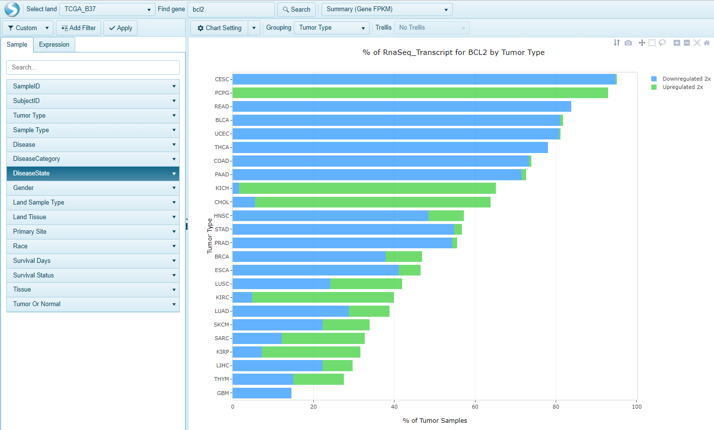
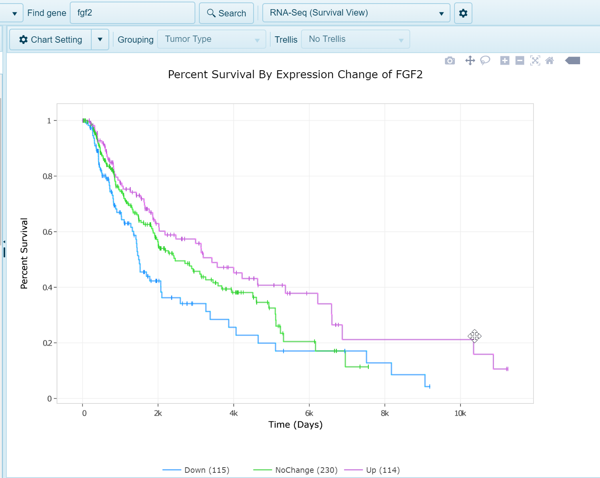
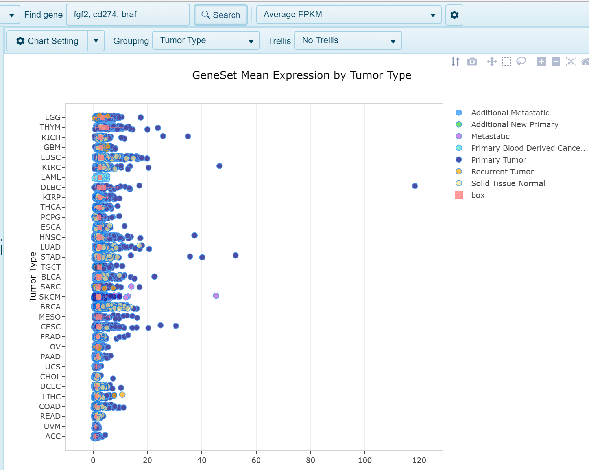
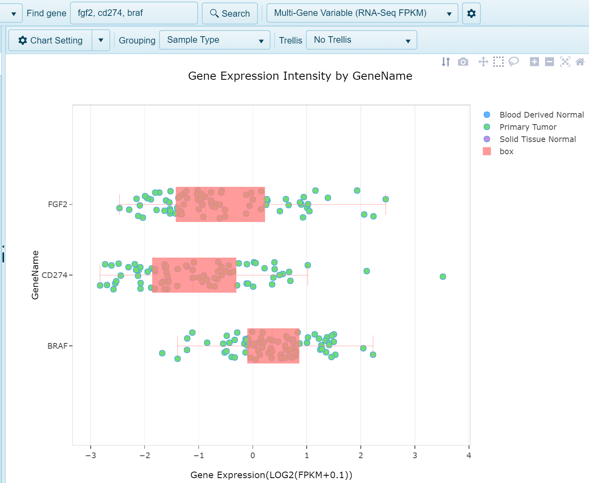

#RNA-Seq Quantification Views

RNA-Seq data that has been processed into land can be visualized to determine expression of a gene across various sample types, as well as differential transcript usage, and survival data (when available).

## Summary Gene FPKM

Easily search samples in Land that have a minimal up- or down-regulation for a gene of interest. For each gene, this view shows % of disease samples whose RNA-Seq expression is 2x up-regulated or 2x down-regulated, compared to normal samples in each group (e.g. Tumor Type). Samples are grouped by the primary grouping category by default.

### View Navigation
For each group, expression for normal samples is calculated as the average of Log2(FPKM + 0.1). For each tumor (disease) sample, when the Log2(FPKM + 0.1) value is larger than normal sample average by ExpressionUpRegulationCutoff or is smaller than normal average by ExpressionDownRegulationCutoff, this tumor sample is counted as up-regulated or down-regulated.

The percentage showing on X axis = ( # of tumor samples up-regulated or down-regulated) / ( # of all tumor samples in this group).

### Key Filters
Fold change cutoff can be changed under Expression in the left panel.

## Gene FPKM View

The Log2(FPKM + 0.1) expression of any gene can be visualized in this view. Expression is plotted on the x-axis and samples grouped on the y-axis by the chosen Grouping column in the metadata. In the below screenshot fgf2 expression is plotted on the x-axis and samples are grouped by Sample Type (Tumor or Normal). Each dot represents a single sample:

## Transcript FPKM View

This view shows the Transcript RPKM (Reads Per Kilobase per Million mapped reads) for the specified gene, organized by group (e.g. Tumor Type).

Each transcript is shown in a separate chart. When visualizing more than one gene, all transcripts (all genes) will be represented in individual plots. The X-axis shows Transcript RPKM while the Y-axis shows the group.

## RNA-Seq Survival View

In this view, when survival data is available and attributed to samples within the land, such as within OncoLand studies (TCGA, OncoGEO, etc.), a survival view will be generated. Samples will be grouped into quartiles (Up, upper 25% (Q1) expression of gene, Down, lower 25% (Q4), Mid (all remaining samples, Q2 and Q3)). Survival will be plotted on the Y-axis and time on the X-axis.

## Average FPKM View

When a user searches multiple genes, the default expression view will be the average FPKM view, where the expression of all genes searched is averaged for each sample. Each dot in the plot will represent a single sample, with expression plotted on the x-axis and samples grouped on the y-axis by the designated grouping category.

## Multi-gene Variable (FPKM) View

Similar to the gene FPKM view when searching a single gene, this view will generate plot expression on the x-axis and samples grouped on the y-axis by the GeneID. This grouping can be changed to reflect gene metadata. Trellising the view by metadata may provide better visualization of the gene expression. Values plotted are Log2(FPKM + 0.1).

## Multi-gene search: Heatmap FPKM View

Another way to visualize the expression of multiple genes is in a  heatmap view. The Heatmap FPKM view allows users to visualize the expression of all genes (columns) by all samples filtered (rows). Unbiased heirarchial clustering of genes and samples allows userss to find genes or samples that may exhibit similar gene signatures.

