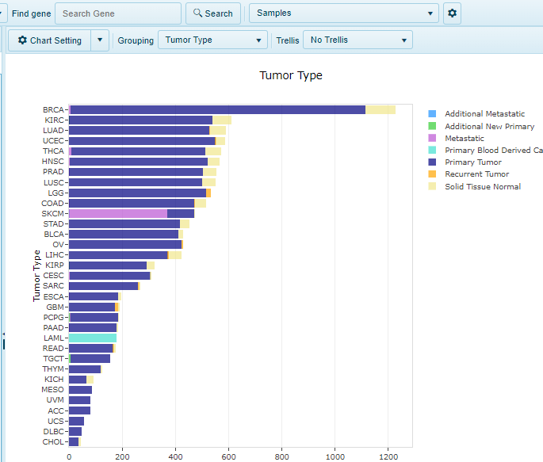

# Sample Distribution View

## Default View in Land Portal

The sample distribution view is the default view of all Lands. The view will is a stacked bar graph which is displayed with the primary grouping column on the y-axis and samples colored on the x-axis using the secondary grouping column. In TCGA land, this will correspond to Tumor type on the Y-axis and Sample type on the X-axis:

**General Options**

This view, like all views in Array Suite, is highly customizable. Users can: filter to samples of interest using columns from the MetaData and Clinical Data. Additionally, Custom Queries and Sample Sets can be used. These columns can also be used to determine the primary grouping (what will be plotted on the Y-axis, as well as the secondary grouping (what will be plotted on the X-axis). For example, to see what skin cancer samples have RNA Seq data available in TCGA, users can filter to a specific tumor type (SKCM), and use Sample Type (Primary) and RnaSeq_Transcript (Secondary) for the grouping:

**Chart Options**

Users of Array Studio will notice the familiar task controller in the Sample Distribution view, which can be used customize the view (i.e. change color, labels, flip axes). In addition, users can export information (SampleID, Primary and Secondary Grouping information) by Opening in Editor or a summary of the chart by opening in Excel
