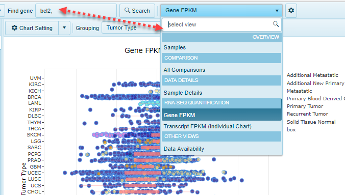
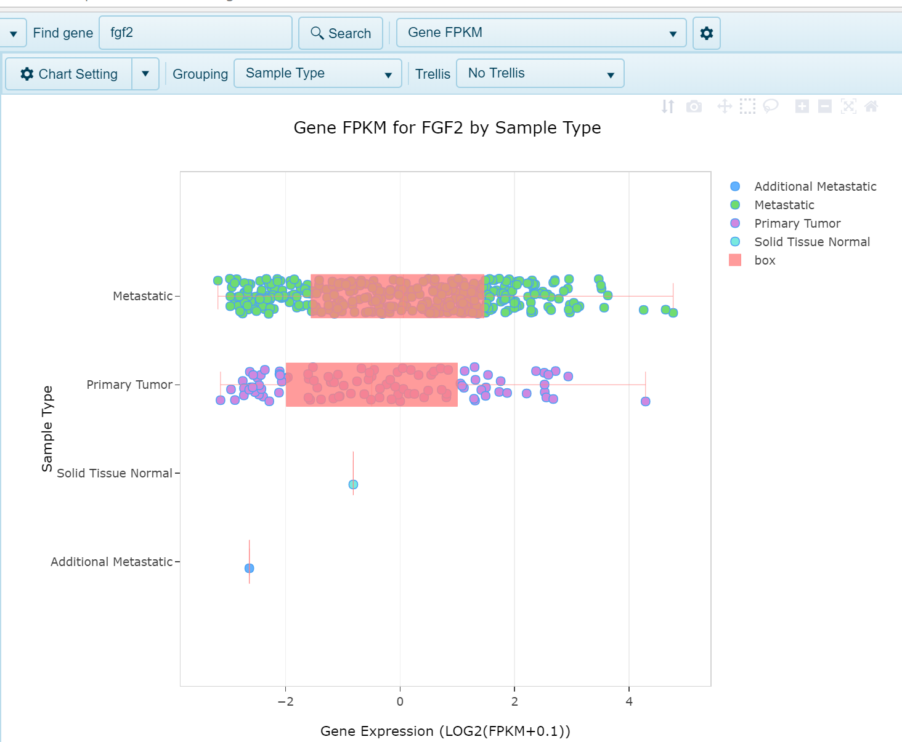
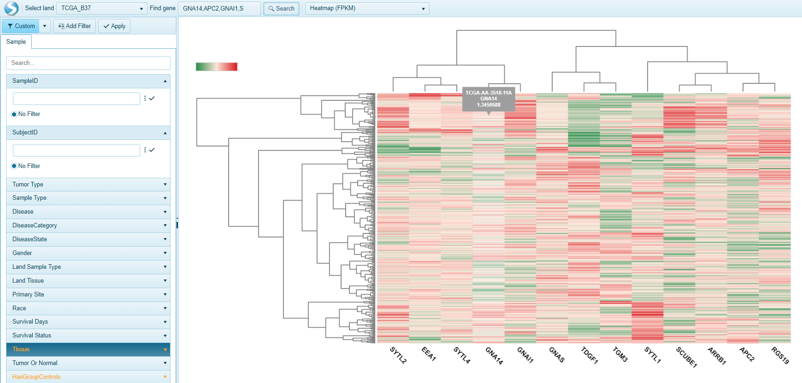

# Omicsoft Views

The Land Explorer features a number of views to visualize and interact with the data:

## Sample Level Views

In addition to the default **Samples** view above, other views like **Data Availability** and **Table View** are also available for users to query the sample data at a general level.

## Gene Level Views

When a user searches a gene or a gene set (multiple genes), there will be more views available, like DNA-Seq, Somatic Mutation Distribution, RNA-Seq, Gene FPKM, Transcript FPKM, etc.

## View types

Visualization of the data in Lands can come in many formats. Please find the description of each specific view found in Lands under the subsections for the Land Views page. Some basic themes exist for certain views:

### Distribution Views

Distribution views are generally histogram views. For Sample Level views, such as [Sample, Comparison or Project Distribution](./Sample Level Views/Samples.md), these views will plot the number of each available on the x-axis. Users can group these on the Y-axis using the metadata associated with that land. As a variation, quantification of mutation data can also be plotted in a Distribution view and found for both [DNA-seq](./Gene Level Views/DNAAlterationDistribution.md) and [RNA-seq](./Gene Level Views/RNASeqSomaticMutation.md) mutation calling. An example of a distribution view is shown below for TCGA, where all samples are plotted (with numbers of x-axis showing quantity). Under the Grouping option, Tumor Type is chosen - therefore the samples are grouped on the y-axis by the TCGA-designated tumor type.

### Expression Views

When users search for a single gene or multiple genes, various "omic-data" can be plotted in expression views. Among the data types supported in these views are [RNA-Seq](./Gene Level Views/RnaSeqQuantification.md), [microarray](./Gene Level Views/ExpressionRatio.md), as well as [Proteomics data](./Gene Level Views/Proteomics.md). [Copy Number](./Gene Level Views/CopyNumberViews.md)  and [Methylation](./Gene Level Views/Methylation.md) views are also similarly displayed in Land Explorer. In all such views, each point on the plot represents a single sample, and the x-axis will represent the expression (or copy number/methylation) status for that sample. Similar to the distribution views, samples will be grouped on the y-axis as defined by the user in the "Grouping" option at the top of the screen, as shown below, where fgf2 expression is grouped on the Y-axis by Sample Type.

For multi-gene searches, these views will often be represented as heat-map views such as below:

### Comparison Views

Gene level comparisons are plotted as scatter or "bubble-plots", where the fold change of a gene in a specific comparison is plotted on the x-axis and the size of the dot represents the significance of the gene's differential expression (larger means more significant):

### Details Views

Details views essentially will show a table, such as representing either the [Samples](./Sample Level Views/Data_Availability) or [Comparisons](./Sample Level Views/Comparison_Availability) available in the land, or the [metadata](./Sample Level Views/Sample_Details) associated with the samples that are filtered:

