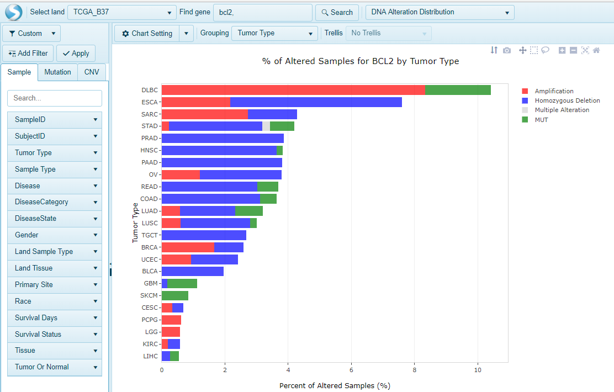
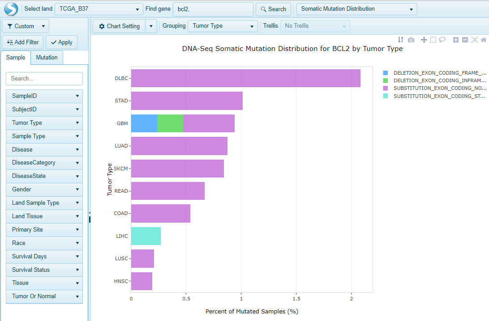
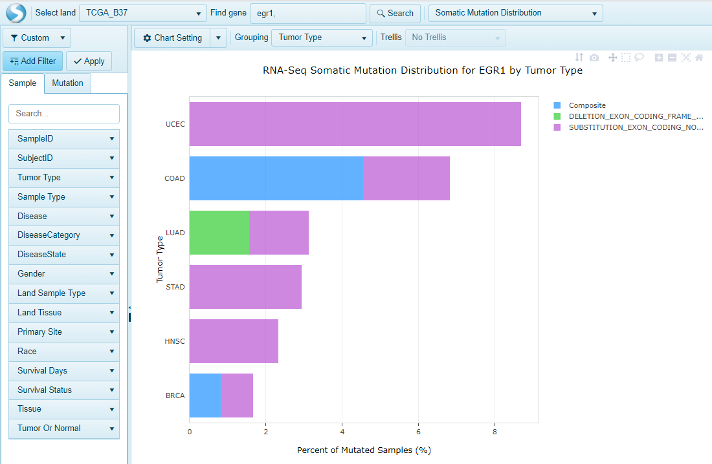

# Distribution

## Distribution views in Land Portal Explore

OmicSoft uses ArrayLand framework to deliver large data service results. ***Land Portal*** is the quickest way to explore OmicSoft Land data (OncoLand, DiseaseLand, GeneticsLand, and Internal Lands). The streamlined web interface uses our most popular visualizations to help researchers and clinicians explore OmicSoft Lands.

### DNA Alteration Distribution

Alteration distribution view shows alterations of all genes searched in the current view, limited to DNAseq alterations (mutations and copy number).

There will be one bar for each combination of Group (e.g Tumor Type), gene and alteration type (mutation or CNV).

Samples will be colored by alteration type (mutation, amplification, deletion, multiple alteration). Summary information (% samples mutated) will also be given. By default, Alteration.Omicprint and Alteration.Distribution are using GISTIC2 calling method with only "Amplification" and "Homozygous Deletion" checked. Multiple alteration represents more than one type of alteration type in the sample.

### DNA Seq Somatic Mutation Distribution

DNA Seq somatic mutation distribution view shows % of mutant samples organized by group (Tumor Type in this case) for a queried gene.

### RNA Seq Somatic Mutation Distribution

RNA Seq somatic mutation distribution view shows the RNA-Seq mutations, organized by group (Tumor Type in this case), each chart is an individual site mutation.

X-Axis shows percent of mutant samples, while Y-axis shows the group.

Use the Sample Tab to change filtering options on the samples (or to change grouping).

Use the Mutation tab to filter for specific Amino Acid mutation (OS_AAMutation), Annotation Type (i.e non-synonymous via OS_AnnotationType) and more.

Select one or more bars from the plot and choose Details for Selection to find out more details on the selected samples.

Choose RNA-Seq Mutation Details to see a table of all selected mutations with annotation.
