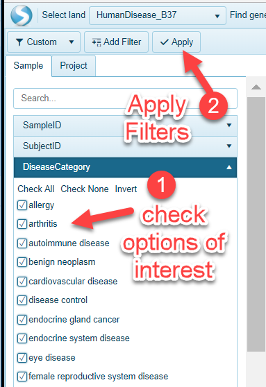
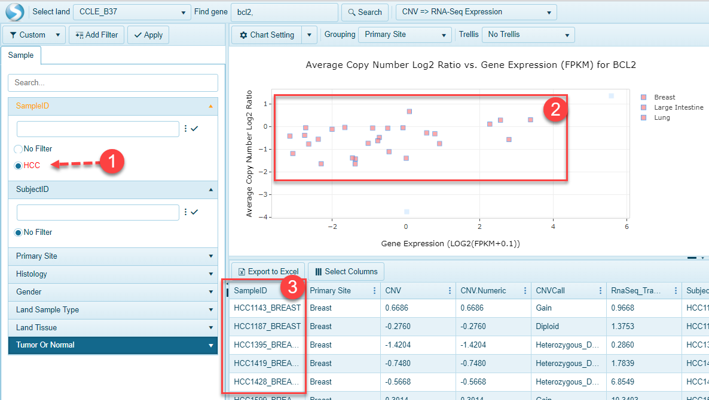
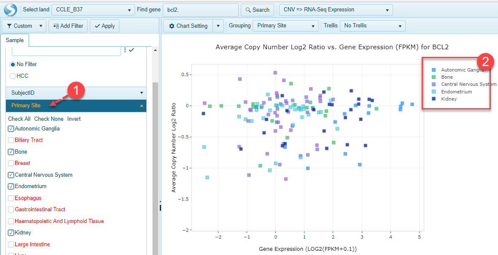
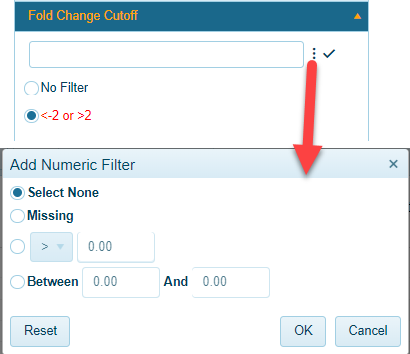
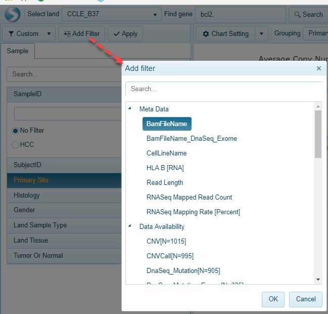
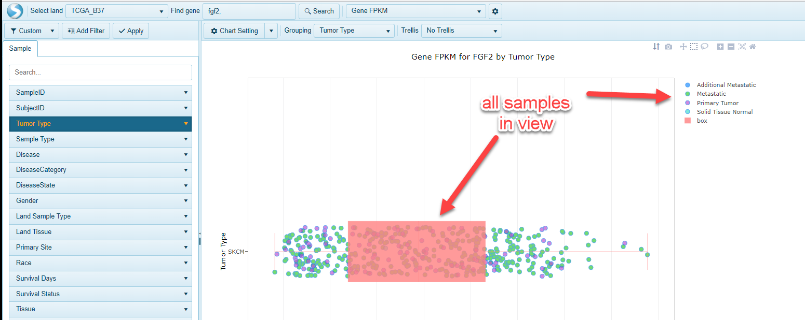
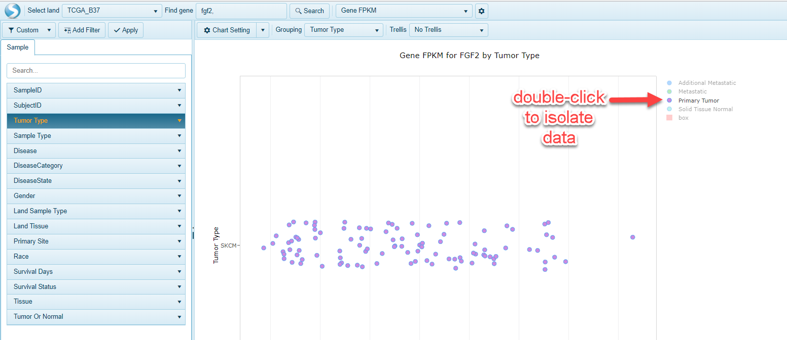
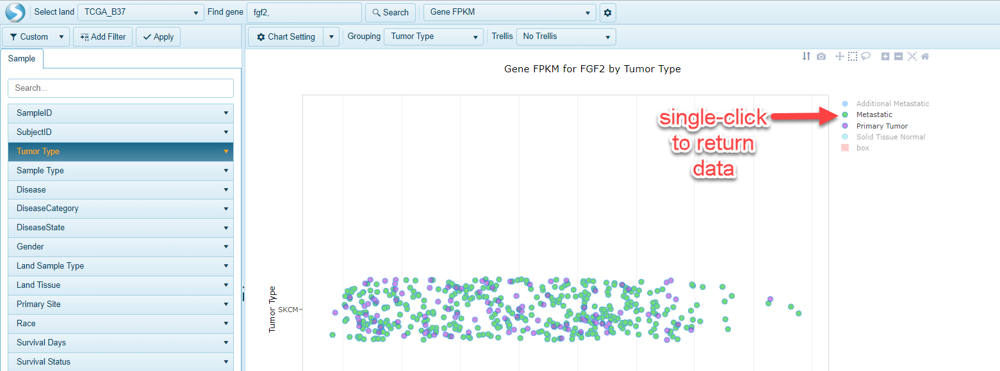

# Filtering in Land Explorer

All Samples, Comparisons, and Projects within Omicsoft Lands are associated with extensive metadata, which can be used to filter Land data to find the samples users are interested in.

## Filter Types

There are three main types of filters users could apply to Land metadata: 1) String, 2) Checkbox and 3) Numeric.

### String Filters

String filters could be on various metadata columns, such as Sample IDs, and Subject IDs, as shown above after applying "HCC" as the filter, only sample IDs started with "HCC" will show up in the scatter plot. After selecting all the data dots in the scatter plot, detail information about these samples could be found in the data table.

### Check Box Filters

Check Box options are available for Primary Site, Histology, Gender, Land Sample Type, Land Tissue, and Tumor Or Normal categories. As shown in the demo screenshot, after checking 5 primary sites, the samples with corresponding primary sites are shown in the scatter plot.

### Numeric Filters

Metadata with numeric characteristics (such as Age, Survival Days, Fold-change) can be filtered using exact numbers to filter, or a range of numbers. Clicking on the 3 dots for these filters will bring up a menu with preconfigured ranges:

Alternatively, users can simply type in a range. For example, in the option above, a user may be interested in comparisons where a gene has an absolute fold change greater than 2. In this case, simply type in "<-2 or >2". As shown in the screenshot above, this will create a new filter that will automatically be selected.

## Available Filters

For simplicity, the Land Explorer will display 10-15 (at most) of the most commonly used metadata for users to choose from. However, all metadata for the data available in the land is available, and users can simply add the metadata category of interest using the "Add Filter" option at the top of the filtering menu:

## Legend Filtering

In addition to using the metadata to filter the view on the left-hand side of the screen, users can also interact with the legend to filter samples of interest:

Simply double-click on an item in the legend, and only that item will appear in the view:

Single-clicking on "hidden" items will restore them in the view:

This feature may be useful to a user who may want to visualize where a particular sample type is represented in a view where a lot of samples are plotted.

## Additional filters

Users can also add Custom Queries to use gene level information to filter for samples of interest. Custom Queries will be available as filters in addition to the standard metadata. For more information on Custom Queries, please see [Custom Queries](../../Using Land Explorer/Queries/Custom_Query.md)
