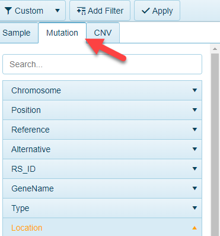
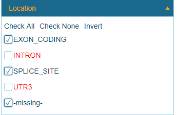
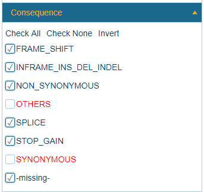
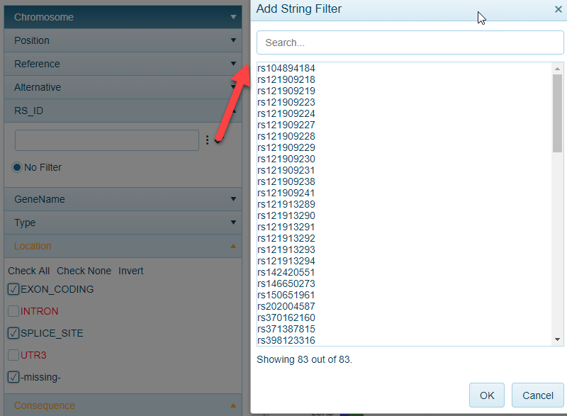
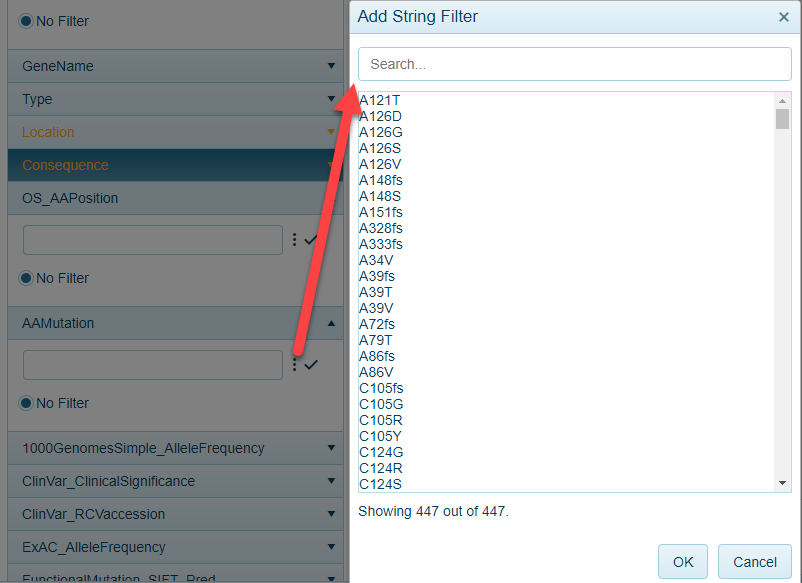
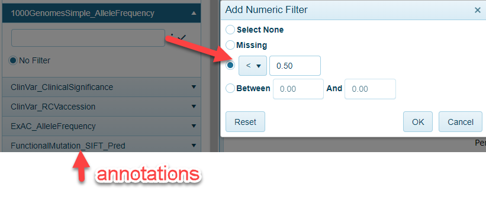

# Mutation Filters

For views that contain data from [DNA-seq](../../Land Views/Gene Level Views/DNAAlterationDistribution.md) and [RNA-seq](../../Land Views/Gene Level Views/RNASeqSomaticMutation.md), these views can be filtered to variants of interest. The Mutation tab will appear in these views for filtering:

The filters can be applied to:

## Location

By default, only non-synonymous coding mutations are applied in the Land. Users can filter to intronic and 3'UTR variant calls:

## Consequence

By default, only non-synonymous coding mutations are applied in the Land. Users can filter synonymous mutations, or perhaps more stringent filters using this Mutation metadata:

## RS_ID

RS_ID (when available) can be used to filter to specific mutations:

## AAMutation (Amino Acid Mutation)

All variants in a searched genes are represented in the mutation views. Users can filter to specific variants using this filter:

## Classifiers

A number of classifiers can be used to filter for variants that are not highly abundant in variant databases. For example, in the case below, users can filter to mutations in a gene with less than fifty percent frequency in 1000 genomes:

