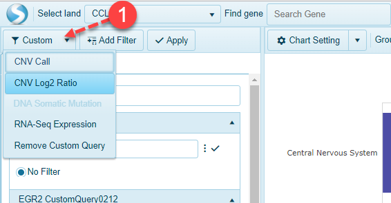
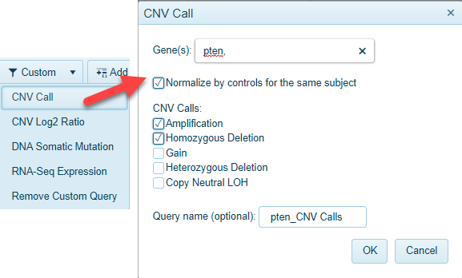
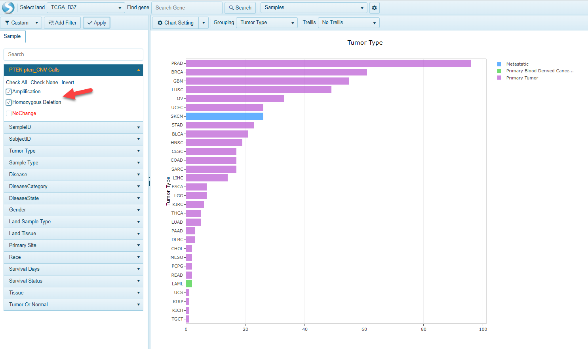
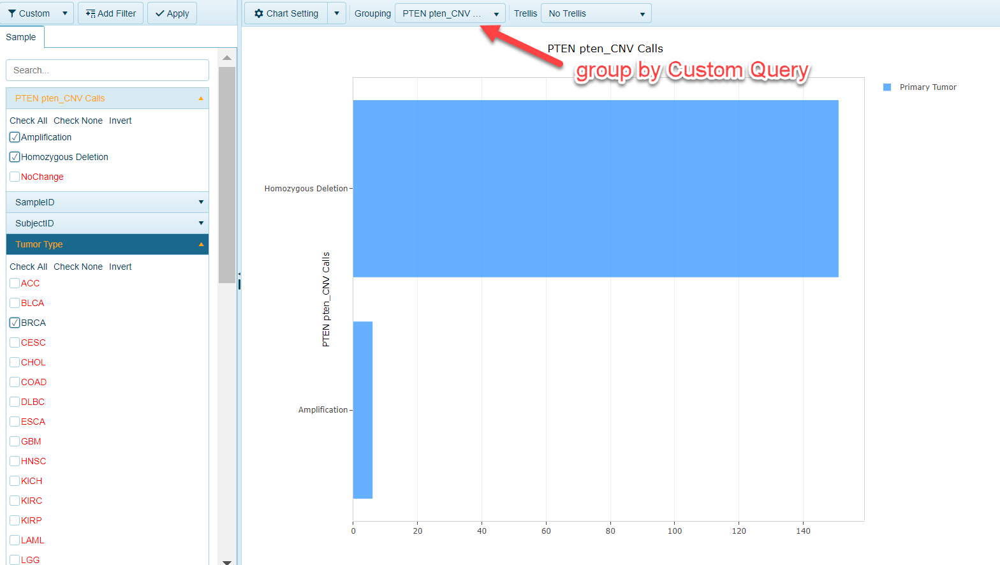
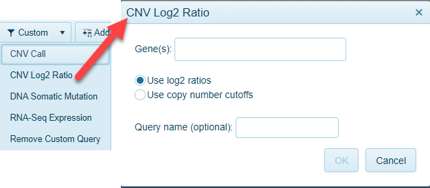
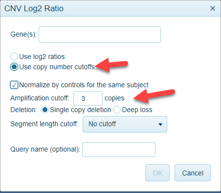
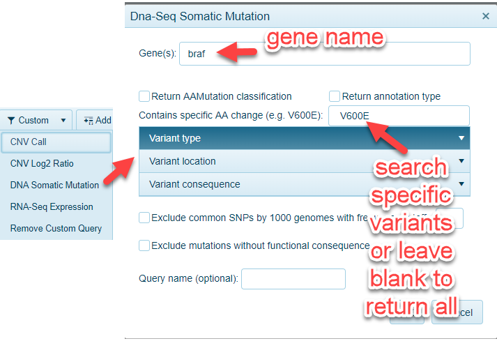
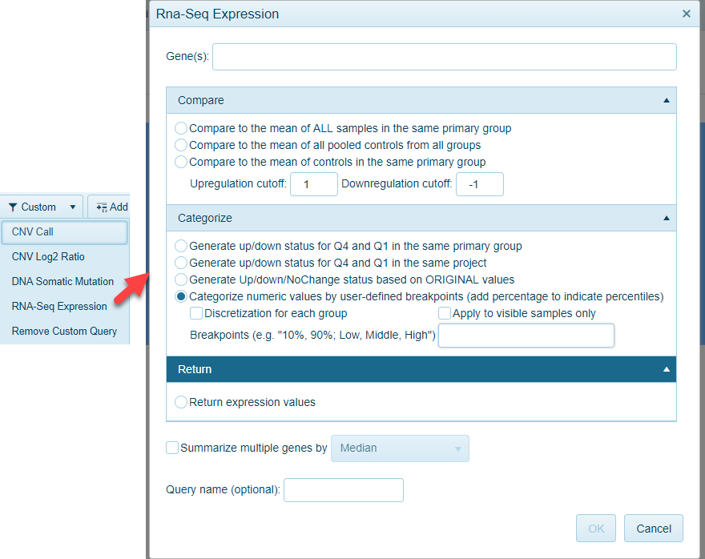
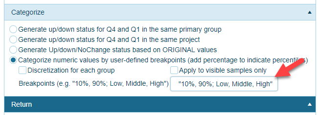
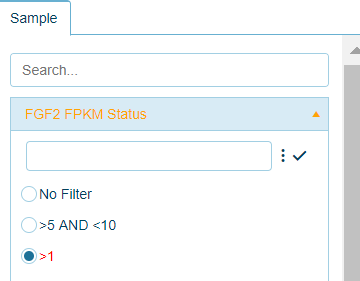

# Custom Query

Omicsoft Land users can add **Custom Query** in Land to group samples based on gene-level metadata obtained from "Omic"-data types such as mutation status, copy number status and expression. The customized query can be used to further filter and/or group samples in the view.

A number of custom queries can be generated, including:

## CNV call

Within many of the Lands in the OncoLand collection, such as TCGA, GISTIC2 calls for copy number status have been provided. Users can identify samples with alterations in copy number status as shown below:

In this example, all copy number gains (2 or more extra copies) or loss (2 missing copies) will be identified, with all remaining samples showing "No Change":

As shown above, removing the No Change samples will filter to only samples with CNV calls. For the gene PTEN, there are 60+ samples each for prostate and breast cancer with variations in copy number. To determine if these are mainly deletions or amplifications, the custom query can by used to group the samples as well. Filtering to BRCA and PRAD tumors, and grouping the samples by the query, it is clear that the majority of these samples have deletions affecting pten:

## CNV Log2 Ratio

Similar to the GISTIC2 calls, users can browse the log2 ratio derived from an Affymetrix SNP6 Copy Number Inference Pipeline:

As shown in the screenshot above, users can simply obtain log2 ratios for a gene across all samples, or group genes as with CNV call by specific criteria:

## DNA Somatic mutation

Users can query a gene's mutation status within the samples of the Land. Simply type in the gene name and click OK to return a custom query metadata for WT vs MUT assigned to all samples in the land. Alternatively, one can generate a more detailed mutation status returning all variants for that gene and assigning to the samples (by clicking the "Return AAMutation classification"). Users interested in samples with a specific allele can search it as shown below for BRAF.V600E:

The variant consequence dropdown will allow users to customize the type of mutations queried. By default, only non-synonymous mutations are selected.

## RNA-Seq Expression

A user can also attach metadata to samples based on the expression status of a gene of interest. Simply type in the gene name in the window at the top of the screen. Three options for output are available:

### Compare

Identify samples that have an up- or down-regulation of the gene compared to the average expression of the gene across all samples or within a group (i.e. Tumor Type).

### Categorize

Separate samples into quartiles based on the gene's expression, again pooling all samples in a group or a project. In this case, the samples in the upper quartile (Q4), will be designated as "Up", while the samples in the lower quartile (Q1) will designated "Down". All remaining quartiles (Q2 and Q3) will be pooled together and represented as "No Change".

As a variation of this approach, users can define the breakpoints at which to define the samples. Simply choose the option to "Categorize numeric values" - As shown in the example below, you could designate breakpoints to separate the low and high expression level samples (based on the top and bottom 10%):

With this latter option, users can perform the query across all samples, or use filter samples only (checking the option for "Apply to visible samples only"). By default, the categorization will happen across all samples - however, users can choose to define these breakpoints within specific groupings (i.e. Tumor Type or Disease Category, defined by Grouping column).

### Return Expression Values

For this option, users can simply append the sample metadata with the expression value of the gene that is queried. This can be used as a numeric filter to identify samples with a minimal (or maximal level of expression for this gene).

