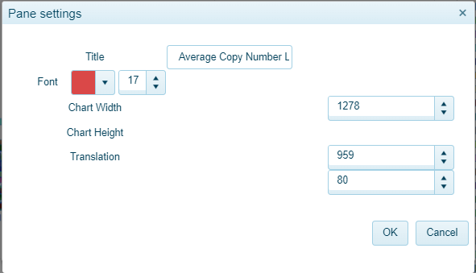
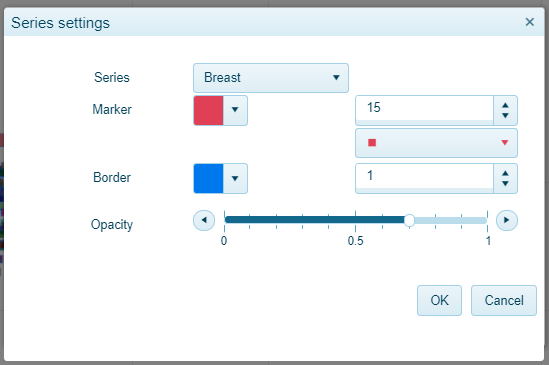
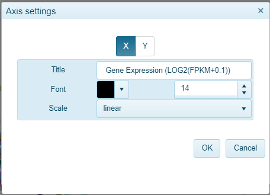
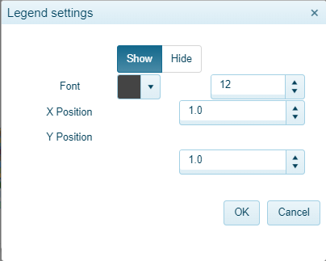
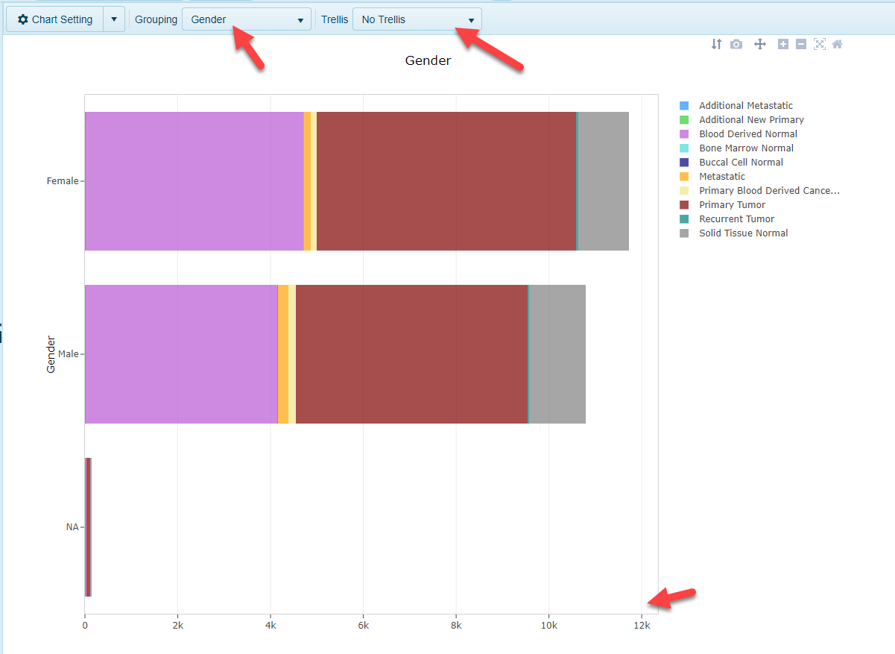
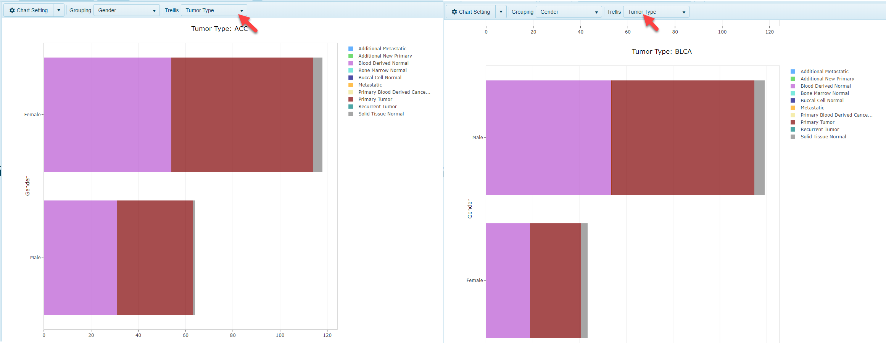

# View Controller

## View Controller in Land Explorer

The "View Controller" is an extremely important feature for the customization of views in the Land Explorer. Here, users can control the appearance of the view, such as color and size. In addition, users can determine the metadata used to group samples on the y-axis or choose to trellis a view by key metadata:

## Chart Setting

In the **Chart Setting** tab, there are 4 options, Pane, Series, Axis, and Legend.

### Pane Settings

Users could edit the Title, set the Width, Height, Font color and size in the **Pane** option setting window.

### Series Settings

The Color, shape, border, and opacity of each labeled group could be defined under **Series Settings**.

### Axis Settings

In the Axis Settings window, each X/Y label can be customized, as well as the scale of each axis.

### Legend Settings

The color and position of the figure legend could be defined in the **Legend Settings** window.

## Grouping

Any of the available metadata in the Land can be used to group the samples in the view. For example, in CCLE_B37, there are several options for grouping, SampleID, SubjectID, Primary Site, Histology, Gender, Land Sample Type, Land Tissue, and Tumor Or Normal.

## Trellis

Users may want to trellis a view in order to better visualize the distribution of samples with a certain grouping. For example, in TCGA, if a user groups the samples by Gender to see how many samples from each gender are present, it will be unclear as to which tumors these represent:

Simply adding a trellis for Tumor Type, now 33 charts (representing the 33 tumor types represented in TCGA) will be displayed, with a breakdown of gender for each:

