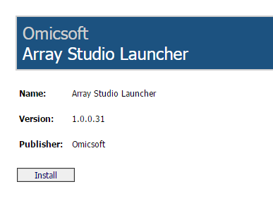
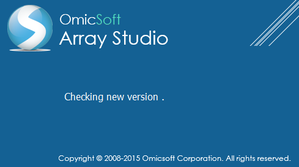

# Installing Array Studio

## Introduction update

*Array Studio* provides an integrated environment for analyzing and visualizing high dimensional data.
It is convenient for organizing and visualizing data with its *Solution Explorer*,
which organizes each project into two main sections ( *-Omic data* and *Table data*),
as well as different folders: *QC, Inference, List, Cluster, Text, Attachments* and other categories.
Multiple projects can be opened simultaneously in the *Solution Explorer*,
and data can be shared among projects.
Each view is controlled by a *View Controller*,
which performs view customization, applies filtering, and displays legends.
Furthermore, its interactive visualization technique provides the details of data with the *Details Window* and the *Web Details On-Demand*.

This section will cover installation of Array Studio.
The next section will cover downloading of the data and chip normalization.
In the process, the user will become familiar with some of the features of the *Workflow Window* and *Solution Explorer*, as well as getting acquainted with the *TableView* in *Array Studio*.

##Prerequisites and installation of Array Studio

While Array Studio does not have any specific requirements for memory or processor speed, the following are suggested for successfully finishing this tutorial:

*   *2.0GHz 32-bit (x86) or 64-bit (x64) processor*

*   *512MB of RAM (1GB recommended)*

    - *2GB of RAM for ExonArray, SNP/Genotyping, and CNV analysis*

*   *2GB hard drive (4GB recommended)*

*   *800\*600 display resolution (1024\*768 recommended)*

To install Array Studio, (in Internet Explorer) proceed to [link](http://omicsoft.com/software/ArrayStudioLauncher/publish.htm )

Click *Install* to install *Array Studio Launcher*.

Note:

*   The version number listed here is  for Array Studio Launcher, not the Array Studio program. Array Studio Launcher is a tool to download Array Studio online.

*   If you have not previously installed the .NET Framework Version 3.5 on your machine, the website will prompt you to do so.

The next time you would like to access Array Studio, you can double click the Array Studio Launcher icon file that was automatically created on your desktop (and in the start menu). Alternatively, you can go to the same website (you can easily bookmark the page) and click the *Install* button again. If the Array Studio has been updated since your last use, the software will automatically update itself before launching. In other words, you will be able to immediately access the software. **Note**: Bioinformatics is a fast evolving field. We are developing new analysis functions and options every day. The latest version is updated frequently.

If the installation of the .NET Framework 3.5 is required, a dialog box will appear with a security warning after installing .NET Framework. Click *Run* again to proceed and the application will install. Next time you use Array Studio, you can easily launch the program by just clicking the *Run* button.

## Microarray Data and other Data types
In Bioinformatics research, there are many different data sources such as microarray, sequence data, CNV data, etc. In Array Studio, we divide genetic data into two groups:
One is called -Omic data, which is basically a data matrix with annotation for both columns (sample information) and rows (gene/probe set/transcript information),
and NGS data, which contains reads data. Microarray data is a standard example of -Omic data.

We have provided additional tutorials to analyze the multiple types of data that users may obtain, but in this tutorial we will focus on microarray data. Microarray data can be further categorized into many sub-classes according to the chip or platform. It is also important to know that many methods mentioned in this tutorial can also be applied to other -Omic data, such as RNAseq quantification data. For example, when users load RNAseq data as NGS data, Array Studio provides modules to compute gene/transcription quantification, which is also stored as -Omic data.  It shares the same views as microarray data, and users can apply many methods mentioned in this tutorial to such -Omic data. Therefore, we recommend all users begin with this microarray tutorial to understand the basics of how to analyze -Omic data in Array Studio before exploring other tutorials.
