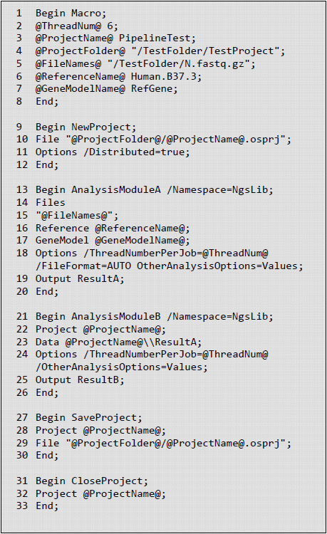
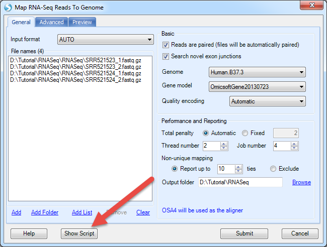

# Run Oscript

## OSCRIPT
Oscript file (file extension .oscript) contains a list of omicsoft procs that can be sequentially excecuted to process user's data in a local or server project. A proc is a script corresponding to a data process operation in *Array Studio* GUI. A proc starts with keyword BEGIN and the name of the proc, and end with keyword END and semicolon ;. Users may obtain a template of the procs by following the Export Oscript from GUI section.

A Oscript may include procs for macro definition, initiation of project, analysis modules, saving and closing project. The figure below provides a simplified example showing the structure of an Oscript.

As shown in the example, a local Omicsoft project is created and saved as an OSPRJ file (see line 9-12 in the figure below). The OSPRJ file records all analysis steps and results (or links to large result files such as BAM files) as the analysis modules are performed. NGS projects are specified as  distributed  projects, which save different analysis results in separate files. Undistributed projects save all results in a single file. Input for analysis modules can be either raw sequence files (specified by  Files ) or intermediate data objects (specified by  Project  and  Data ). One advantage of working in the OSPRJ environment is that all data objects generated in preceding modules can be passed onto downstream modules smoothly by calling the data object name. For example, the output data object in AnalysisModuleA is defined as  ResultA , which can be directly used by AnalysisModuleB as input (see line 13-26 in the figure below). Whenever new analysis results need to be saved in the OSPRJ file, SaveProject is called, which usually happens before closing a project (see line 27-30 in the figure below). Details of options used in each module can be found in our online collection of Oscript templates.

Macro proc are used for parameters that are frequently called in the Oscript, including project-specific parameters (project name, project folder and input files) and parameters shared across modules (thread number, paired-end or single-end layout, reference genome and gene model). Macros are defined as @ParameterName@ Value (see line 1-8 in the figure below).

A full example OScript can be found at
[^link^](http://www.arrayserver.com/wiki/index.php?title=OmicScript_pipeline_for_RNA-Seq_data_analysis )

Oscripts may be launched from Array Studio or from a linux or windows Oshell command line.

## Export Oscript Procs from GUI

Each analysis module in the GUI corresponds to a unique proc section in human-readable Oscript, for instance MapRnaSeqReadsToGenome for RNA-Seq alignment and NgsQCWizard for raw NGS data quality control. The OScript proc can be obtained by clicking on  Show Script  button after setting all parameters in GUI. In RNA-Seq alignment module, for example, after setting all parameters, user can click  Show Script  to get MapRnaSeqReadsToGenome OScript proc. The user can modify input, analysis parameters and output directly in the OScript for other jobs.

A text file will open with the full OScript:

	 Begin MapRnaSeqReadsToGenome /Namespace=NgsLib;
	 Files
	 "D:\Tutorial\RNASeq\RNASeq\SRR521523_1.fastq.gz
	 D:\Tutorial\RNASeq\RNASeq\SRR521523_2.fastq.gz
	 D:\Tutorial\RNASeq\RNASeq\SRR521524_1.fastq.gz
	 D:\Tutorial\RNASeq\RNASeq\SRR521524_2.fastq.gz";
	 Reference Human.B37.3;
	 GeneModel OmicsoftGene20130723;
	 Trimming /Mode=TrimByQuality /ReadTrimQuality=2;
	 Options /ParallelJobNumber=4 /PairedEnd=True /FileFormat=AUTO /AutoPenalty=True /FixedPenalty=2
	 /Greedy=false /IndelPenalty=2 /DetectIndels=True /MaxMiddleInsertionSize=10
	 /MaxMiddleDeletionSize=10 /MaxEndInsertionSize=10 /MaxEndDeletionSize=10 /MinDistalEndSize=3
	 /ExcludeNonUniqueMapping=False /ReportCutoff=10
	 /OutputFolder="D:\Tutorial\RNASeq" /ThreadNumber=2 /InsertSizeStandardDeviation=40
	 /ExpectedInsertSize=300 /MatePair=False /InsertOnSameStrand=False
	 /InsertOnDifferentStrand=True /QualityEncoding=Automatic
	 /CompressionMethod=Gzip /Gzip=True /SearchNovelExonJunction=True
	 /ExcludeUnmappedInBam=False /KeepFullRead=False /Replace=False
	 /Platform=ILLUMINA /CompressBam=False;
	 Output ;
	 End;

## Run Oscript from Array Studio Tools | Run Script
Users can submit an oscript via Array Studio GUI **Tools | Run Script**. It is typically used to work on local projects and less frequently in server projects. For large-scale server projects, we recommend to use pscript that has an optimized workflow for sample registration, job submission and job monitoring (see next chapter for more details).

Once an oscript is saved with extension .oscript, users may click on **Tools | Run Script** to open the window to submit the .oscript file. Run Script may submit jobs to a local machine for a local project, and a server (and HPC cluster) for a server project, depending on the procs used in the oscript.

If an oscript does not contain a connectServer proc, the oscript submitted via **Tools | Run Script** will run in the local machine where Array Studio resides. One example is the oscript in the figure at the begining of this chapter. Another example is shown below to create an local project, map DnaSeq reads, save and close the project:

	 Begin Macro;
	 @ThreadNum@ 6;
	 @ProjectName@ "testProject";
	 @ProjectFolder@ "/local/data/support/test";

	 @FileNames@
	 "/workspace/ws03/IData/TestDataSets/HumanDNASeqPaired/test_1.fastq.gz
	 /workspace/ws03/IData/TestDataSets/HumanDNASeqPaired/test_2.fastq.gz";

	 @CompressionMethod@ None;
	 @Gzip@ False;
	 @PairedEnd@ True;
	 @ReferenceName@ Human.B37.3;
	 End;

	 Begin NewProject;
	 File "@ProjectFolder@/@ProjectName@.osprj";
	 Options /Distributed=True;
	 End;

	 Begin MapDnaSeqReads /Namespace=NgsLib; Files
	 "@FileNames@";
	 Reference @ReferenceName@;
	 Trimming /Mode=Composite /LeftTrimming=0 /RightTrimming=0 /ReadTrimQuality=2 /ReadTrimSize=65536;
	 AdapterStripping 3'End /AdapterSequence=CTGTCTCTTATA /ExcludeUnmatched=False;
	 Options /PairedEnd=@PairedEnd@ /FileFormat=FASTQ /AutoPenalty=True /FixedPenalty=2 /IndelPenalty=2
	 /DetectIndels=False /Greedy=False /IndexMode=14Mer /ExcludeNonUniqueMapping=True /ReportCutoff=2
	 /WriteReadsInSeparateFiles=True
	 /OutputFolder="@ProjectFolder@/BAMOutput"
	 /MaxMiddleInsertionSize=10
	 /MaxMiddleDeletionSize=1000 /MaxEndInsertionSize=10 /MaxEndDeletionSize=10 /MinDistalEndSize=3  
	 /GenerateSamFiles=False /ThreadNumber=@ThreadNum@ /ExpectedInsertSize=300
	 /InsertSizeStandardDeviation=40 /QualityEncoding=Automatic /CompressionMethod=@CompressionMethod@
	 /Gzip=@Gzip@ /ExcludeUnmappedInBam=True
	 /KeepFullRead=False /MapRead=True /MapReverseComplement=True /Version=4 /ParallelJobNumber=1
	 /BamSubFolder= /Platform=ILLUMINA /Replace=False /LocalAlignment=True;
	 Output Alignment;
	 End;
	  
	 Begin SaveProject;
	 Project @ProjectName@;
	 File "@ProjectFolder@/@ProjectName@.osprj";
	 End;
	  
	 Begin CloseProject;
	 Project @ProjectName@;
	 End;

To run jobs on a server and cluster via **Tools | Run Script**, a connectServer proc is required to connect to an array server. The procs that are intended to run on server are also required to be compatible to server jobs. Please refer to the proc documentation for server job compatability. In some cases, a statement /RunOnServer=True is required in a proc in order for the proc to be excecuted on the server.

Here is an example of an oscript that was submitted via **Tools | Run Script** to work on a server project. The script defined some parameters in a Macro proc, connected to an array server, created a new project in the server, performed RnaSeq alignment in a cluster, saved and closed the project in the server.

	 Begin Macro;
	 @ThreadNum@ 6;
	 @ProjectName@ "AlignmentProject10";
	 @ProjectFolder@ "/local_data/TestDataSets/tem/tem_20170720";
	 @FileNames@
	 "
	 /local_data/TestDataSets/SRR521462_1.fastq
	 /local_data/TestDataSets/SRR521462_2.fastq
	 ";
	 @JobNumber@ 4;
	 @ThreadNumber@ 4;
	 @DesignFile@ "/local_data/TestDataSets/tem/tem_20170720/design3.txt";
	 End;

	 Begin ConnectServer;
	 Server "tcp://192.168.3.226:9065" /User=xxx /Password=xxxxx;
	 End;

	 Begin NewProject;
	 ServerProject "@ProjectName@";
	 Options /Distributed=True;
	 End;

	 Begin MapRnaSeqReadsToGenome /Namespace=NgsLib /RunOnServer=True;
	 Files
	 "@FileNames@";
	 Reference Human.B38;
	 GeneModel Ensembl.R82;
	 Trimming /Mode=TrimByQuality /ReadTrimQuality=2;
	 Options
	 /PairedEnd=True /FileFormat=FASTQ /AutoPenalty=True /FixedPenalty=2 /Greedy=false /IndelPenalty=2
	 /DetectIndels=False /MaxMiddleInsertionSize=10 /MaxMiddleDeletionSize=10 MaxEndInsertionSize=10
	 /MaxEndDeletionSize=10 /MinDistalEndSize=3 /ExcludeNonUniqueMapping=False /ReportCutoff=10
	 /WriteReadsInSeparateFiles=Tru  /OutputFolder="@ProjectFolder@/@ProjectName@/BAM"
	 /GenerateSamFiles=False /ParallelJobNumber=@JobNumber@ /ThreadNumber=@ThreadNumber@
	 /InsertSizeStandardDeviation=40 /ExpectedInsertSize=300 /MatePair=False /InsertOnSameStrand=False
	 /InsertOnDifferentStrand=True /QualityEncoding=Automatic /CompressionMethod=Gzip /Gzip=True
	 /SearchNovelExonJunction=True /ExcludeUnmappedInBam=False /KeepFullRead=False /Replace=False
	 /Platform=ILLUMINA /CompressBam=False;
	 Output RNASeqAlignment;
	 End;

	 Begin SaveProject;
	 Project @ProjectName@;
	 Options /Distributed=True;
	 End;

	 Begin CloseProject;
	 Project @ProjectName@;
	 End;

## Run Oscript from Array Studio **Tools | Run Script (Send To Queue)**
If a user has logged into Array Server from Array Studio, the user may click on **Run Script (Send To Queue)** to submit an oscript to work on a server project and run jobs in HPC cluster. Users may monitor the job status in **Server | Manage Server Jobs**.

Please note that the connectServer proc is not required in the oscript in this case since the user has logged into Array Server. Please also note that the Macro proc can not currently be used for constructing paths if the oscript is submitted via **Tools | Run Script (Send To Queue)**.

Below is an example oscript that can be submit via Run Script (Send To Queue) to run on a server:

	 Begin MapRnaSeqReadsToGenome /Namespace=NgsLib /RunOnServer=True;
	 Files
	 " /local_data/TestDataSets/SRR521462_1.fastq
	 /local_data/TestDataSets/SRR521462_2.fastq";
	 Reference Human.B38;
	 GeneModel Ensembl.R82;
	 Trimming /Mode=TrimByQuality /ReadTrimQuality=2;
	 Options
	 /PairedEnd=True  /FileFormat=FASTQ /AutoPenalty=True /FixedPenalty=2 /Greedy=false
	 /IndelPenalty=2 /DetectIndels=False /MaxMiddleInsertionSize=10  
	 /MaxMiddleDeletionSize=10 /MaxEndInsertionSize=10 /MaxEndDeletionSize=10
	 /MinDistalEndSize=3 /ExcludeNonUniqueMapping=False /ReportCutoff=10
	 /WriteReadsInSeparateFiles=True
	 /OutputFolder="/local_data/TestDataSets/tem/tem_20170720/AlignmentProject/BAM"
	 /GenerateSamFiles=False /ParallelJobNumber=4 /ThreadNumber=6
	 /InsertSizeStandardDeviation=40 /ExpectedInsertSize=300 /MatePair=False
	 /InsertOnSameStrand=False /InsertOnDifferentStrand=True
	 /QualityEncoding=Automatic /CompressionMethod=Gzip /Gzip=True
	 /SearchNovelExonJunction=True /ExcludeUnmappedInBam=False /KeepFullRead=False
	 /Replace=False /Platform=ILLUMINA /CompressBam=False;
	 Output RNASeqAlignment;
	 End;

	 Begin SaveProject;
	 Project AlignmentProject;
	 Options /Distributed=True;
	 End;

## Run Oscript from Windows or Linux Oshell Commandline
Users may also run an oscript from a single windows or linux command line (oshell commandline) by using Omicsoft's oshell.exe function in Omicsoft Oshell environment. The Oshell Environment is another Omicsoft package that is independent from Array Server and Array Studio. Users may need to obtain a license from Omicsoft to install the package. Please contact omicsoft.support@qiagen.com for more information.

By running with OShell command line, users do not need to interact with the GUI. The Oshell Environment can work on a local project as a commandline version of Array Studio GUI, and also can interact with an Array Server to work on a server project.

The requirements of the oscripts for Oshell commandline is the same as the oscript for **Tools | Run Script (Send To Queue)**. Specifically, Marco proc allows for path construction. The oscript will be ran in a server (and cluster) if it has connectServer proc and server job compatible procs, and would run in the local machine if otherwise. In fact, the example oscripts in **Run Oscript from Array Studio Tools | Run Script** can be directly launched from the oshell commandline.

Users may save the file as test.oscript and run using command line:

If OShell is installed on Windows (one line command):

	 C:\Oshell\oshell.exe --runscript C:\Users\user\Documents\Omicsoft C:\tmp\test.oscript
	 C:\Users\user\Documents\OmicsoftTmpDirectory > C:\tmp\testrun.log

If Oshell is installed on Linux and can be run using mono (one line command):

	 /opt/mono-2.10.9/bin/mono /home/user/Oshell/oshell.exe --runscript /home/user/OmicsoftHome
	 /tmp/test.oscript /home/user/OmicsoftTmp /opt/mono-2.10.9/bin/mono > /tmp/testrun.log

## Wrapping External Tools into Oscript

Omicsoft has implemented external script (EScript) integration to build pipelines/workflows using public bioinformatics tools. Since most third-party tools are Linux-only, users should run Escript in Oshell or ArrayServer on a Linux machine.

Escript can wrap and run public bioinformatics tools, such as BWA, Bowtie, Tophat, and Cufflink, in OmicSoft Project Environment. The results from public tools can be imported as a table in Array Studio seamlessly. Escript runs can be submitted to the job queue in ArrayServer and run in Grid Engine if the server has been configured. Escript jobs are monitored and tracked in ArrayServer.

Here is a local (as opposed to server) Escript using a simple example wrapping Bowtie. The script assumes that:

*   Bowtie is installed and can be found in PATH
*   ebwt indexes are located in /idx

Example Script:

	 Begin RunEScript;
	 Files
	 "/home/user/Test/_Raw/SRR243575.s.1.fastq
	 /home/user/Test/_Raw/SRR243575.s.2.fastq";	 
	 EScriptName Bowtie;
	 Command mkdir "/tmp/testRun";
	 Command bowtie "/idx/hg19" -1 "%Path1%" -2 "%Path2%" -p 8 -a -m 1 -v 2 -t -S "/tmp/test.sam";
	 Options /ParallelJobNumber=1 /ThreadNumberPerJob=8 /Mode=Paired /ErrorOnStdErr=False;
	 End;

	 Begin AddMappedDnaSeqReads /Namespace=NgsLib;
	 Files
	 "/tmp/test.sam";
	 Reference Human.hg19;
	 Options /FileFormat=SAM /ThreadNumber=4 /NoCopy=True;
	 Output BAMFile;
	 End;
