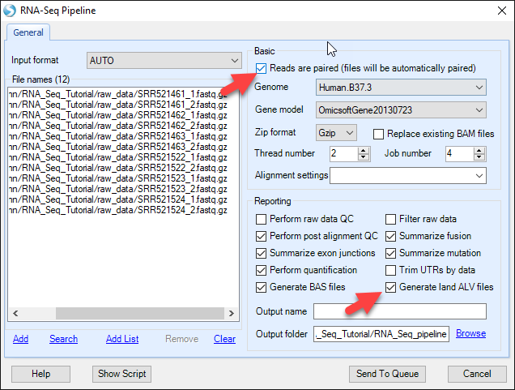

# Add From RNA-Seq Pipeline

Users have two options to perform RNA-Seq analysis -- one is to run through RNA-Seq pipeline, the other is to run step by step.

**Add From RNA-Seq Pipeline**, as dicussed in this chapter, allows users to finish the whole RNA-Seq analysis in a single click. Based on a user's selections, Array Studio will run the following pipeline:

To perform RNA-Seq pipeline analysis, choose **Add NGS Data - Add From Pipeline - RNA-Seq Pipeline**

For each step in the RNA-Seq pipeline, the user can choose the default parameters found in Array Studio or customize settings such as genome version, gene model, alignment stringency and reporting options. To ease in the sharing of data after processing, it is recommended that the user choose the **Reporting** option to *Generate land ALV files*.

If users want to add more user-defined options in each step, users can perform RNA-Seq analysis step by step starting with raw data QC and alignment. The step-by-step methods will be discussed in the next chapters.

If the input files are in FASTQ, FASTA, or QSEQ format, then the data will be aligned in the same way as by **Add RNA-Seq Data - Map Reads To Genome (Illumina)** which will be discussed in the Chapter 5, with the default parameters. For this module, select the default options, and check "Reads are paired" as these reads are paired. These files will be automatically paired during the pipeline analysis. Depending on your server options, adjust the number of threads. Job number will determine how many parallel jobs (such as alignments) will be performed at once. This number should not exceed the number of samples. Click Send to Queue and the analysis will begin.

This could take hours, depending on the number of threads/jobs or type of computer (64-bit/32-bit), etc.

After alignment, it will load BAM files once and finish all selected downstream analyses.

If user is using BAM files as input, the module will use AddGenomeMappedRnaSeqReads to add alignment file as NgsData directly for all downstream analysis. The pipeline has been tested briefly for external BAM files generated by other aligners (outside of Omicsoft). We are recommending users starting from raw (fastq/fasta) files. If you have BAM files and would like to use the Array Studio RNA-Seq Pipeline, you can covert these files back to fastq.gz files by using **NGS | Tools | Convert Files**.

The pipeline module is particularly better than individual modules when enabling cloud based analysis with less file transfers and saving EC2 machine setup time.
