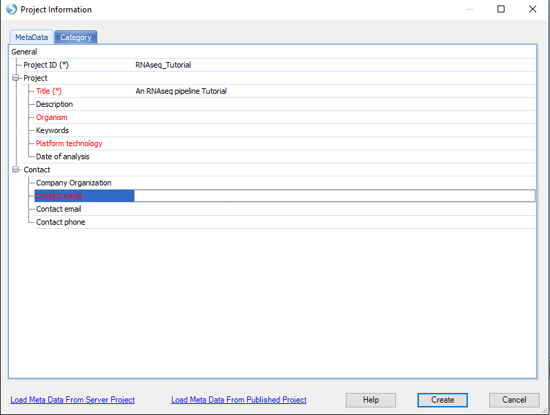
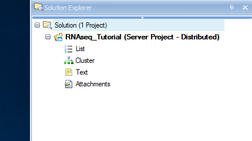

# Create Array Studio Project

Array Studio provides an integrated environment for analyzing and visualizing high dimensional data. It is convenient in organizing and visualizing data with Solution Explorer, which organizes data/results as projects. User can create a local project which uses the local computer power to do analysis, or create a server project which will run all analyses in Array Server. Server-based analysis allows the user to run jobs on a remote server (Linux or Windows), which usually has more computing power than a desktop computer. The Array Studio client software, installed on a local desktop machine, is used to interact with the ArrayServer (like a server terminal). Tasks such as job submission, monitoring, file transfer and data visualization can be done through the client software. Moreover, ArrayServer has a built-in scheduling system that supports high performance computing clusters (both SGE and PBS/Torque), accelerating the analysis of tremendous amounts of NGS data.

In this tutorial, we will create a server project to run the analyses. This assumes the user has Array Server installed - the user can run this tutorial as a local project and analysis steps are almost the same as described in this tutorial.

Once Array Studio has been opened, under the **Server** tab at the top of the screen, log in to the server where Array Server is running. Click **File | New Server Project** from the File Menu (also can be accessed via the **New** button on the toolbar).

**Note to "Local" mode users:** If you are using this tutorial in *Local* mode for any Next Generation Sequencing datasets, choose the option to create a distributed project. Clicking the Browse button will allow the user to specify the location for the dataset. It is required that the user has approximately 100GB of available space on their hard drive for this experiment. The general rule of thumb is that the user has 3x the size of the raw data files available for the import of data. The user might also want to specify a different location for the "Omicsoft Home" folder using **Tools Menu | Preferences | Advanced**.
This will place the Omicsoft folder, which is used as storage for any genome reference index and temp files for the process, at a specified user location.

Click **Create** to store the project and you will see your empty project in the **Solution Explorer**:

