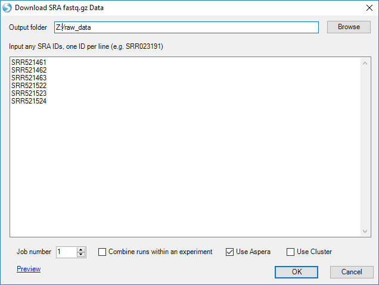

# Introduction

## ArrayStudio

Array Studio runs local NGS analysis in 64-bit mode on a Windows 64-bit computer with at least 8GB of RAM. Server-based analysis allows the user to run jobs on a remote server (Linux or Windows), which usually has more computing power than a desktop computer. The tutorial is based on a server-based NGS analysis using a Windows Workstation with
3.4GHz Intel® Core TM i7-3770 Processor (# of cores: 4; # of threads: 8) with 16GB RAM.

It is highly recommend that the user complete the prerequisite for this tutorial:
**the Microarray tutorial**, as a way to learn the basics in Array Studio.
This tutorial assumes working knowledge of Array Studio, standard visualizations, and different modules within the software.
As many of the downstream data types from next generation sequencing are "Microarray" data sets, the Microarray tutorial is an invaluable starting tool.

## Test Dataset

This RNA-Seq tutorial will utilize a public dataset that will be imported into Array Studio. This dataset was run on the Illumina Genome Analyzer platform, and each read is 76bp long. We have selected six SRR run .fastq paired-end files for use in this analysis. The full dataset is available on the SRA archive:

SRR521461-521463 from GSM958729:
[^link^](http://www.ncbi.nlm.nih.gov/sra/?term=GSM958729 )

SRR521522-521524 from
GSM958745:
[^link^](http://www.ncbi.nlm.nih.gov/sra/?term=GSM958745 )

There are two groups of samples in this dataset from the files we have selected (cell line K562 and MCF7). Within ArrayStudio, SRA archives can be downloaded directly by choosing in the menu bar **Tools | Data | Download SRA Data (NGS)**:

Enter in all the SRR run IDs and specify a folder for the download as the "Output Folder". Be sure to enable Aspera to optimize efficient and accurate downloads:

The whole dataset is ~35GB. For convenience, if you prefer to work with a smaller dataset for this training (i.e. to run a local project - see Chapter 2), we also provide a subset (5% of reads) of the dataset for download:
[^link^](http://omicsoft.com/downloads/data/tutorial/RNASeq.zip )

Note:
This download also contains a design table, "Design.txt" that will be required and discussed for further analyses during this tutorial.  Also, since this tutorial is based on the full dataset, users analyzing the smaller subset of data will obtain results that are different than what is shown in this tutorial.

## RNA-Seq Analysis Workflow

In this tutorial, we will introduce the RNA-Seq data analysis workflow in ArrayStudio, step by step. The workflow consists of a number of modules for RNA-Seq data processing, including raw data quality control (QC), alignment, aligned data QC, quantification at gene, transcript, exon and exon junction levels, and detection of fusions and mutations, as shown the scheme below:

