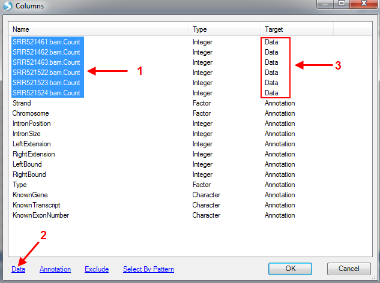
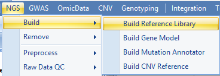
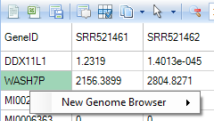

# Others

## Downstream Analyses On Quantification Values

After aligning data, there are a number of downstream analyses that can be done on the data. For instance, the generated RPKM(or FPKM) dataset can be used, as a **Microarray Data**, for clustering (log2 transformation may be necessary). Counts can be used to look for changes between groups of samples through **DESeq** analysis. We also have a **NGS | Inference | Normalize RNA-Seq Data** module designed to further normalize RNA-Seq quantification data.

Additionally, the user can look for differences in splice alignment using exon and exon junction report table. Both results are stored in table format. They can be converted to **Microarray Data** (**OmicData**) type via right-clicking on the table and choosing **Convert to MicroArray Data**:

Choose count columns and click on **Data** to specify them as data columns. Keep others as **Annotation**.

There are more visualization and analysis functions/options available for **Microarray Data(OmicData**). Users are encouraged to visit the Microarray Tutorial to examine additional ways to represent their data, such as principal component analysis and heat map clustering.

## Build Reference and Gene Model

Omicsoft provides standard genome reference (such as Human.B37.3, hg19, mm10, Mouse.B38) and gene model (RefGene, Ensembl and UCSC). Prebuilt index files will be downloaded from Omicsoft website and cached in local machine for all future data analysis.

If genome or gene model are not shown in the dropdown list, users can build their reference library with a FASTA file for genome reference and a GTF file for gene model.
Both functions are located in NGS menu:

More details can be found in the following two wiki articles:

1. Build referencel library. [^link^](http://www.arrayserver.com/wiki/index.php?title=Ngs_BuildReferenceLibrary.pdf )

2. Build NGS general model. [^link^](http://www.arrayserver.com/wiki/index.php?title=Ngs_BuildGeneModel.pdf )

## Genome Browser

Omicsoft's Genome Browser is fully integrated with Omicsoft's Array Suite package (Array Server and Array Studio).

It can be used to visualize varied data type, including count/fpkm, exon/exon juncion data, fusion data and many other tracks which have genomic coordinate information.

For example, you can right click a gene/trancript ID in RNA-Seq count data and view tracks in Genome Browser.

Please read tutorial, **Omicsoft Genome Browser**, for more details.
