# QC of RawData Files

If users want to run RNA-Seq analysis with more custom options, other than running RNA-Seq pipeline, users can run the whole process step by step. The first step will be raw data QC.

Array Studio contains a few modules for QC of raw data files. The easiest way is to run **Raw Data QC Wizard** which scans each file once to calculate all quality statistics such as GC content, per position nucleotide distribution, read length distribution, quality box plot, sequence duplication and K-mer analysis. User can also try each function which has more options to specify, such as adapter stripping and max read position.

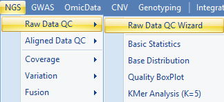

Click **Add** to find all 12 files for the six samples, check QC metric to run. Optionally, for a quicker analysis, the user can choose **Preview mode** to only generate QC on the first one million reads. This is, in most cases, good enough to get an assessment of quality. Leave **Quality encoding** as **Automatic** to automatically set the correct quality encoding method (this tutorial has fastq files with the Sanger method of quality encoding). Specify **Job Number** as the number of processes to run in parallel. Specify the output folder where the results files (.ngs) will be saved, otherwise the files will go the project folder by default.

Click **Send to Queue** to begin the analysis.

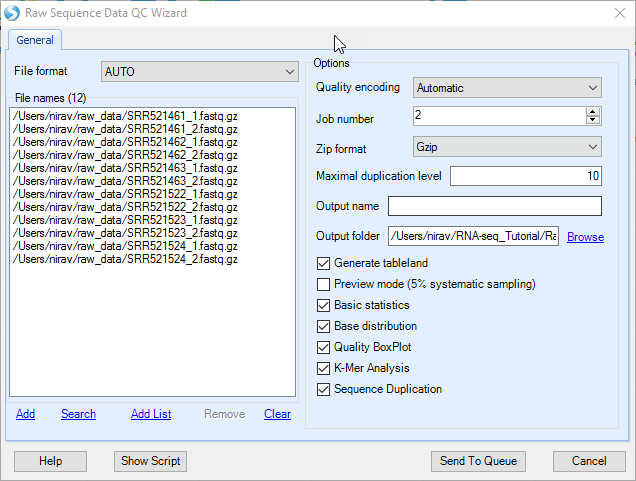

The raw data QC returns multiple raw data QC results/reports in **Raw Data QC** folder which are described in the following subsections.

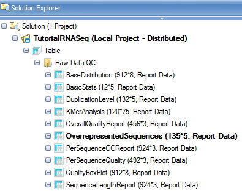

The corresponding output files can be found in the output directory specified as shown below. Please refer to [^link^](http://www.arrayserver.com/wiki/index.php?title=SummaryType ) for the meaning of specific file extensions in Omicsoft.

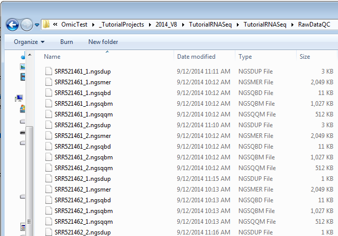

## Basic Statistics

The basic statistics table contains some important information about your samples, including total Sample #, Minimum and Maximum read length (if pre-filtering has occurred), total Nucleotide #, and GC%. Use this table to confirm any expected values, as well as to get an idea of the overall size of your experiment.

Base distribution QC results are located in the **Solution Explorer | Raw Data QC** folder with name **BasicStats**. Double click the table view to open if you do not see basic statistics table in the middle window:

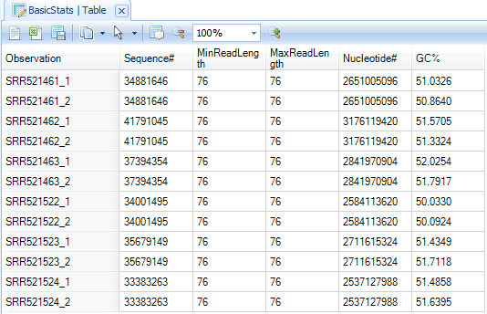

## Base Distribution

Base distribution of each raw data file is useful for ensuring that the base distribution is expected (sometimes this can be used to notice adapter sequences if the user is not aware that adapter sequences are in the read file). Base distribution QC results are located in the **Raw Data QC** folder with name **BaseDistribution**.
By default, the BaseDistribution **ProfileView** should be shown, but if not, open it by double-clicking the *Profile* view from the **Solution Explorer**.

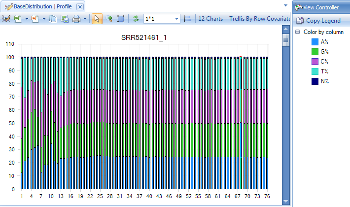

In the **View Controller** window of the right hand side of the screen, the **Legend** section shows the color representations of A, G, C, and T. Based on the legend, it is easy to see the percentages of A, G, C, and T for each base pair position from the plot.

Notice that there are a total of 12 charts (scroll through them to look at each sample), one for each file that was QC d.

Selecting points on the chart will also show additional details in the **Details** window, as shown below.

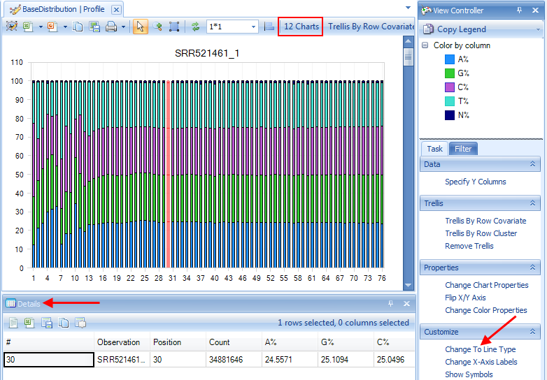

One can also switch to line plot view by going to **View Controller | Task | Customize | Change To Line Type**.

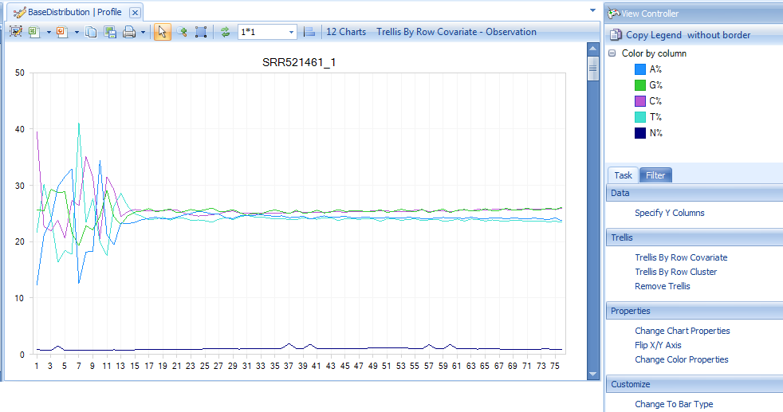

## Read Quality QC

The QC results include a **PerSequenceQuality** (view and table), a **QualityBoxPlot** (view and table) and a **OverallQualityReport** (view and table) in the **Solution Explorer**.
Per Sequence Quality calculates the average quality score for each read and shows the distribution of quality for all reads in each file.

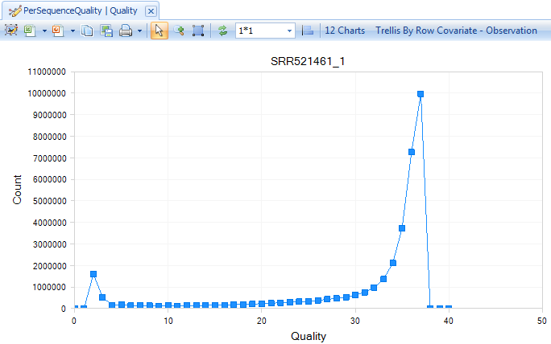

In **Quality BoxPlot**, all reads in a file are overlaid and box plot for each base pair position is shown.
This gives the user an idea where the quality starts to drop for most reads in a sample. It is useful to compare plots when evaluating sequencing quality for multiple samples. This can be done easily by changing the view option in the tool strip as in the image below (arrow).

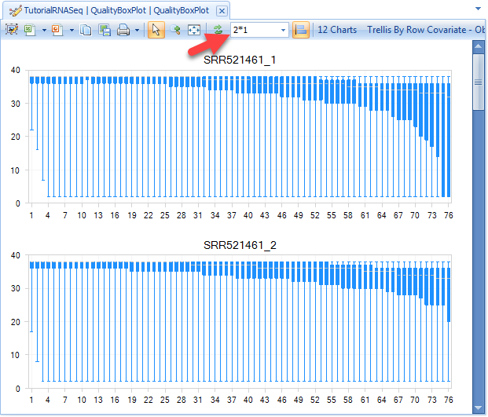

From the **QualityBoxPlot** view (shown above), it is clear that the quality of the read1 starts to drop off earlier than read 2 in sample SRR521461. Scroll through each of the 12 charts to see the quality BoxPlots for each individual fastq file. Selecting a point on the chart will show additional details in the **Details Window** below the plot.

The **Overall Quality Report** summarizes quality of each base pair. It shows the total number of base pairs in one input file that have a certain quality score.

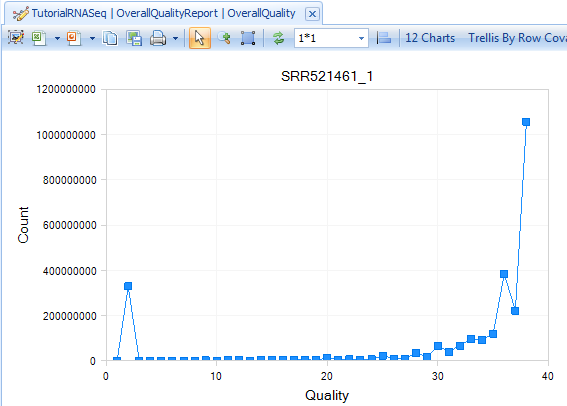

## K-Mer analysis

The **K-Mer Analysis** module counts the enrichment of every possible 5-mer across the positions of the reads.
This analysis identifies whether there is an enrichment of K-Mer on a particular region of the read. It can help find overrepresented patterns, such as adapters being read through when inserted fragment is short.

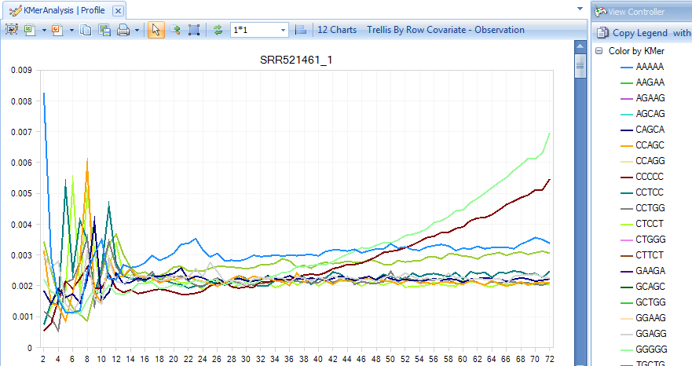

In the **KMerAnalysis** profile view, Y-axis is the percentage of reads (0.001 means 0.1%) that contain each K-Mer. There is no significant (all less than 1%) enrichment of K-Mer in this tutorial dataset.
