# Introduction

## Array studio

*Array Studio* provides an integrated environment for analyzing and visualizing high dimensional data. It is convenient in organizing and visualizing data with its *Solution Explorer*, which organizes each project into *Data, QC, Table, List, Cluster, Text, Attachments* and other categories. Multiple projects can be opened simultaneously in the *Solution Explorer*, and data can be shared among projects. Each view is controlled by a *View Controller*, which performs view customization, applies filtering, and displays legends. Furthermore, its interactive visualization technique provides the details of data with the *Details Window* and *Web Details On-Demand*.

It is highly recommended that the user complete the prerequisite for this tutorial: MicroArray Tutorial, which is a good introduction to installation, basic usage, data structure and standard visualization in Array Studio.

## Downloading the SNP Sample Data

This chapter will cover the import of the .MAP and .PED file sample dataset, as well as the attachment of the pedigree and phenotype covariate information to the dataset (the *Design Table*).

For this tutorial, the following files will be required:

*   The GenotypeData.ped file

*   The GenotypeData.map file

*   The SNP.design.txt file, derived from the simulated sample covariate information for this study.

These files are available in a zipped resource file located on the Omicsoft web server at the following URL:
[^link^](http://omicsoft.com/downloads/data/tutorial/SNP30data.zip )

The SNP sample data contains 90 samples and 45,930 SNPs. The 90 observations are split into their two sources, Japanese and Chinese (JPT and CHN). Additional covariate information includes a simulated Group column (for an example of case/control association analysis), a simulated Group2 column (for an example of categorical trait association analysis), a simulated Qtrait column (for an example of quantitative trait association analysis), and simulated Survival Time and Status columns (for an example of survival trait association analysis). The size of the original dataset has been reduced because of the large size of the imported data files, but *Array Studio* can handle millions of SNPs and many thousands of observations.

The SNP.Design.txt file contains the design information for the tutorial s study, including columns for *Source, Sex, Group, Group2, Qtrait, Covariate 1, Covariate 2, Survival Time, and Status*. A design table can be created at any time by a user, using Microsoft Excel or Array Studio. As a rule, the design table must contain a first column, usually deemed *ID*, that contains the exact file names of the SNP arrays used in the experiment (it has to match the names of the Affymetrix .CHP files, or the names listed in the Illumina text file, etc.). Additional columns usually include *disease status, quantitative traits, etc.* (anything pertinent to the experiment). If you forget to include a particular column at the time of the creation of the design table, it is not a problem, because any design factors can be added or edited after importing the design into *Array Studio*. An example design table is shown below.

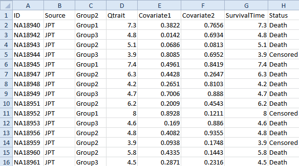

After downloading the single .zip file, unzip the file to a folder of your choice (to be used in the remainder of this tutorial).

## Creating a New Project

When Array Studio is first installed, it will look similar to what is displayed below.

If you have previously opened projects in Array Studio, you will see the **Last Opened Projects** window. If so, just click cancel so that Array Studio looks similar to below.

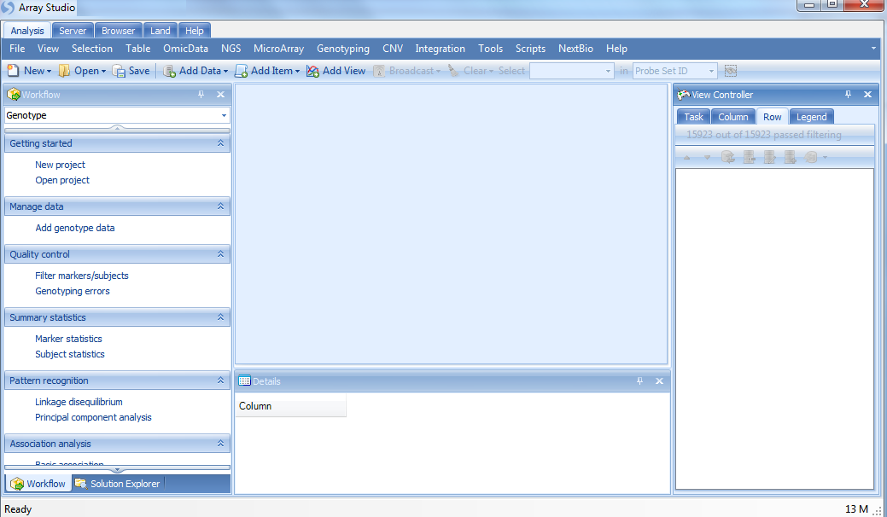

The **Workflow** window should be visible on the left side of the screen. If the window is not visible, go to the **View Menu | Show Workflow**. The **Workflow** window should appear similar to the screenshot below.

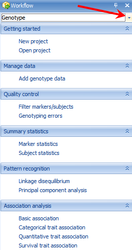

This window provides users, especially new users, with a  guide  to running different types of analysis. Click the Workflow dropdown box now and select **Genotype**.

To create a new project, click the **New Project** button in the Workflow, or the **New** button on the toolbar, or go to **File** Menu, then click **New Project**.

This opens the *New Project* window.

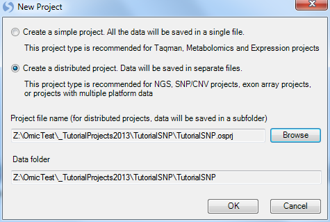

*Array Studio* allows the user to create two different project types:

*   A simple project, in which the project is saved in a single file (recommended for microarray and RT-PCR projects).

*   A distributed project, where data are saved in separate files (recommended for exon array, CNV, or genotyping projects).

Choose the **Create a distributed project** option. Click the **Browse** button to choose a location and name for the project. Click *OK* to continue.

Switch to the **Solution Explorer** by clicking on the *Solution Explorer* tab, which should be found at the bottom of the *Workflow Window*. If the *Solution Explorer* tab is not visible, open to it by going to the menu bar and choosing **View | Show Solution Explorer**.

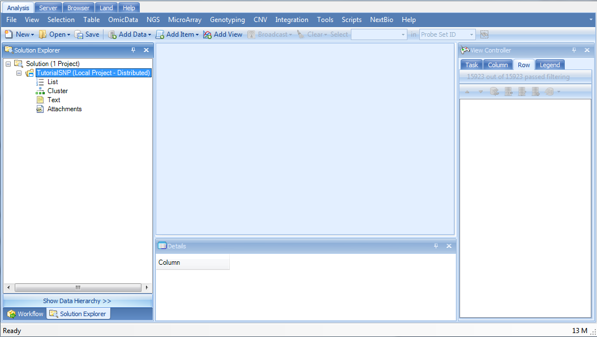

The Solution Explorer will be empty except for data containers for List, Cluster, and Text files. You can right-click on List, Cluster, and Text for their additional options. For instance, right-clicking on List will bring up options to add a new List, add list from file, etc. A List can be used to filter the data, by either Variables (e.g. probesets), or Observations (e.g. chips or samples).

## Importing SNP Data and Attaching Design Table

To import our sample SNP data, click **Add genotype data** in the Workflow Window, or click the **Add Data |Add -Omic Data** button in the toolbar, and then choose **Add Genotype Data**.

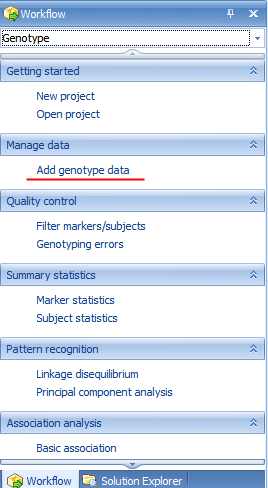

This opens the *Specify Genotype Data Source* window. In this window, the user can choose the *Genotype Data Source* for input. Choices include using the import *Wizard*, *SNP Data: PED file + Map file*, *SNP Data: Transposed PED file + Family file*, *SNP Data: PLINK binary file (.bed)*, *SNP Data: Affymetrix CEL files*, *SNP Data: Affymetrix .CHP files*, *SNP Data: Illumina genotype final report (standard)*, *Genotype data: PED file + Map file*, *Genotype data: Transposed PED file +Family file*, *SNP Dose data: output from MACH(.mldose)*, and *SNP Probability data:* *output from MACH(.mlprob)*.

In Array Studio, with SNP data, all markers are assumed to be biallelic, with support for millions of SNPs and thousands of samples.
With Genotype data, all markers are not assumed to be biallelic, with support in Array Studio of up to 100K markers and hundreds of samples.

The sample data is stored in the **SNP Data: PED file + Map file** format, so choose that option now, and click OK to continue.

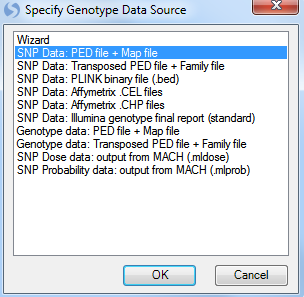

This brings up the *Import PED File* window. The first step in this window is to click the *Browse* button, and navigate to the *GenotypeData.ped* file downloaded earlier. Once the *PED* file is selected, the *MAP file* will be automatically selected as well. Array Studio assumes that the *MAP* file is located in the same directory as the *PED* file, so if this is not the case, the user can change the location of the *MAP* file.

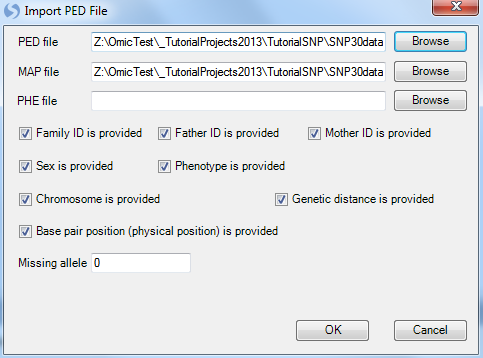

Once a file name has been selected, the user should verify any other information in the *MAP* and *PED* files, and set the checkboxes accordingly (*i.e. Family ID, Father ID, etc.*). Once all the information is confirmed click *OK* to continue.

The import process should take approximately 10 seconds.

Upon completion of importing, Array Studio will prompt the user to attach a **Design** to the data. If the user wishes to attach a design at a later time, this can be done as well (by right-clicking the *Design* folder of the dataset in the *Solution Explorer*), however, it is recommended to build and have your design table ready for use upon import of the data. Click **Yes** to begin the Design import process.

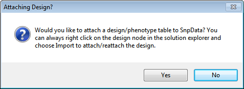

Array Studio will prompt the user to specify a table source. As the design table for the sample data is in a **tab delimited file** format, choose that option now, and click **OK**.

When prompted, choose the *SNP.design.txt* file that was unzipped earlier, and click *Open* to attach the design table to the dataset.

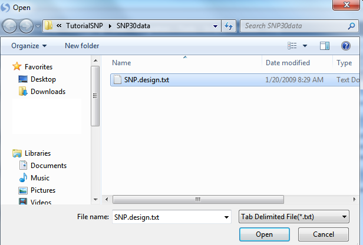

Once the design table is imported, a "Specify Options" window will appear. Here the user can select the options to **Append to the existing covariate table** (if one exists) and to **Use the name order in the new covariate table**. Leave these options as default.

After choosing a design file, the user is prompted with a *Set Columns* window. In this window, the user can inform Array Studio if any of the imported design columns pertains to *FamilyID*, *IndividualID*, *FatherID*, *MotherID*, *Sex*, or *Phenotype*. Some of this information is used in different modules for analysis. By default, these columns should be set correctly, since this data was included in the *.PED* and *.MAP* files.

If the user chooses not to set the columns at this time, they can later reopen the design table, and later use the *Table Menu | Columns | Column Properties* to set the column mode. For this tutorial, these columns need not be set and can you can just select the "OK" button.

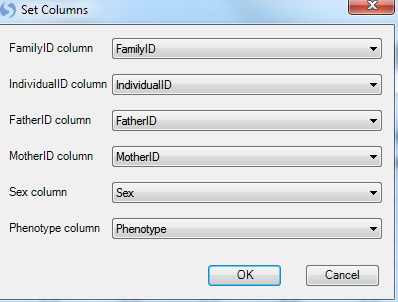

Once imported, Array Studio should look similar to the following screenshot. By default, a *TableView* is created for the imported dataset.

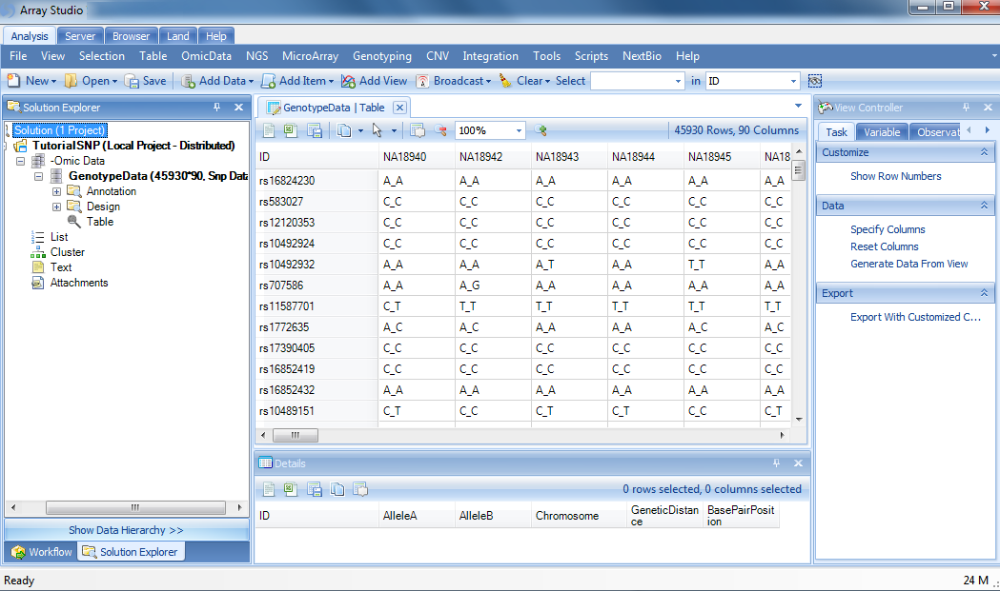

Also, note that a new data object has been added under the *Omic Data* section of the *Solution Explorer* (on the left-hand side of the screen).

The *Solution Explorer* can provide important information about the different datasets and tables that are created in Array Studio.
For instance, note that next to the name of the dataset, **GenotypeData**, Array Studio lists the number of rows and columns (or markers and observations) in the dataset. In this case, there are 45,930 markers and 90 observations.

The *Solution Explorer* also provides the user with information on the different views that have been created. Notice that there is a *TableView* for dataset **GenotypeData**, as well as for *Annotation* and *Design* (Expand the nodes to see this). User can double-click either of these views (named *Table*), and open them in the main view window.

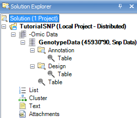

Congratulations! You have successfully imported your first SNP dataset into Array Studio. In the next chapter, we will explore some of the different visualizations and views available in Array Studio.
