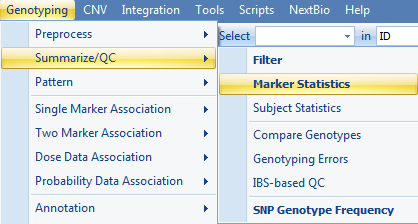
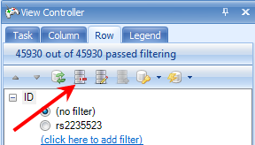
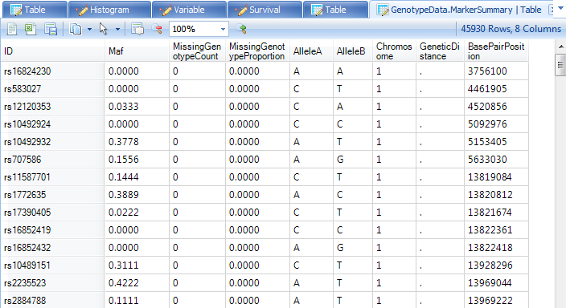
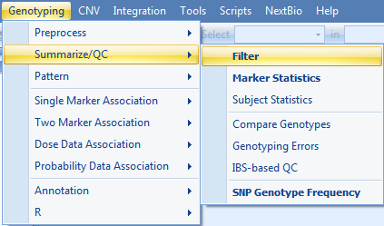
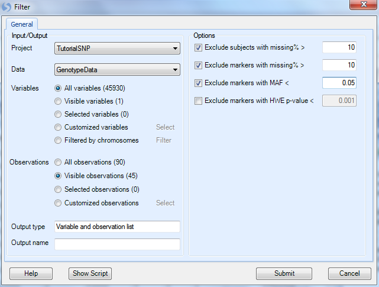
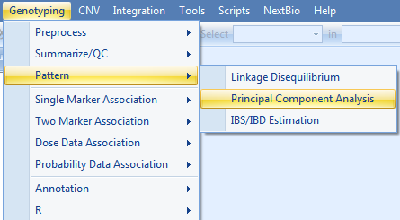
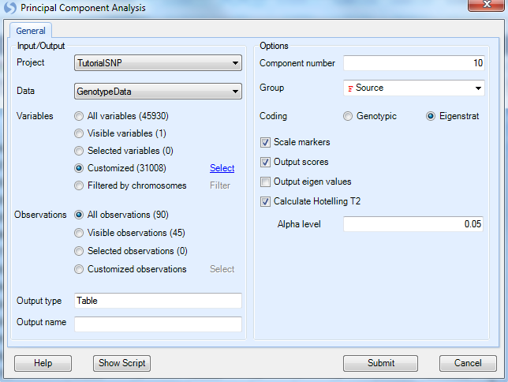
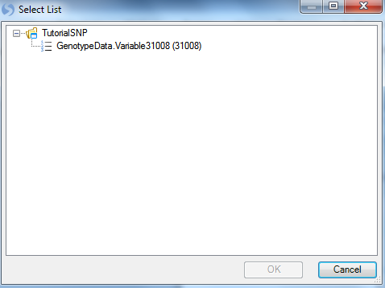
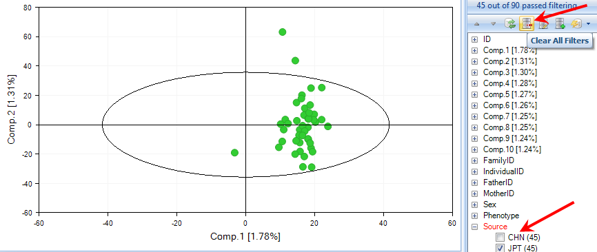
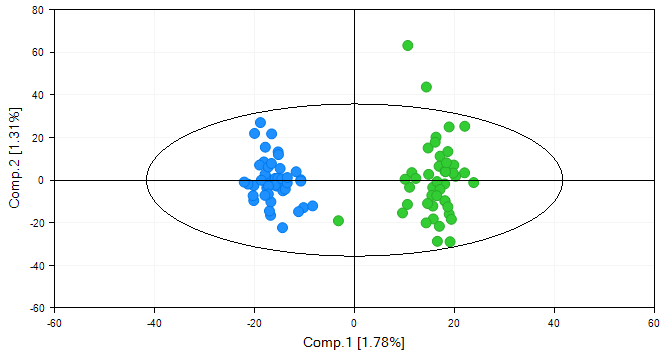

# Marker Statistics, Data Filtering, and Population Structure

## Marker Statistics

In *Array Studio*, the user can generate a number of different summary and QC statistics. In particular, the user can generate **Marker Statistics** or **Subject Statistics**. In this tutorial, we will just generate marker statistics, but the generation of subject statistics is very similar, and can be done by the user on their own.

Go to **Genotyping | Summarize/QC | Marker Statistics** now.

This brings up the *Marker Statistics* window.

All module windows in *Array Studio* follow a similar pattern to this one. First, the user can select the *Project* and *Data* to be analyzed; in this case the only project opened is *Tutorial SNP* and our only *Data* is *Genotype Data*.
Next, if the user has generated a list of variables/markers (subset) for analysis, this can be selected. The user can also manually choose particular chromosomes for analysis.

As we are really only interested in marker statistics for the Japanese population, and since
these samples are currently filtered and are visible, choose **Visible Observations (45)** now, to ensure that only the visible subjects (i.e. the Japanese subjects) will be analyzed.

*   First, a **Group** may be specified, and the marker statistics will be calculated separately for each group.

*   Next, the user can choose to report a number of statistics, including

    *   **Allele frequencies**

    *   **Minor allele frequency**

    *   **Missing genotype count**

    *   **Effective genotype count**

    *   **Missing genotype proportion**

    *   **Genotype frequencies**

    *   **Observed heterozygosity**

    *   **Gene Diversity**

    *   **HWE chi square p-value**

    *   **HWE exact p-value**

    *   **Inbreeding coefficient**

    *   **Silhouettes width** (requires SNP intensity data, i.e. Affymetrix or Illumina).

Leave the other settings as default, and click *Submit* to run the module.

A new *Table* is generated under the **Table | Summary** folder of the *Solution Explorer*, called **GenotypeData.MarkerSummary**. It s evident from the solution explorer that this data contains 45930 rows (or markers) and 9 columns of information.

Make sure that all variable filters are cleared.

Once unfiltered, the *TableView* should look as follows. It contains a column for the minor allele frequency (Maf), missing genotype count and percentage, as well as the covariate information (AlleleA, AlleleB, Chromosome, and BasePairPosition). This table, like any other table views, can be filtered, sorted and customized using **View Controller**.

## Data Filtering

Prior to SNP analysis, it is a good idea to filter the markers and subjects, to exclude markers and subjects with high missing data percentage, as well as exclude markers where the minor allele frequency (MAF) is below a certain cutoff. Other options include removing markers due to an extremely significant Hardy Weinberg Equilibrium (HWE) p-value.

To filter genotype or SNP data in *Array Studio*, go to the *Genotyping Menu | Summarize/QC | Filter* to open the *Filter* window, as shown below.

In this window, make sure that the *Project* is set to *Tutorial*, *Data* is set to *GenotypeData*, *Variables* to *All Variables*, and *Observations* are set to **Visible Observations (45)** so that we filter only on the **JPT** subjects.

For the options,

*   First, a **Group** may be specified, and the marker statistics will be calculated separately for each group.

*   By default the filter will **exclude subjects with a missing percentage** > 10%

*   **Exclude markers with a missing percentage** > 10%.

*   Change  **Exclude markers with MAF<** to 0.05 (from default of 0.01).
    This is done because of the small number of subjects we have. This is a subjective criterion and the user can change.

If we were interested, it is also possible to **exclude markers with a HWE p-value** < a cutoff.

Also, note the *Output type* is *Variable and Observation list* for this module.
This means that **two Lists** will be generated in the *Solution Explorer* as a result of filtering, a *List* of markers that passed the criteria, and a *List* of observations that passed the criteria. Optionally, the user can name the list as well.

Click *Submit* to run the filtering.

As can be seen below, two new *Lists* were generated by the module. All 45 JPN subjects passed the filter, as did 31008 markers. These *Lists* will be used for all further analysis.

## Population Structure - Principal Component Analysis

**Principle Component Analysis**
can be used with SNP and Genotyping data to get an idea of population structure. The components generated from this data can then be used as covariates when running the analysis model.

In this tutorial, we will demonstrate how to run **Principle Component Analysis** (on the CHN and JPN subjects), but we will not use the generated component information for our modeling, because in our modeling we are not interested in CHN subjects. However, this can be easily accomplished with other experiment designs, if the necessary design information is available.

To run **Principle Component Analysis (PCA)**, go to the **Genotyping Menu | Pattern | Principle Component Analysis** to open the *Principle Component Analysis* window.

As always, ensure that the *Project* is set to *Tutorial* and *GenotypeData* is set as the *Data*. To choose the markers that passed the filters from our last step, choose the **Select** button next to **Customized variables** to open the *Select List* window.

This allows the user to choose any variable list, including those from any open project in the *Solution Explorer* (as we only have one open project, the only lists shown are from the *Tutorial SNP* project). Choose the variable list31008 and click on OK to continue. Notice the **Variables** section in **Principal Component Analysis** window is updated.

Observations should be left as the default **All observations**.

*   **Component number** can be set to the user s choice number of components, but is set at 10 by default.

*   Change the **Group** drop-down menu to **Source**. This does not affect the generation of the data; rather it provides automatic coloring using a group of the user s choosing. *Source* is chosen, so we distinguish between the CHN subjects and the JPT subjects to better visualize the population difference.

*   For **Coding**, choose **Eigenstrat** which is a publicly recognized method for Principle Component Analysis, and probably most familiar to users. A  classical genotypic  method is also available.

*   Ensure that **Scale Markers** and **Output Scores** are selected, as well as **Calculate Hotelling T2** with alpha level of 0.05.

Click **Submit** to run the *Principle Component Analysis.*

Initially, the output only showing one group because our filter of JPT subjects has been carried over to every view.

Now, choose **CHN** population or reset all filters using the button **Clear All Filters**.

By default, *Array Studio* shows the first two components of the PCA, but this can be changed by using the *Specify X Column* and *Specify Y Column* options in the *Task* tab of the *View Controller*.

*Note:*

The  outliers  from the PCA analysis is a result of the default EigenStrat coding. Using the classical coding (genotypic) will remove this effect from the output. In practice, we recommend classical coding (using dummy variables to represent genotypes), although EigenStrat has been very popular in academia. Please contact Omicsoft to learn more details.

The PCA has also generated a new *PcaScore Table* in the **Table | Pattern** section of the *Solution Explorer*.

As stated earlier, all of the generated components can be used as covariates in the model.
This will not be done in this tutorial, but to visualize all 10 components in a *TableView*, open up the view PcaScores by double clicking on it.

This TableView could, in other circumstances, be incorporated into the design table of your SNP data, so that it could be used as covariates in further analysis.

Congratulations! You have learned about **Marker Analysis**, **Data Filtering**, and **Principal Component Analysis**.

In the next chapter, we will focus on different types of association analysis.
