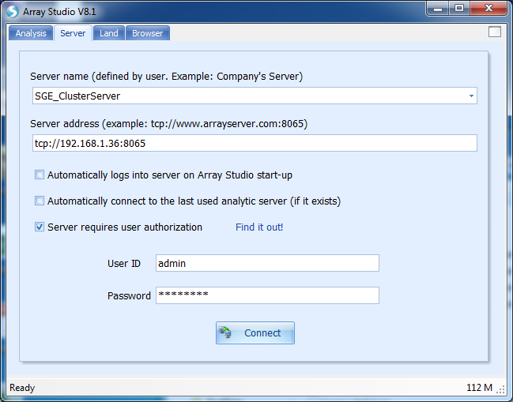
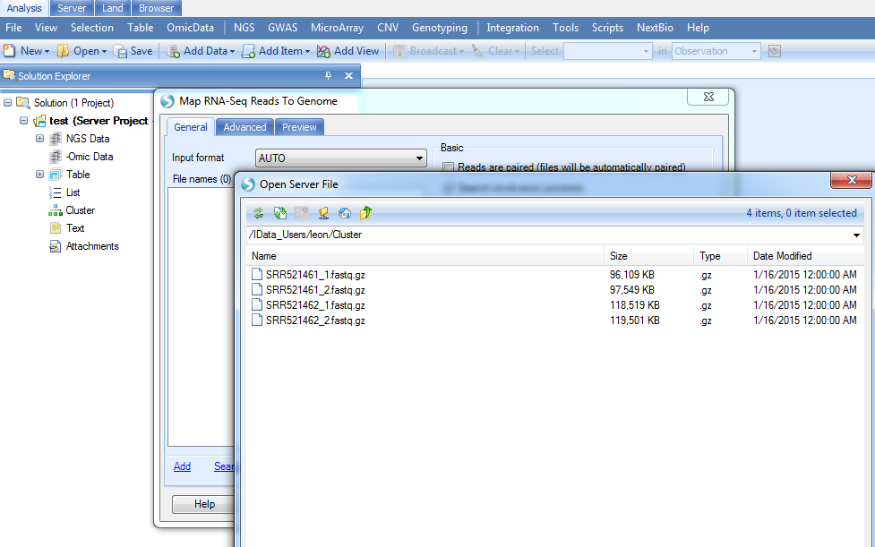
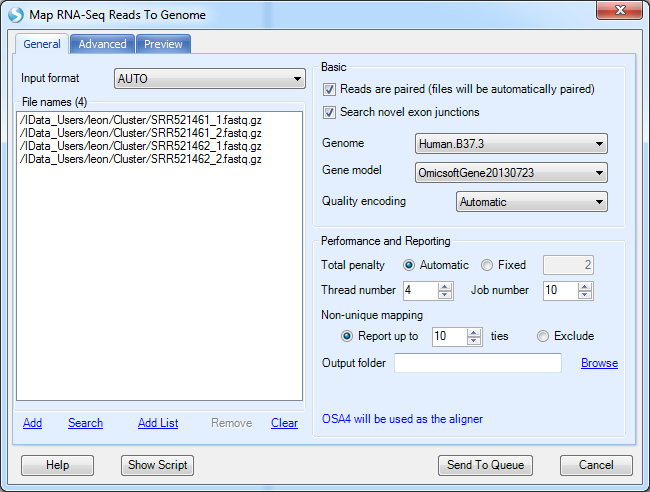
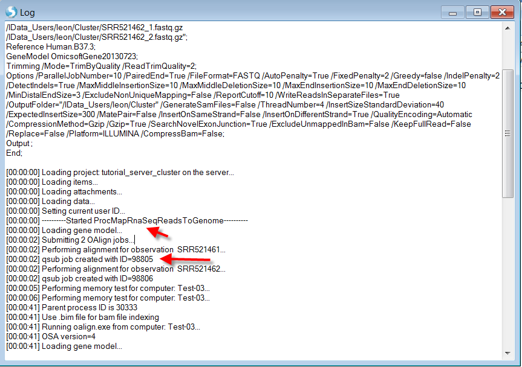

# Array Server on Cluster

Array Server can run jobs on clusters. It only requires ArrayServer administrator to perform a simple one-time set up. To other users, it is a transparent process. They do not need to do any extra setup, nor will they find any differences with other non-cluster jobs.

Actually, Array Server on Cluster is pretty similar with that on a common server.
The underlying difference is that running jobs are automatically assigned to different nodes of the cluster,
greatly utilizing the power of a cluster that enhances computing speed and saves time.
To configure a Server on Cluster, please contact Omicsoft Support to get the manual for Server deployment on Cluster. After ArrayServer admin configures the Server on Cluster, standard users do not need to set up Cluster Preferences but only need to connect to the ArrayServer:

To run server jobs on Cluster, users just follow the tutorial of running Array server on common server to upload data files, create project and run server project as in Chapter 3 of this tutorial.

## Run Multiple Jobs on Cluster

When running multiple jobs (For example, multiple samples sequencing data alignment), multiple Cluster nodes will be used. This makes it much faster to perform the analyses.

To test this, please download the RNA-seq demo dataset from: [^link^](http://omicsoft.com/downloads/data/tutorial/RNASeq.zip )

More detailed description of the dataset can be found in the accompanied RNA-Seq Analysis Tutorial.

Here, we will only use two samples to save the process time. Make sure to load the data in the right Cluster folder and then, in the **Analysis** tab, choose: **Add Data | Add NGS Data | Add RNA-Seq Data | Map Reads to Genome (Illumina)**. Click *Add* and navigate to your downloaded RNA-seq demo dataset. Select all four fastq files and click OK.

The demo dataset is paired-end sequencing data; please check the **Reads are paired** check box and **Send to Queue**:

The job can be monitored in the **Server | Server Jobs** tab:

The users can right click on the job and select **View Full Log** or **Cancel Job**:

In the *Log* window, the jobs are being submitted to Cluster, 2 Cluster nodes (users can check qsub on cluster if they have permission) will be started with job IDs as we have two samples to align. Right-clicking on the job and viewing the log, we can see that SRR521461 and SRR521462 have been submitted as two separate jobs:

Once the job finishes, user could go back to Analysis tab to update the project as above and continue any downstream analyses and visualization (Clicking Update Project in the analysis tab to see the results):

