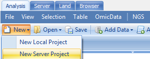
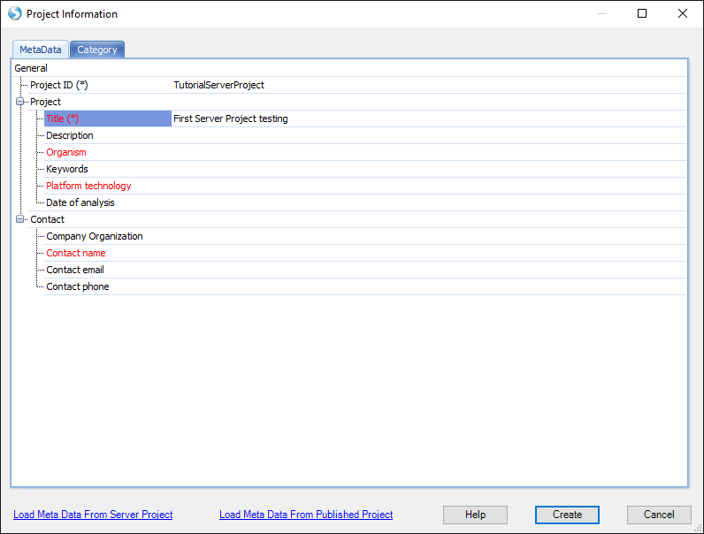
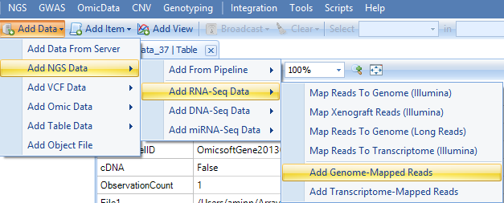
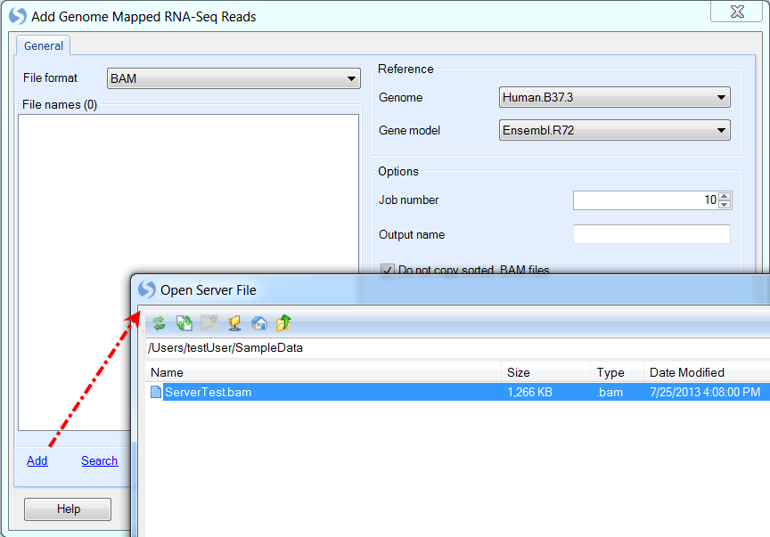
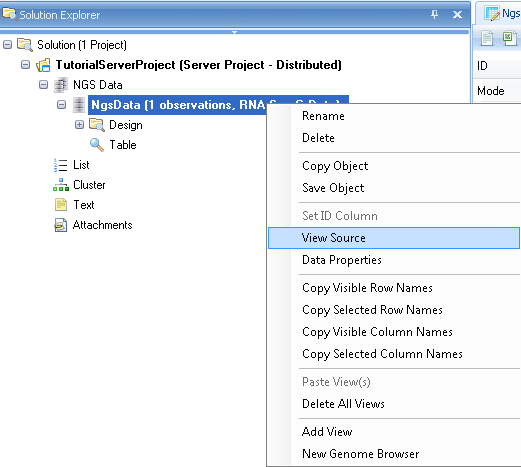
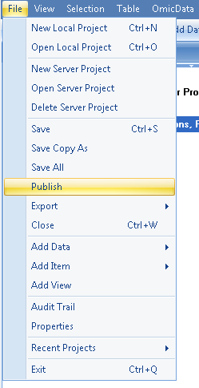
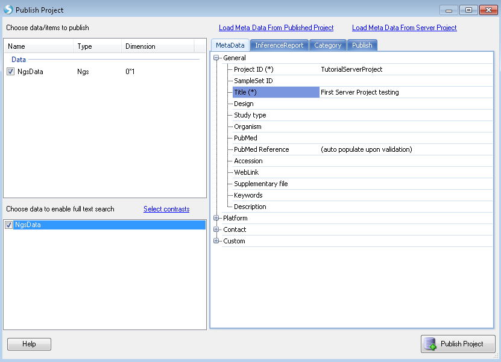
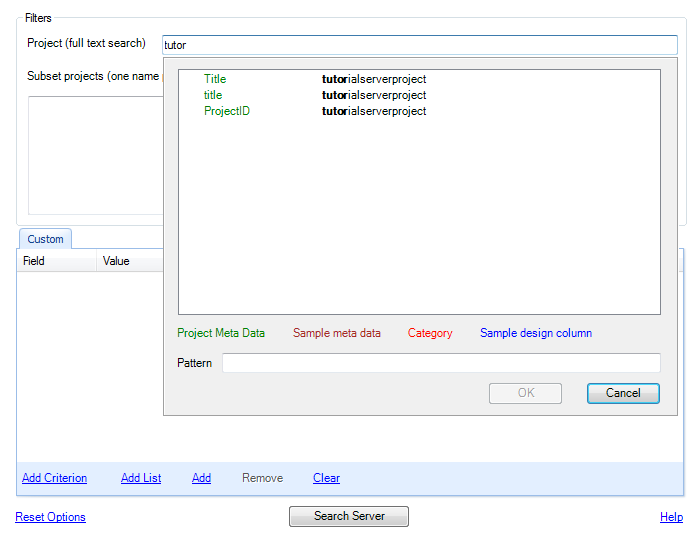
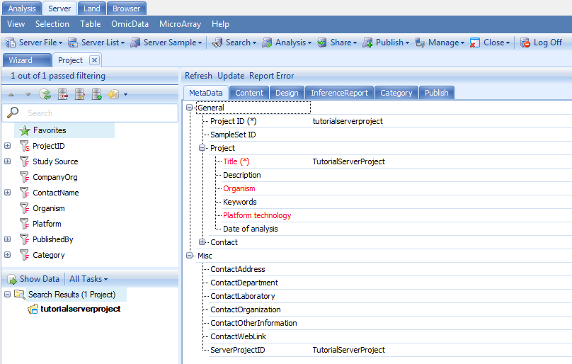

#Creating and Publishing a Server Project

##Creating A Server Project

To create a server project, in **Analysis** tab go to **File | New Server Project**.

The user will be prompted to enter some basic meta data about the project, including an option to categorize the project using the **Category** tab. 
After filling in the required information (indicated by asterisks), click **Create** button.

Now an empty project will be created (below):

Notice that the project name includes **Server Project - Distributed** in the name so that the user can quickly see that this is a server project and the type is *Distributed*. **Distributed** indicates that data objects are saved in separate files.

From here, we can perform all the analysis tasks on the server using the interface of Array Studio. For example, we can add the alignment analysis file (that we loaded to the server earlier) by going to the toolbar **Add Data | Add NGS Data | Add RNA-Seq Data | Add Genome Mapped Reads**:

then choose the file uploaded in previous section (*ServerTest.bam*).

Then click **Send to Queue**.

A **ServerJobs** window will show, listing all the jobs on the server.

Now switch back to the Analysis tab. Once the job is completed, the user will see an **Update Project** on the far right in the menu selection of Array Studio (below):

Click **Update Project** to show the results of finished job: one **NgsData** is created for this BAM file.

If the user would like to see the parameters used for the alignment, select the data set name **NgsData** and right click, then choose **View Source** 

Users can run all data analysis based on this **NgsData** in the same way as they run in Array Studio locally. 
They will see **Send to Queue** button and all analyses will be done on server.

##Publishing a Server Project

At this point, the project that we are working on is stored in our **ServerProject** folder on the server (along with a cache on the local machine). 
Note: BAM files are not cached in local machine. The data object of **NgsData** only stores the link to the BAM file. 
The server project is only accessible to the user who created it. 
The user can also publish this project to the server to allow other users to access it. 
This will also make it searchable in the **Wizard** on the server.

If the project is active in Array Studio, simply select from the menu **File | Publish**. If the project is not active, the user first has to select **Open | Open Server Project** which will then make it active:

Selecting **Publish** will open the **Publish Project** window.

The user has the options to **Choose data/items to publish** and **Choose data to enable full text search**.
Meta data fields (some required and some optional) are filled in and indexed when published.

Go into the **Server** tab of Array Studio and select the **Wizard** tab and select **Search Server**; the newly published **TutorialServerProject** will be visible in autofill:

If you leave the search fields empty and click **Search Server**, all published server projects will be listed including the **TutorialServerProject**.

Congratulations! You are done with the analysis. You can reopen this project later on to get back to the same state as you saved. This includes all views, filters, analyses, etc.

