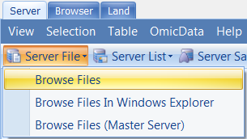
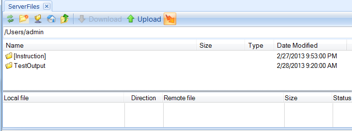
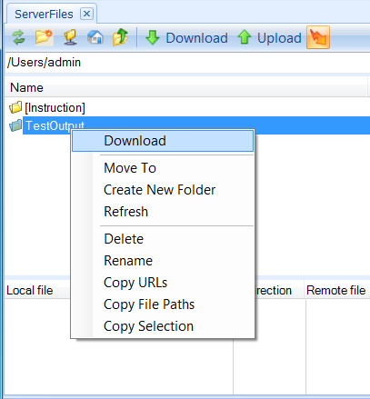
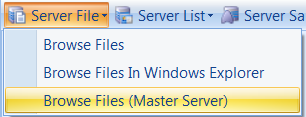

# Server File Management

The user has the option of accessing the raw data management system via Server Explorer in Array Studio.
They can do so by choosing **Server Files | Browse Files** in the Server Explorer.

## Browse Files

In the screenshot below, notice that there are two levels to the ServerFiles tab that is opened when you choose Browse Files. On the top level is a browser. The user can go up or down a level, create new folders (where appropriate), download files, or upload files. The user can also refresh the FTP folder they were previously viewing.

When uploading or downloading from the raw data management system, progress for the transfer is shown on the lower part of the screen. This FTP transfer system supports a queue, so one file is transferred at a time until the queue is completed. The user can right click to stop and start a file in the queue.

The user can also right-click on individual files to Download the file, Create New Folder, Refresh, Delete (only allowed by administrators), Rename (only allowed by administrators), Copy URLs (to get a copy of the exact location of the file of interest), or move the file to other locations in the server.

## Browse Files in Windows Explorer

The user can also access the FTP site using **Windows Explorer** by choosing **Server File | Browse Files in Windows Explorer** from the Server Explorer menu. This can be useful for quickly uploading data by  drag and drop  from folders in Windows.

## Browse Files in Master Server

If ArrayServer has been set up using Master-Analytic setting, users can only browse the analytic server they are logged into with **Browse Files**. The user can choose to browse contents in Master server by **Server File | Browse Files** **(Master Server)** from the **Server Explorer** menu.

For more details regarding master and analytic server, please read the following wiki article:
[^link^](http://www.arrayserver.com/wiki/index.php?title=Master_and_Analytic_Servers )
