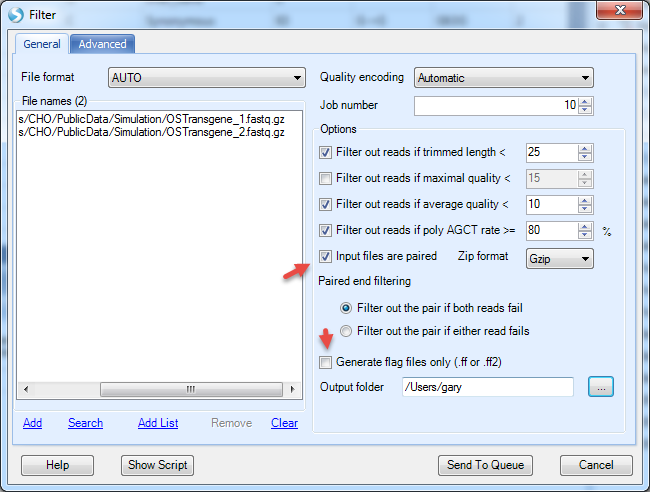
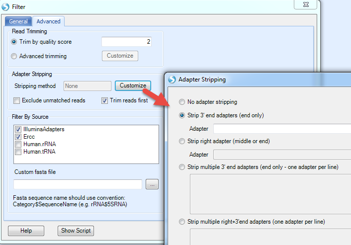
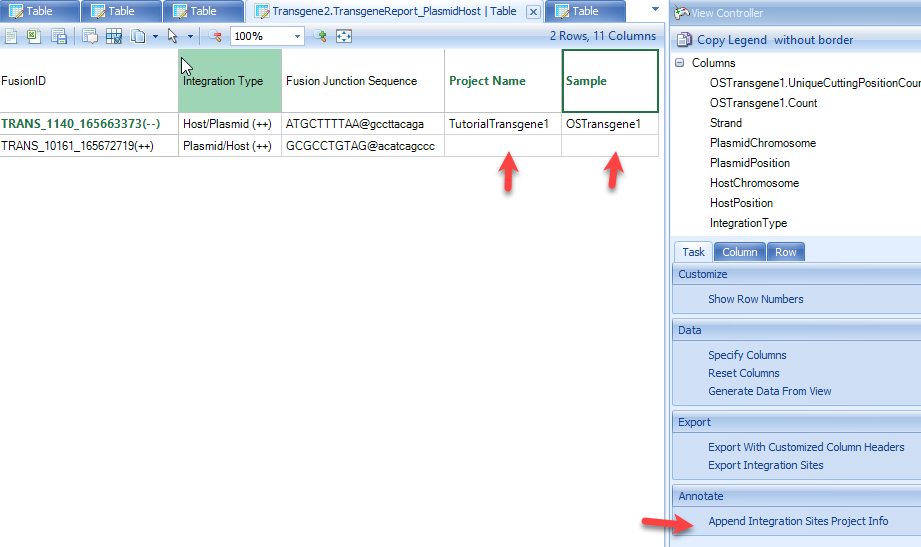
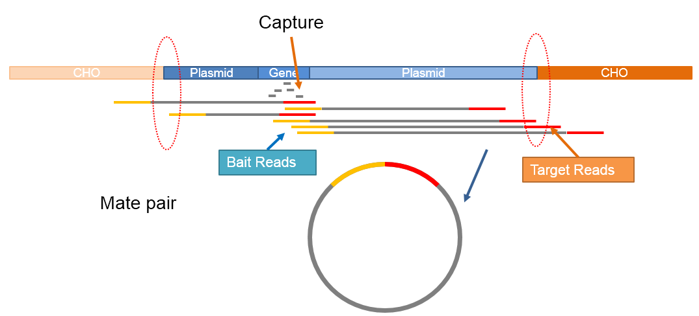
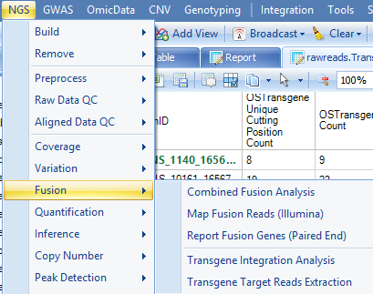
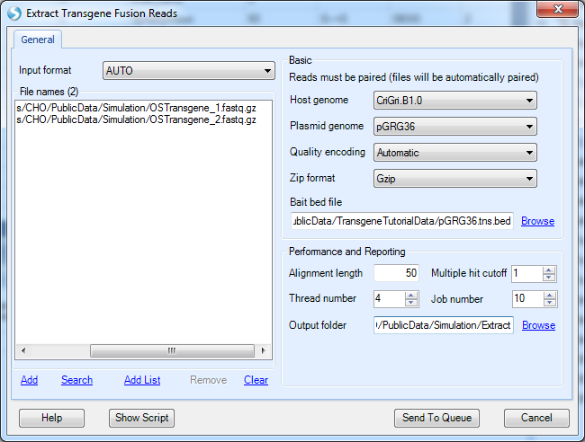

# Others

Below are some other useful options/functions.

## NGS Pre-Processing: Filter Reads

Besides split read by tags, there are a few of NGS data pre-processing steps which can improve the data quality and reduce background noise.  To filter bad reads and remove adapter sequences, use **NGS | Preprocess | Filter**:

Choose the appropriate file format: AUTO or FASTQ based on your data, then click **Add** to find input data.
Use the default options but check "*input files are paired*" option if your data is paired end or mate pair reads.
**Choose an Output folder for new fastq files**:

In the **Advanced** tab, click **Customize** for the **adapter Stripping** section. There are two adapter types users can specify:

**3' end adapters**: these are usually the type of adapters used in paired end reads. When NGS read length is short, the sequencer will get the adapter sequence as part of read sequences. The 3' adapter stripping does a localized alignment at the right end of the read and removes the adapter part of read ends. More details can be found in this wiki page: http://www.arrayserver.com/wiki/index.php?title=AdapterStripping_3%27End

**Right adapter:** it is usually the type of short adapters used in mate pair reads. The adapter sequence has become a part of read sequence, in the middle of the read, but close to the 3' end. Array Studio aligns the adapter sequence against read sequence to strip up to where the best alignment to the adapter ends. All nucleotides after the adapter sequence are stripped away. More details can be found in this wiki page:
http://www.arrayserver.com/wiki/index.php?title=AdapterStripping_Right

After the filtering step, new fastq files will be generated. Again, this step is optional if data quality is good.

##Use Grouping File

In Omicsoft, we consider one file as one sample, or two files as one sample if option "reads are paired" is checked.
In some cases, the user may have multiple files from multiple lanes for one NGS sample, such as one flow cell as one sample. Omicsoft provides a solution to input multiple files for one sample using the GroupingFile parameter.
The parameter should work for any NGS modules that take raw read files as input.

For more information about grouping files, please read:
http://www.arrayserver.com/wiki/index.php?title=How_to_use_multiple_sequence_files_for_one_sample%3F

## Integration Site Repository

Users can export selected integration sites and save them to tab-delimitated text files. The flat file can serve as an integration site repository. Users can also use the file to annotate new transgene detection reports.

To export, select integration site Fusion ID, and click "Export Integration Sites". It will ask user to either create a new file or select an exisiting repository to append.

To annotate new tables with repository file, click "Append Integration Sites Project Info", select the repository text file, then two new columns (Project Name and Sample) will be appended to the report. It annotates the table with names of old samples analyzed in old projects having the same integration site. It is matched by the same host and plasmid reference ID, and their integration locations/directions.

## Target Reads Extraction

Target reads extraction is designed to extract target reads based on the read pair connectivity, such as pair-end and mate-pair linkage. Below is one example using mate pair, the Target Reads Extraction function is trying to extract target reads with its mate mapped to the designed capture region (transgene region):

This tool is useful when there are multiple transgene regions, such as tnsA and tnsD in the tutorial dataset.
User can design the capture region to be specific to the transgene and then use the target reads to do transgene integration site analysis. The result (integration site) will be transgene-specific since we only use the reads that are uniquely linked to the transgene region.

To run transgene target reads extraction, go to the NGS menu below:

In the analysis menu:

Select input format and click "Add" to add paired-end or mate pair raw data. It is better to add a filtered (filtered + adapter stripped) data set.

*   **Input format:** the read file format, fastq, qseq or fasta;
    most datasets from current next-generation sequencing machines are fastq

*   Add data from server; input files have to be paired based on regular paired or mate pair read file names

*   **Host genome:**
    the host genome to detect integration;

*   **Plasmid genome:**
    the plasmid genome built by user;

*   **Quality encoding:**
    the encoding for quality score; recommend using Automatic;

*   **Zip format:**
    no gzip or gzip format;

*   **Bait BED file**
    : Bait file defines regions that are used to capture read pairs. For transgene studies, it is usually a file listing the transgene regions in the plasmid genome. Taking the tutorial data as one example, the following bed file defined tnsA and tnsD region on the plasmid:

| Plasmid     | Start     | End     | Name     |
| :---------- | :-------- | :------ | :------- |
| pGRG36      | 1453      | 2274    | tnsA     |
| pGRG36      | 6036      | 7562    | tnsD     |

The file extension is .bed and is a tab-delimited text file. The BED file contains four columns: chr, start, end and region name.

*   **Alignment length:**
    the length of read that required to be aligned to the bait region. It is designed to align part of the reads in case there are low quality nucleotides on the right side of read ends. For example, when read length is 100bp and alignment length set to 50, it only requires the first 50bp of the read aligned to the bait region.

*   **Multiple hit cutoff**: usually, we set cutoff=1, requiring one read uniquely aligned to the bait region and it cannot be aligned to any other locations in plasmid and host genome. When there is a known similarity between the bait region and other regions, such as a region shared in two plasmid backbones, user can set the cutoff to be 2 to allow multiple mapping of the bait reads.

*   **Thread number:**
    Number of Threads for each job;

*   **Job number:**
    Number of parallel jobs to run

*   **Output folder:**
    Browse to specify the output folder

User will get two files for each target region from every sample: .bait.fastq and .target.fastq. Below, for the same input sample, there is a bait.fastq and a target.fastq for the tnsA region and tnsD region as defined by the BED file.

User can run raw data QC and also align the fastq files to plasmid genome and check the read coverage statistics and enrichment efficiency. The figure below is one example from a mate pair dataset.

Congratulations! Now you can successfully run a transgene detection analysis!

If you have any questions, please feel free to contact Omicsoft support@omicsoft.com.
