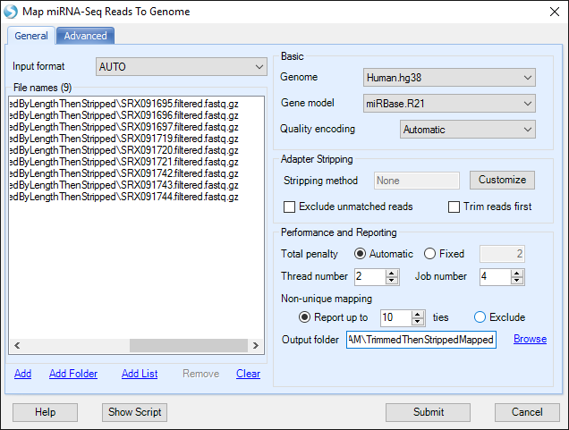
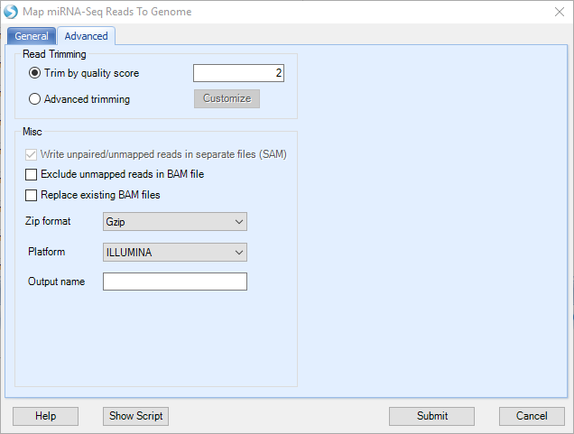
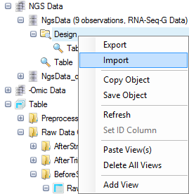
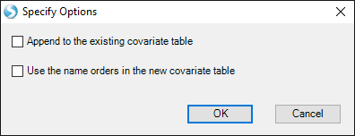

# Alignment to the Genome

After QC and filtering raw reads, the next step in most miRNA-Seq analysis is the alignment of the reads to the genome.

Please go to the **Add Data** dropdown menu on the toolbar, then choose **Add NGS Data | Add RNA-Seq Data | Map Reads to Genome (Illumina)**.

At this point, the Map miRNA-Seq Reads to Genome module appears.

First click the **Add** button to specify the location of the filtered fastq files from the previous section.

Note that these files are in .gz format.
The alignment process takes this into account and supporting .gz format is an effective way to save some space when importing files, as there is no need to extract all files.

Choose the *Genome* for the experiment. In this analysis, we will use *Human.hg38*.
Choose the *Gene model*. We will use miRBase.R21. In general for miRNA-seq, results will be much more successful when mapping exclusively to known miRNAs.

---
!!! note
    If your goal is miRNA discovery, there are several specialized tools for this purpose, such as miRDeep2.
---

Leave the **quality encoding** set to automatic. However for your information, these files were encoded using the Sanger quality scoring system.

*Adapter Stripping* allows trimming (under *Advanced*) and adapter-stripping of reads.
Since we have already trimmed and stripped the tutorial reads, there is no need to do it again here.

In **Performance and Reporting**,
*Total penalty* should be left as automatic, and is described completely in Omicsoft's white paper on alignment.

*Thread number* indicates the number of threads to use per alignment, and usually this number should be less than 6.
Job number refers to the number of parallel jobs (independent processes).

*Non-unique mapping* indicates how many "ties" for non-unique reads should be reported, or whether they should be excluded all together.

Only BAM files will be output.
If users also want SAM files, there is a tool (**NGS | Tools | Convert Files**) in ArrayStudio to generate SAM files from BAM files.

**Output folder** is the place if one wants to explicitly specify a location to store the alignment BAM files.
Otherwise the bam files will be saved in a default location (a random number/letter folder in the project folder).
In this tutorial, it is recommended to specify a folder so that BAM files can be found easily in next step.

There are a few options in the **Advanced** Tab.
In general the default values have been tuned and should work well in most cases.

Leave the **Exclude unmapped reads** *unchecked*, so that the generated BAM file will contain the information for all the reads (i.e. mapped and unmapped).
The generated BAM files (which contain mapped and unmapped reads) can be directly used as input for subsequent steps.

Click **Submit** to start mapping.

The mapping stage could take anywhere from several minutes to over an hour, depending on the number of threads, type of computer (64-bit/32-bit), etc.

After the alignment, you will see a NgsData object with an alignment report table (1) and design table (2) in the solution explorer,

and BAM files as well as alignment report summary files in the specified output folder.

To help downstream analysis, we will add grouping columns to the design table.

First, double-click the new NGS data *Design table* in the *Solution Explorer* to view the *Design Table* in Array Studio.
Next, click either the (1) **Open as Text** or (2) **Open as Excel** buttons:

To the design table, add a column named **Group**, then enter group labels "Normal", "Psoriatic_Uninvolved", and "Psoriatic_Involved" as follows:

*    **SRX091742-SRX091744** are **Normal**
*    **SRX091719-SRX091721** are **Psoriatic_Uninvolved**
*    **SRX091695-SRX091697** are **Psoriatic_Involved**

You may add additional columns if you like, such as the StudyID, source organism, etc.

Save the file as a tab-delimited file, named "Design.txt", in the same folder as your .BAM files.

Then, right click on the **Design** folder for the NgsData, and select **Import | Tab delimited file**:

Navigate to "Design.txt". Two options for importing will be offered:

**Append to the existing covariate table**: checking this option will append the selected design file contents to the existing design table, using the first column to match rows.

**Use the name order in the new covariate table**: checking this option will use the name orders in the selected design file, instead of using the name orders in the existing design table.

These two options should be left unchecked for this tutorial (as we will just over-write the design table).

Now save your project, then we can quantify reads mapped to each known miRNA and identify differentially-expressed miRNAs.
