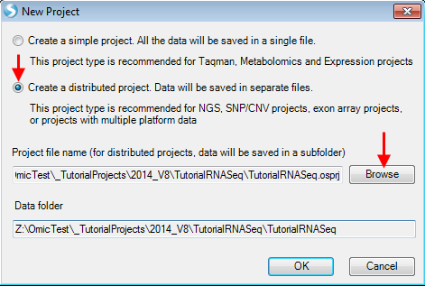
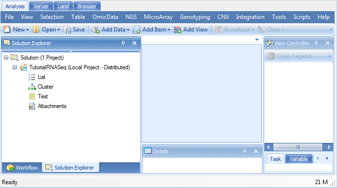

# Create Array Studio Project

Array Studio provides an integrated environment for analyzing and visualizing high dimensional data. It is convenient in organizing and visualizing data with Solution Explorer, which organizes data/results
as projects. User can create a local project which uses the local computer power to do analysis, or create a server project which will run all analyses in Array Server.
In this tutorial, we are using local projects. If user has Array Server installed, user can run the tutorial as a server project and analysis steps are almost the same as described in this tutorial.

Once Array Studio has been opened, click **File | New Local Project** from the File Menu (also can be accessed via the **New** button on the toolbar).

For any Next Generation Sequencing datasets, the user should choose the option to create a distributed project. Clicking the Browse button will allow the user to specify the location for the dataset.

Note: It is required that the user has approximately 3GB of available space on their hard drive for this experiment. The general rule of thumb is that the user has 3x the size of the raw data files available for the import of data. The user might also want to specify a different location for the "Omicsoft Home" folder using **Tools Menu | Preferences | Advanced**.
This will place the Omicsoft folder, which is used as storage for any genome reference index and temp files for the process, at a specified user location.

Click **Browse** to choose a location to store the data and click **OK** to create an empty project:

