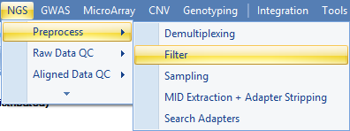
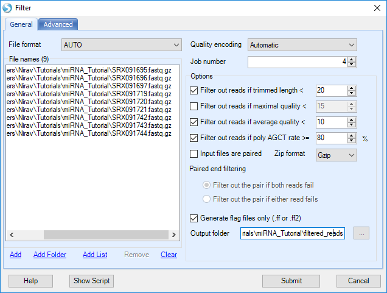
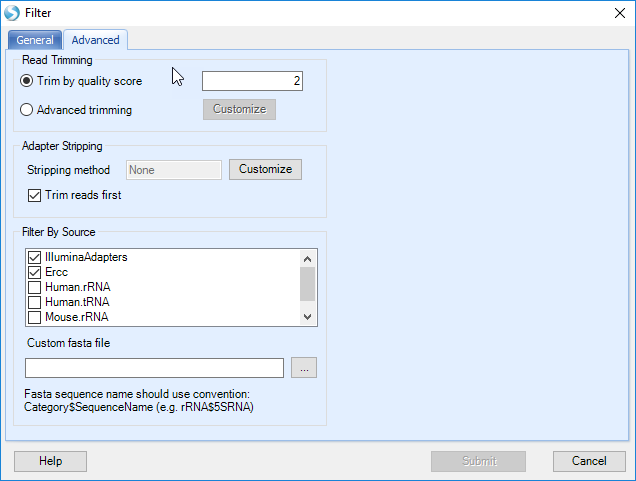
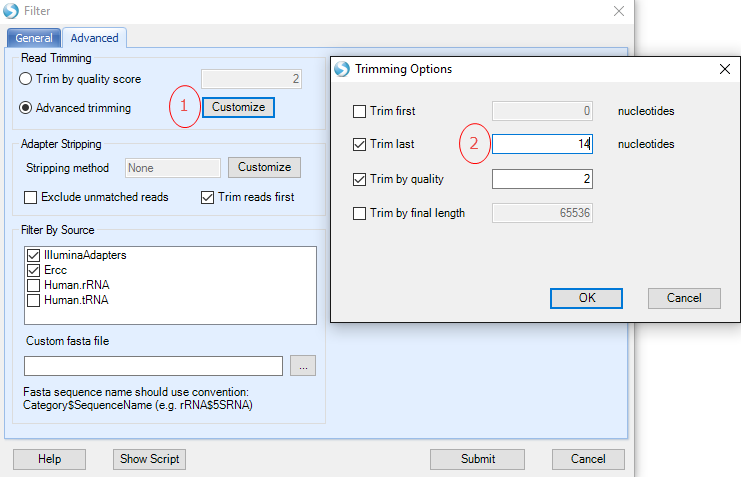
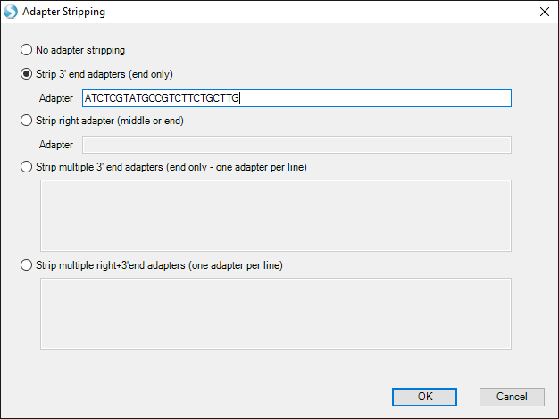
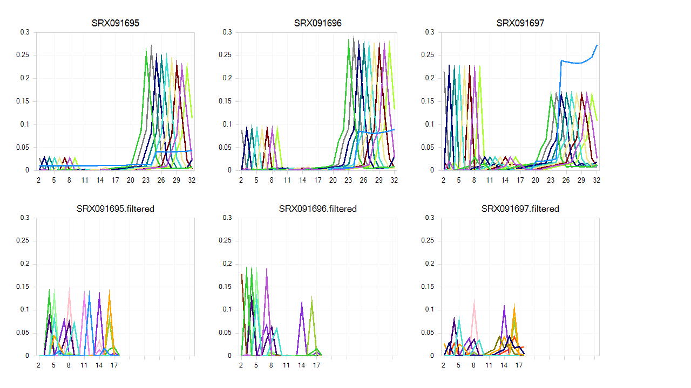

# Filtering And Trimming Raw Reads

If we look closely at the Kmer pattern from the raw QC report, it is clear that the same sequence is at the 5' and 3' ends, and that these sequences both match the Illumina 3' adapter sequence.

It is likely that reads with the adapter sequence toward the 5' end are simply adapter-dimers. In contrast, reads with adapters at the 3' end, starting ~22-24 nucleotides, are the reads we want to map.
However, the user must strip (remove) the adapters before mapping these reads. This can be performed multiple ways in Array Studio.

1. Trim the last 36 - 22 = 14 nucleotides (read length - processed miRNA length), which will remove adapters from proper reads.
2. Use the Array Studio Adapter Stripping method to dynamically detect and remove substrings matching adapter sequences.

Regardless of which technique is used, we can also filter out reads that are comprised entirely of adapter sequences,
or match common NGS contaminants such as rRNA and tRNA.

To filter and strip the raw reads, open the Filtering module by clicking **NGS | Preprocess | Filter**:

This will open a window with multiple methods for stripping, trimming, and filtering our reads:

Click **Add** to find all 9 files for the samples, then select filtering options:

1. Filter by read length (**set to <20 in this case**)
2. Per-read quality scores
3. Abnormally high single-nucleotide frequency
4. Paired-end quality filtering (tutorial reads are not paired, so this option is not used)

If the user wants to generate a new set of fastq files containing filtered/trimmed reads,
specify the full path to the output folder.

Alternatively, the user can choose "Generate flag files only",
which will generate a flat file with filter status for reads in each file, instead of generating new fastq files.

However, "Generate flag files only" is overridden if adapter stripping is enabled.

To perform adapter stripping or trimming, the user should click on the *Advanced* tab,
revealing several additional options:

To trim reads to 22 nucleotides, select the **Advanced trimming** radio button, and click the **Customize** button:

Alternatively, to dynamically strip away 3' adapter sequences, Click **Customize** in the Adapter Stripping section,
then change the radio button to **Strip 3' end adapters**:

Enter in the sequence **ATCTCGTATGCCGTCTTCTGCTTG**, which was found in the miRNA *adapter search* module (or you can copy-paste from this document).
This sequence matches the 3' adapter used by the study authors.
If multiple adapter sequences were found by the *adapter search* module, they could also be entered as a list in *Strip multiple 3' end adapters*.

An additional option within *Adapter Stripping* is *Trim reads first*.

*Trim reads first* controls the Order of Operations for Trimming and Stripping.
For example, if reads were 3' barcoded  such that the read was miRNA-Barcode-Adapter,
setting *Trim reads first* to false would allow stripping of the adapter, followed by removal of the barcoded portion.

The final set of *Advanced Options* is *Filter By Source*, where common contaminant sequences can be automatically removed.
By default, several sets of sequences are included (e.g. adapters, rRNA, tRNA), but additional sequences can be also included as a FASTA file.

For this tutorial, we will take a simple approach to sequencing trimming:
We will trim to 22 nucleotides (i.e. select *Trim Reads First* under *Adapter Stripping*),
then strip any 3' nucleotides exactly matching 3' adapters,
then filter reads that are <20 nucleotides or match known adapter sequences,
and save fastq files to a new folder.

Re-running *Raw Data QC* will reveal that the reads are now all trimmed to 22 nucleotides,
and the frequency of kmers has been significantly reduced (notice the Y-axis scale).

We can now move on to mapping the reads to the genome.
