# QC of Raw Data Files

The first step to ensure reliable miRNA-seq results is to check and filter the raw data, to use only high-quality reads.

Array Studio contains several modules for QC of raw data files. The easiest way is to run **Raw Data QC Wizard** which scans each file once to calculate all quality statistics such as GC content, per position nucleotide distribution, read length distribution, quality box plot, sequence duplication and K-mer analysis. User can also try each function which has more options to specify, such as adapter stripping and max read position.

## Adapter detection and trimming
A QC step especially important to miRNA-seq is checking for/stripping adapter sequences.
Because miRNAs are ~22 nucleotides long, standard high-throughput sequencing read lengths will read the entire miRNA, as well as the 3' adapter.
In the tutorial set, reads are 36 nucleotides long.
Thus, it is important to check that these adapters have been removed before continuing.
This module is not included in the **Raw Data QC Wizard**, so must be run separately before mapping reads.

You will find the "Search Adapters" module under **NGS | Preprocess | Search Adapters**

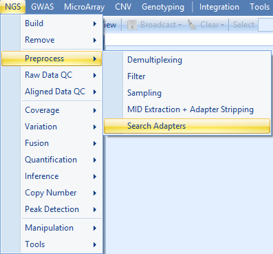

Click **Add** to add the fastq files for the nine samples.

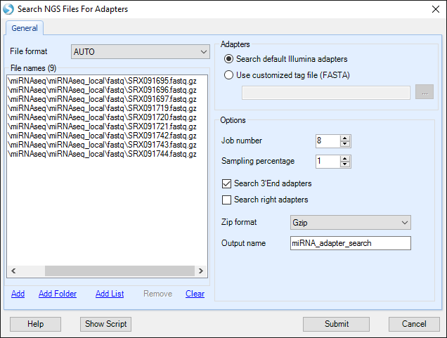

You can choose to search for the default set of Illumina adapters, or search for a custom list of FASTA-formatted sequences.
Specify the **Job Number** as the number of processes to run.
Specify **Sampling Percentage** to change what fraction of your data to sample for adapter sequences. In this dataset, 1% is sufficient to capture adapter sequences.
By default, this module searches for matches to adapter sequences at the 3' ends of reads, but does not allow additional bases to the right of the read match.
To enable a Smith-Waterman algorithm to identify adapters with additional bases to the right, check "Search right adapters".
In this sample, no additional adapters will be found by this procedure, so we will leave this option unchecked.
Confirm that the Zip format is correct, optionally specify the Output name, and click "Submit".

When the analysis is complete, a new table will be available in the Solution Explorer, under **Table | Preprocessing**:

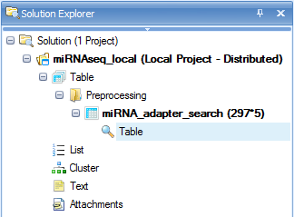

This table contains a list of all identified adapter sequences in each file, along with occurrence count and percentage per-file.

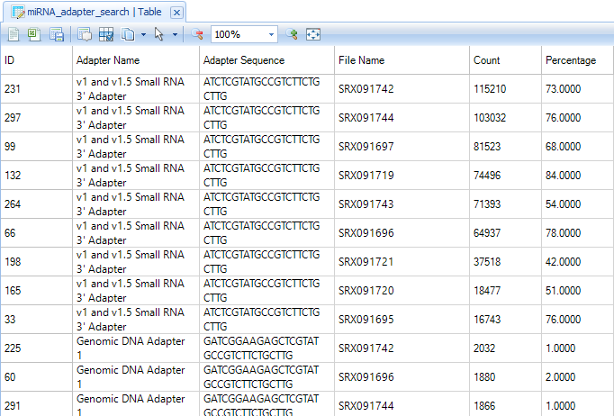

In these samples, the majority of reads contain an adapter sequence, so this should be stripped before mapping. We will explore this in the next chapter.

## Raw Data QC Wizard

To check overall sequence quality, n-mer over-representation, and sequence length, the Raw Data QC Wizard can be run. Alternatively, each module within can be run, enabling additional options.

To run the wizard, click **NGS | Raw Data QC | Raw Data QC Wizard**.

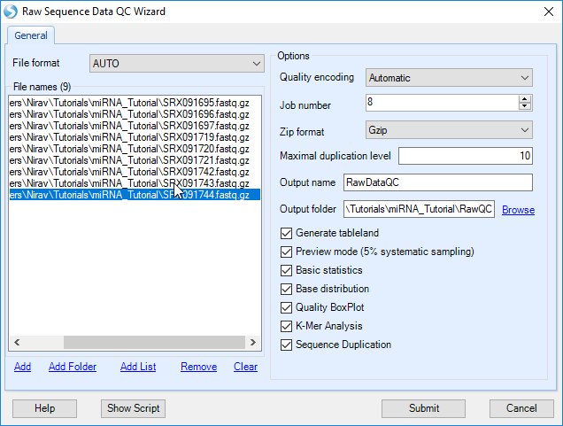

Click **Add** to find all 9 files for the  samples, and check the boxes for each QC metric to run. For a quicker analysis, the user can choose **Preview mode** to only generate QC on the first one million reads.
This is, in most cases, good enough to get an assessment of quality.
Leave **Quality encoding** as **Automatic** to automatically set the correct quality encoding method.
Specify **Job Number** as the number of processes to run in parallel.
Leave **Maximal duplication level** at the default of *10*.
Specify the output folder where the results files (.ngs) will be saved, otherwise the files will go the project folder by default.

Then click **Submit** to begin the analysis.

The raw data QC returns multiple raw data QC Views and tables in the **Table** Data section, under the **Raw Data QC** folder.

In this screenshot, new subfolders were generated to cluster different QC analyses, by right-clicking the **Raw Data QC** folder and selecting *New Folder*.

## Basic Statistics

The basic statistics table contains some important information about your samples, including total Sample #, Minimum and Maximum read length (if pre-filtering has occurred), total Nucleotide #, and GC%.
Use this table to confirm any expected values, as well as to get an idea of the overall size of your experiment.
In this example, you will see that the reads (if untrimmed) are all 36 nucleotides long.

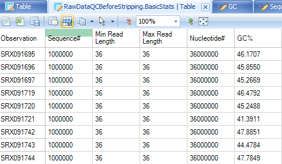

Base distribution QC results are located in the **Raw Data QC** folder with name **BasicStats**.
Double click the table view to open if you do not see basic statistics table in the middle window:

##Base Distribution

Base distribution of each raw data file is useful for ensuring that the base distribution is expected (sometimes can be used to notice adapter sequences if the user is not aware that adapter sequences are in the read file).
Base distribution QC results are located in the **Raw Data QC** folder with name **BaseDistribution**.
By default, the BaseDistribution **ProfileView** should be shown, but if not, open it by double-clicking the Profile view from the Solution Explorer.

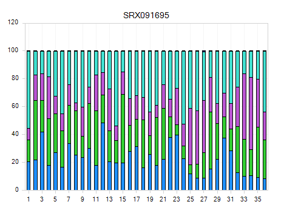

In **View Controller**, **Legend** section shows the color representations of A, G, C, and T. Based on the legend, it is easy to see the percentages of A, G, C, and T for each base pair position from the plot.

Notice that there are a total of 9 charts (scroll through them to look at each sample), one for each file that was QC d.

Selecting points on the chart will also show additional details in the Details Window.

One can also switch to line plot view by going to **View Controller | Task | Customize | Change To Line Type**.

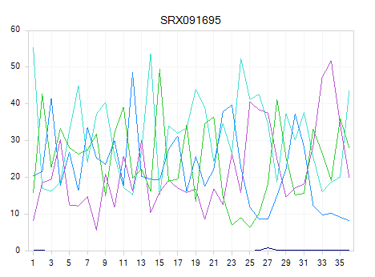

## Read Quality QC

The QC results include a **PerSequenceQuality** (view and table), a **QualityBoxPlot** (view and table) and a **OverallQualityReport** (view and table) in the Solution Explorer.
Per Sequence Quality calculates the average quality score for each read and shows the distribution of quality for all reads in each file.

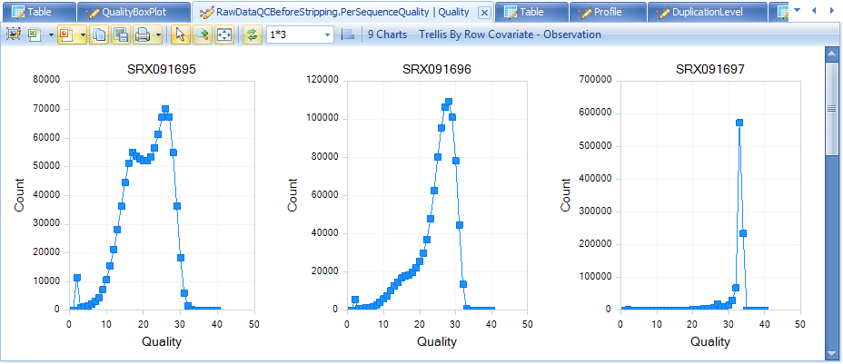

Note that the first two files have far more poor-quality reads than the other files.

In Quality BoxPlot, all reads in a file are overlaid and box plot for each base pair position is shown.
This gives the user an idea where the quality starts to drop for most reads in a sample. It is useful to compare plots when evaluating sequencing quality for multiple samples.

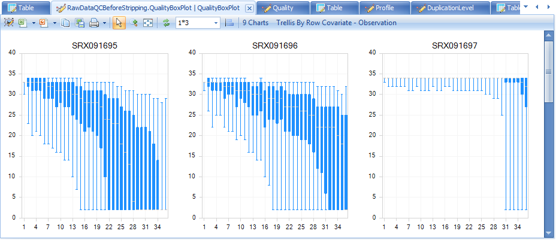

From the **QualityBoxPlot** view (shown above), it is clear that the quality of two files drops off earlier than the others. Scroll through each of the 9 charts to see the quality BoxPlots for each individual fastq file.
Selecting a point on the chart will show additional details in the **Details Window** below the plot.

The Overall Quality Report summarizes the quality of each base pair. It shows the total number of base pairs in one input file that have a certain quality score.

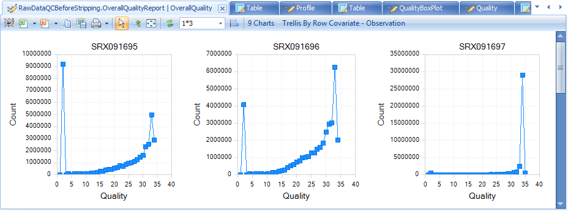

## K-Mer analysis

The K-Mer Analysis module counts the enrichment of every possible 5-mer across the positions of the reads.
This analysis identifies whether there is an enrichment of kmer on a particular region of the read. It can help find overrepresented patterns, such as adapters being read through when inserted fragment is short.

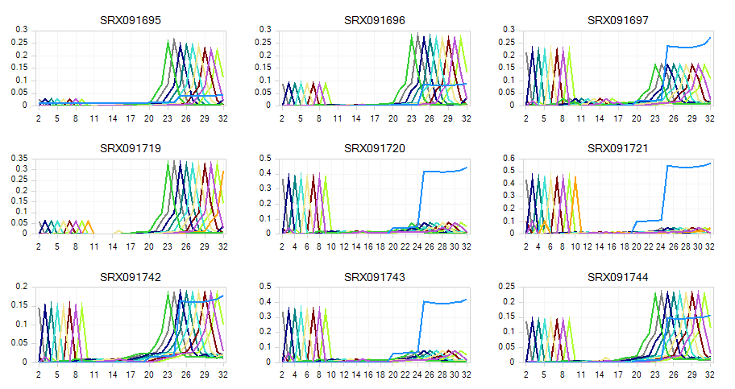

In the **KMerAnalysis** profile view, Y-axis is the percentage of reads (0.1 means 10%) that contain each KMer. Without filtering, there is significant Kmer enrichment at the ends. For a miRNA-seq experiment, this is expected - in the next step, we will trim and filter reads to clean up the raw read data.
