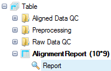
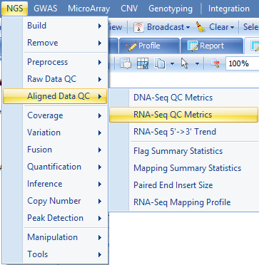
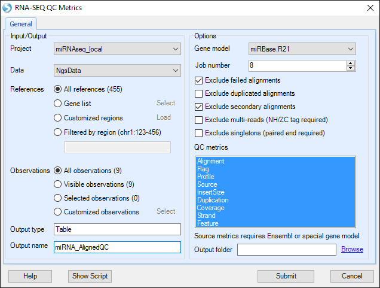
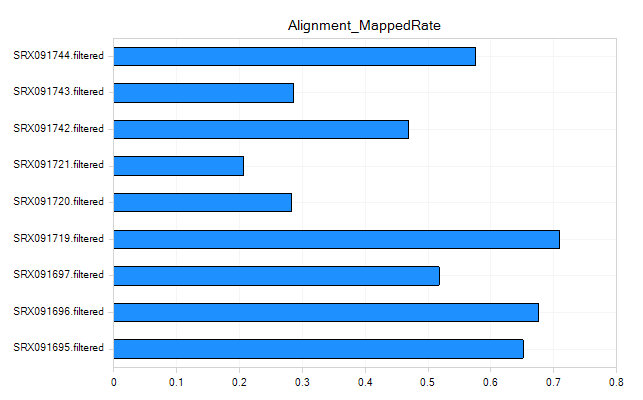
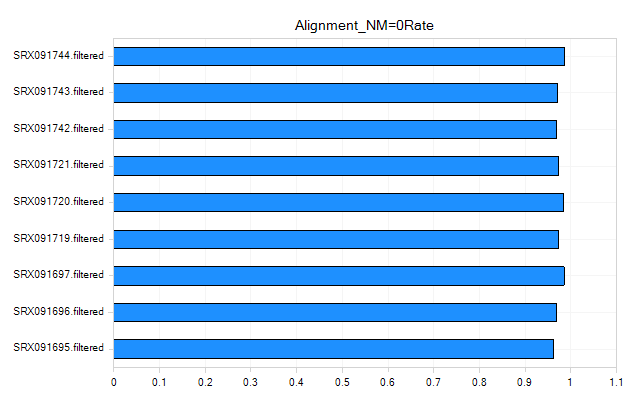
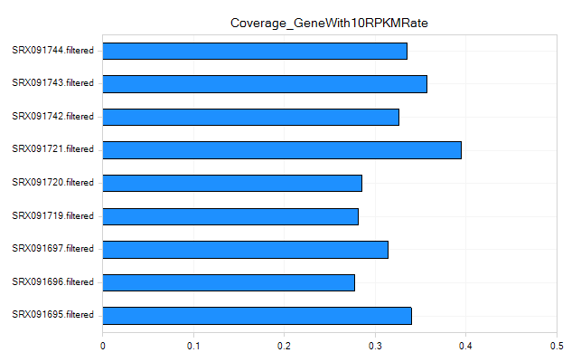
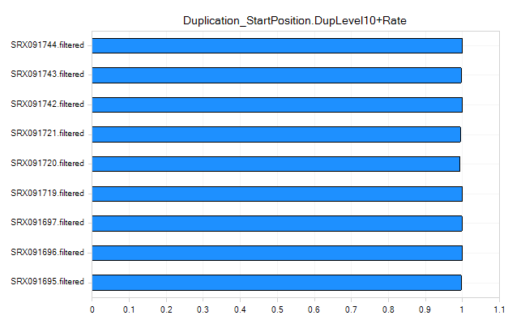
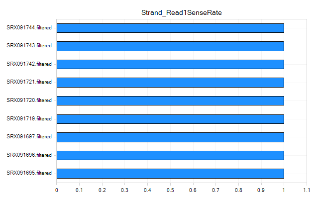
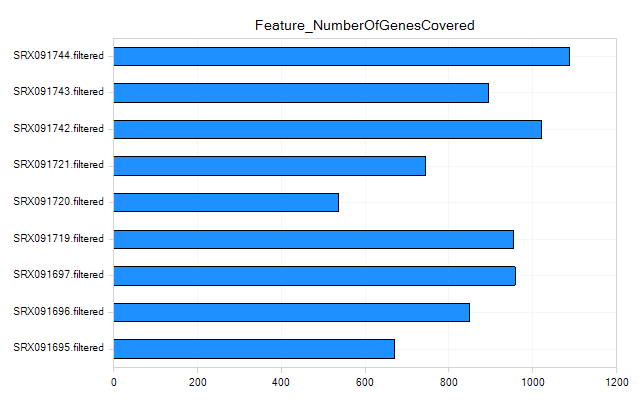

# QC of Aligned Data

## Alignment Report

By default, an alignment report is generated anytime an alignment is done in Array Studio.
If it is not already open, go to your Solution Explorer and double click on Report from the **AlignmentReport** table.

This will show, for each file, some statistics regarding mapping. One of the key statistics is the uniquely mapped reads.

## miRNA-Seq Aligned QC
To get more detailed statistics of mapping rate, the RNA-Seq QC metrics can be used:

This module can be used to generate a table of metrics, along with visualization for each metric by scanning the alignment BAM files.
These metrics can be used to provide an overview of different statistics on alignment, coverage, Flag, mapping location, insert size strandness, and more, in a single table.
It also generates a **ProfileView** showing a chart for each metric.

To run the RNA-Seq QC module, go to **NGS | Aligned Data QC | RNA-Seq QC Metrics** now.

Choose the NGS data object and leave all other settings as their defaults and click **Submit** to run the module.

**Source** metric is based on the provided gene model.
It provides the most information with gene models like Ensembl that have detailed information for the source of each transcript.
Here, we will use the same gene model as with mapping (*miRBase.R21*).

The analysis returns a **Table** View of QC metrics and **Profile** view in the **Aligned Data QC** folder:

In the **Table** view, you will find the following sections:

### Alignment Metrics

These metrics can be used to give an overall idea of the quality of the alignment for your samples.

### Coverage Metrics

The coverage metrics give you an overall idea of the mean coverage of your experiment.
For RNA-Seq, it looks at the (total length of aligned reads/total exon length of your gene model).
It also gives metrics on the number and percentage of genes with coverage.
Finally, it gives a metric on the number of genes with at least 1 RPKM of coverage, as well as 10 RPKM of coverage.

### Duplication Metrics

The duplication metrics can give you an idea of the total level of duplication for an experiment (after alignment).
This is based on coordinates (start position), rather than the raw data QC which was based on sequence.
It is expected that an miRNA-Seq experiment will have a large amount of duplication, so do not be alarmed if these metrics show high values.

### Flag Metrics

Flag metrics are generally only useful for paired end reads when data has been aligned with OSA. It provides metrics using the SAM Flags.

### Insert Size Metrics

Insert size metrics provide some basic metrics on the insert sizes for paired end experiments.

### Profile Metrics

Profile Metrics provide important overall statistics based on the provided gene model.
Metrics include the rate of reads mapped to an exon, exon junction, intron, anywhere in a known gene,
in a known gene with an insertion or deletion, an inter-gene region, inter-gene region with insertion,
inter-gene region with deletion, or a deep inter-gene region (>5kb outside the known gene model).

Since we mapped only to known miRNAs, this should be reflected in the profile metrics (i.e. all mapped reads are in exons).

### Source Metrics

These metrics can be used to get a sense of the overall types of transcripts that are being aligned.
For miRNAs, these statistics will not reflect anything informative.

### Strand Metrics

The strand metrics give you the percentage of reads that are aligned to the sense or anti-sense strands.
For most Illumina RNA-Seq experiments (in which the reads are unstranded, it is expected that reads would align in equal portion (50/50).
However, for some stranded protocols, such as the small rna sample prep kit that generated these data, this is not the case.

### Feature Metrics

Feature metrics measure the rate of CDS/Exon/Gene/Transcript coverage by RNA-Seq data.

## Other Aligned Data QC

**RNA-Seq QC Metrics** provides comprehensive assessment of the alignment data.
We also provide metrics such as **Flag Summary Statistics**, **Mapping Summary Statistics**,
**Paired End Insert Size**, **RNA-Seq Mapping Profile** as separate functions,
where users can specify more analysis options.
