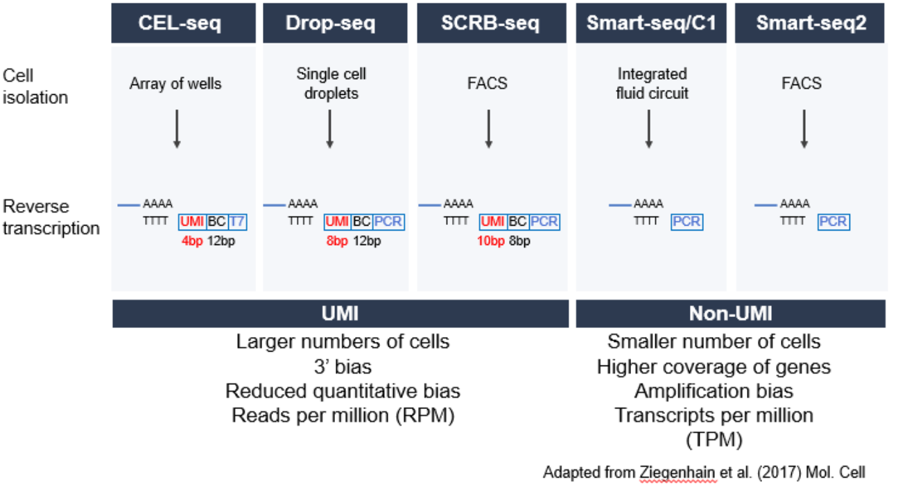
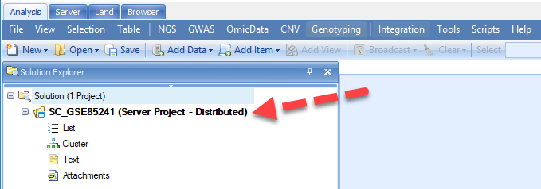

# Introduction

## ArrayStudio

Array Studio runs local NGS analysis in 64-bit mode on a Windows 64-bit computer with at least 8GB of RAM. Server-based analysis allows the user to run jobs on a remote server (Linux or Windows), which usually has more computing power than a desktop computer.
This tutorial is based on local NGS analysis using a Windows Workstation with (Window 10 Pro) with 3.60GHz Intel® Core TM i7-4790 Processor (# of cores: 4; # of threads: 8) with 16GB RAM.

It is highly recommend that the user complete the prerequisite for this tutorial:
**the Microarray tutorial**, as a way to learn the basics in Array Studio. This tutorial assumes working knowledge of Array Studio, standard visualizations, and different modules within the software. As many of the downstream data types from next generation sequencing are "Microarray" datasets, the Microarray tutorial is an invaluable starting tool.

## Single Cell Solutions

Single-cell RNA-seq is a rapidly developing field with many methods of isolating single cells, and generating libraries for NGS sequencing. Below is an example that demonstrates the varying types of methodologies available to isolate single cells:

As shown in the diagram, single cell RNA-seq can be split into two categories, UMI (*Unique Molecular Identifier*) and non-UMI studies. With Single-Cell studies, since the input material is relatively low, there can be an amplification bias that is introduced during library preparation. UMIs have been developed to uniquely tag RNA molecules to reduce this amplification bias. For these UMI studies, this requires users to incorporate these tags into the design and analyses of the RNA-seq. Often, there are barcodes attributed to each cell and UMIs for each molecule. Depending on the experiment, this information can be stored in different parts of the .fastq files that are obtained from a sequecning facility.

OmicSoft has developed modules to allow its users to analyze these complex datasets with the simple interface in the ArrayStudio GUI.
The workflow consists of a number of modules for SCRNA-Seq data processing, including pre-processing, filtering reads, tag-based QC, alignment, quantification, and a series of optional downstream analysis, as shown in the schematic chart below:

These modules can be joined together to allow the user to step through the pre-processing through quantification in a single action.

## Tutorials

A very popular platform for obtaining single cell RNA-seq data is available through 10X Genomics. For this reason, we have developed modules and training material for [10X Genomics](./Pre-processing/10X Data Sets.md) and for all
[other UMI-based](./Pre-processing/non10XData.md). For non-UMI based scRNA-seq datasets, the standard [RNA-seq](../RNASeq/Introduction.md) workflow can be used to align the raw data. For all the single cell datasets described, OmicSoft has a number of [downstream analyses options](./Downstream Analyses of SC Data.md) to aid in classification of clusters of cells, differential expression and marker gene identification.

## Create Server Project

Array Studio provides an integrated environment for analyzing and visualizing high dimensional data. It is convenient in organizing and visualizing data with Solution Explorer, which organizes data/results as projects. Users can create a local project which uses the local computer power to do analysis, or create a server project which will run all analyses in Array Server. In this tutorial, we are using server projects. If a user doesn't have Array Server installed, user can run the tutorial as a local project and analysis steps are almost the same as described in this tutorial.

**Note**: If user is using local project to analyze the SingleCell data in this tutorial, please refer to our tutorial for “RNA-Seq Analysis” about creating ArrayStudio local Project: [Create Projects](../RNASeq/CreateArray_Studio_Project.md).

In order to analyze the data in server project, users should firstly connect to a server and upload the fastq files if they are not accessible on server folder: [Connect to Server and Upload Files](../ServerAnalysisBasics/Connecting_to_a_Server_and_Uploading_Files.md)

Then user can create a server project following analysis: [Create Server Project](../ServerAnalysisBasics/Creating_and_Publishing_a_Server_Project.md)  for

