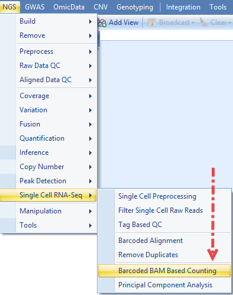
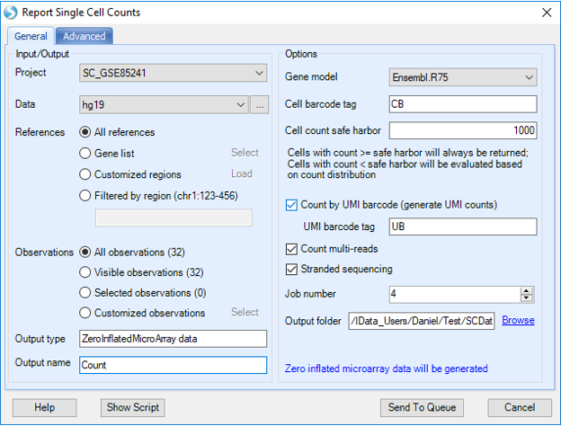
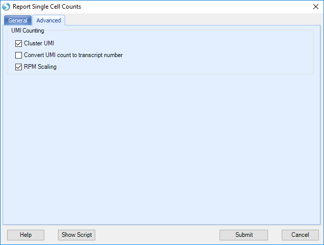
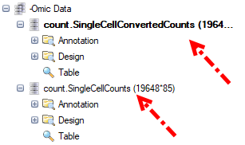
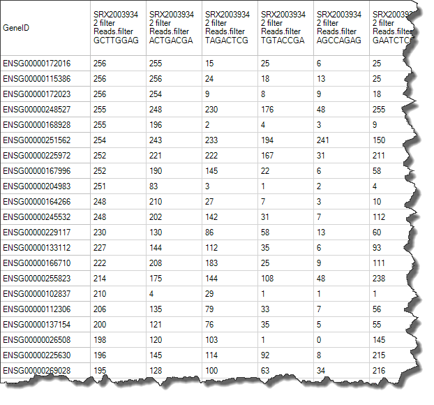
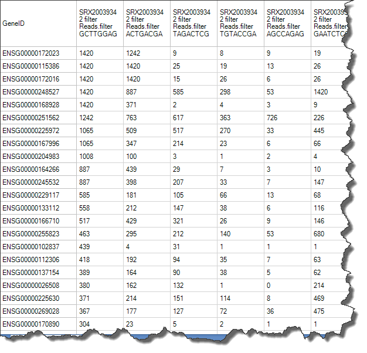

# scRNA-Seq Quantification

ArrayStudio provides modules and options for scRNA-Seq quantification.

## Report Barcoded BAM Counts

For single cell sequencing data analysis, one of the most important parts is to get the transcript count for each cell, and this module in ArrayStudio can be accessed by going to Analysis | NGS | Single Cell RNA-Seq | Barcoded BAM Based Counting:

This window will be similar to the normal RNASeq quantification, user can leave all the settings on the left as default. For the Options on the right section, **Gene model** and **Cell barcode tag** will be automatically assigned based on the bam file information; User can modify the setting for **Cell count safe harbor**, for the cells that have count in total less then this harbor, such cells will be filtered out in the reporting table. We will use set this value as 1000 for this tutorial.  

Leave settings as default and specify **Job Number** as the number of processes to run in parallel. Specify the output folder where the results files will be saved, otherwise the files will go the project folder by default.

And then go to the Advanced tab, check the option for **Convert UMI count transcript number**.

**Convert UMI count to transcript number** is an option we designed for the correction of “UMI saturation”, please refer to our wiki: [UMI to Transcript](http://www.arrayserver.com/wiki/index.php?title=Ngs_ReportSingleCellCounts.pdf#Convert_UMI_count_to_transcript_number) for the detail explanation.

We will check this option “Convert UMI count to transcript number” in the advanced tab as our UMI is only 4nt in this project, it will easily get saturated:

Click **Send To Queue** to submit the job.

## Output files and tables

When the job is done, there will be two -Omic type data objects show up in the GUI of project: a zero inflated binary matrix (ZIM) data object to store the UMI count, and another MicroArray type data object to store the converted UMI count:

This is the ZIM data object file which has 256 as the maximum UMI count:

And this will be the normal MicroArray type -Omic data which store the converted theoretical UMI count, which has the maximum UMI as 1420:

